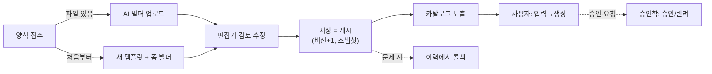

# ADMIN_SPEC — 관리자 화면 명세

> 소스: `autodoc/admin.html` · `autodoc/js/admin/admin.js` · 관련: [API_SPEC.md](API_SPEC.md) · [JSON_SCHEMA.md](JSON_SCHEMA.md) · [PHASE4.md](PHASE4.md)

## 1. 원칙과 접근 제어

- 목표: **관리자는 JSON 을 직접 수정하지 않는다** — 화면(빌더)으로 문서를 등록·수정한다.
  (전문가용 탈출구로 블록 props 만 JSON 미니 편집 허용 — §4)
- 접근: `window.BAZ_PAGE_MIN_LEVEL = 3` + 기존 auth.js 가드. 인증 GAS 에 레벨 4(관리자) 추가 시
  `admin.html` 과 `config.js ADMIN_MIN_LEVEL` 만 4로 상향 📋
- 허브(index.html)는 레벨 ≥ ADMIN_MIN_LEVEL 사용자에게만 ⚙️ 관리자 링크 노출

## 2. 화면 구성 ✅

| 섹션 | 기능 |
|---|---|
| ① 템플릿 목록 | 전체 템플릿(보관 포함) — 편집 / 🕘 이력 / 📦 보관·활성 토글(GAS) / ＋ 새 템플릿 |
| ①-b AI 템플릿 빌더 | 양식 파일 업로드 → 분석 → 편집기 자동 오픈 (§6) |
| ② 템플릿 편집기 | 기본 정보 + 폼 빌더 + 레이아웃 블록 + 실시간 미리보기 + 저장 |
| ③ 버전 이력 | 이력 목록 + [↩ 이 버전으로 복원] (GAS) |
| ④ 초안 승인함 | '대기' 초안 목록 — 내용 요약 + ✅ 승인 / ⛔ 반려(+의견) |

## 3. 폼 빌더 (Form Builder) ✅

입력 필드를 화면에서 편집하면 `inputs` 스키마가 자동 생성된다:

- 필드: 키(key)·라벨·타입 선택·필수 체크 / select 는 옵션(쉼표 구분) / table 은 컬럼 서브 편집기(키·라벨·타입·옵션)
- 순서 이동(↑↓)·삭제·추가 — 구조 변경 시 즉시 미리보기 반영
- 저장 검사: 빈 키·중복 키 차단

## 4. 레이아웃 빌더 ✅

- 블록 목록 편집: 컴포넌트 select(Registry 타입 자동 열거 — 새 컴포넌트 등록 시 자동 노출) ·
  `area` 텍스트(`행/열/행끝/열끝`) · **props JSON 미니 편집기**(문법 오류 시 빨간 표시, 미리보기 갱신 보류) ·
  [기본값] 버튼으로 컴포넌트별 예시 props 주입 · ↑↓ · 삭제 · 블록 추가
- **[🪄 자동 배치]** — inputs 를 읽어 레이아웃 전체 생성:
  `header(1행 전폭) → 짧은 필드는 card 로 행당 3개 → table 3행 전폭 → textarea 는 text 2행 전폭 → footer(마지막 행)`,
  grid.rows 는 필요 시 8행 이상 자동 확장. **AI 빌더의 layout=null 폴백이기도 함**
- 📋 드래그 앤 드롭 격자 편집: 현재는 area 숫자 입력 + 즉시 미리보기로 대체. 12×N 격자 클릭-드래그 UI 는 차기
- 미리보기: `sampleValues()` 가 inputs 에서 예시값을 자동 생성(표는 2행 더미) → 엔진의 preview.js 그대로 재사용

## 5. 저장(게시) 시맨틱 ✅

1. `buildTpl()` — 화면 상태 → 템플릿 JSON (props JSON 파싱 오류 시 저장 중단)
2. 검사: id·name 필수, 입력 키 중복
3. **version patch 자동 +1** (1.1.0 → 1.1.1)
4. GAS 설정 시: `templateSave` — 서버가 **이전본을 템플릿이력 탭에 스냅샷** 후 갱신 → 카탈로그 즉시 반영
   GAS 미설정 시: `<id>.json` 다운로드 (= Export 경로) → `templates/` 커밋 안내
5. 로컬 캐시(`ad_tpl_<id>`) 갱신 — 편집 직후 에디터에 반영

## 6. AI 템플릿 빌더 (Phase 4) ✅

```
파일 선택(.pptx/.docx/.xlsx/.pdf) → [분석]
 ① 추출: 브라우저에서 텍스트·구조 추출 (JSZip / pdf.js)
 ② 분석: GAS aiTemplate → 템플릿 JSON 초안
 ③ normalize: 스키마 안전망 (오염 제거·키 보정·layout 폴백)
 → 편집기 자동 오픈 (검토·수정) → [저장] = 게시
```

AI 는 폼 빌더의 "초안 작성자"일 뿐 — 게시 승인은 항상 사람. 상세: [PHASE4.md](PHASE4.md).
GAS/API 키 미설정 시 안내 문구만 표시.

## 7. 향후 빌더 로드맵 📋

| 빌더 | 내용 | 선행 조건 |
|---|---|---|
| Layout Builder(격자 GUI) | 12×N 격자 위 블록 드래그 배치 → area 자동 산출 | 없음 (독립 UI) |
| Theme Builder | 색상 피커·폰트 선택 → 테마 JSON 생성·저장 | 시트 '테마' 탭 활성화 ([API_SPEC.md](API_SPEC.md) §3) |
| Template Import | JSON 업로드 → normalize → 편집기 (Export 는 §5-4 로 부분 존재) | 없음 |
| 권한 매트릭스 UI | 역할×템플릿 접근 표 편집 | 시트 '권한설정' 탭 + 레벨 4 |

## 8. 운영 워크플로 요약


