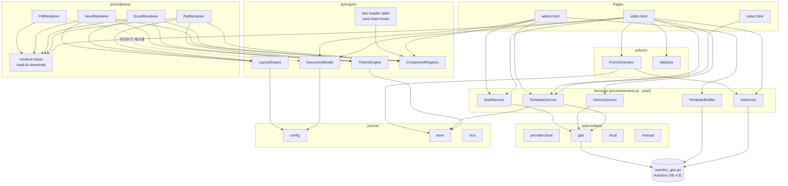
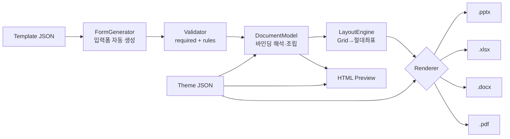
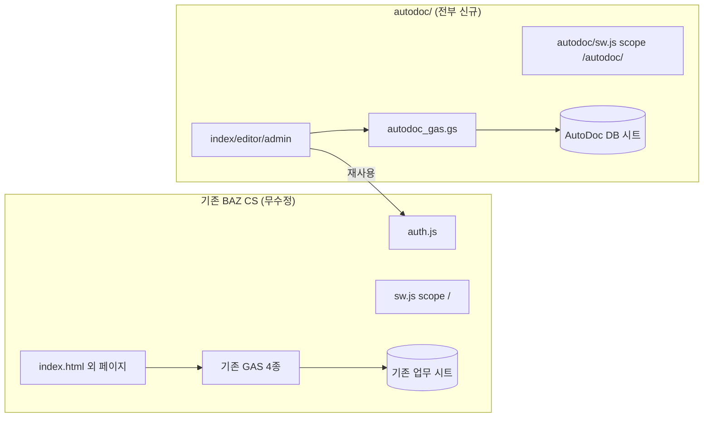

# ARCHITECTURE — 시스템 아키텍처와 의존성

> 관련: [DESIGN.md](DESIGN.md) · [FOLDER_STRUCTURE.md](FOLDER_STRUCTURE.md) · [DOCUMENT_MODEL.md](DOCUMENT_MODEL.md) · [PLUGIN_SPEC.md](PLUGIN_SPEC.md)

## 1. 계층 구조

위 계층은 아래 계층에만 의존한다. 역방향 의존은 금지.

```
[Pages]      index(허브·로그인) · editor(입력→미리보기→생성) · admin(관리·AI빌더)
[Services]   TemplateService · HistoryService · DraftService · AIService · TemplateBuilder
[Form]       FormGenerator · Validator
[Engine]     DocumentModel · LayoutEngine · ThemeEngine · ComponentRegistry
[Renderers]  PptRenderer · ExcelRenderer · WordRenderer · PdfRenderer   ← 공통 계약
[Providers]  GasProvider · LocalProvider · ManualProvider · (Rest/DB 📋)
[Core]       config · store(localStorage) · bus · loadLib(CDN 로더)
[Backend]    autodoc_gas.gs ←→ Google Sheets "AutoDoc DB"
```

### 핵심 의존 규칙

| 규칙 | 의미 |
|---|---|
| **engine은 포맷을 모른다** | DocumentModel·Layout·Theme 어디에도 pptx/xlsx 지식이 없다 |
| **renderers는 문서 의미를 모른다** | "주간보고"인지 "회의록"인지 렌더러는 알 필요 없다 — 블록만 그린다 |
| **providers는 화면을 모른다** | DOM 접근 금지, 데이터만 반환 |
| **렌더러 상호 비의존** | PPT↔Excel↔Word↔PDF 는 서로를 참조하지 않는다. 공유물은 DocumentModel과 컴포넌트 스펙뿐 |
| **새 문서 = 데이터** | 문서 종류 추가는 템플릿 JSON 추가일 뿐, 코드 폴더를 건드리지 않는다 |

## 2. 모듈 의존성 다이어그램



렌더러 4종이 서로를 가리키는 간선이 **하나도 없음**에 주목 — 렌더러 상호 비의존 원칙의 시각적 증명.

## 3. 데이터 흐름 (생성 파이프라인)



요청서의 `Template → Validation → DocumentModel → LayoutEngine → ThemeEngine → Renderer → 산출물` 파이프라인과 동일하다. 구현상 Layout/Theme 은 별도 "단계"가 아니라 렌더러가 블록별로 호출하는 **함수**다(LayoutEngine.resolve, Theme.token) — 파이프라인 의미는 같고 결합만 더 느슨하다.

## 4. 기존 BAZ CS PWA 와의 경계



| 자원 | 격리 방식 |
|---|---|
| HTML/CSS/JS | 전부 `autodoc/` 내부. 기존 페이지와 파일명·전역 충돌 없음 (전역은 `window.AD` 네임스페이스 하나) |
| **auth.js (유일한 공유)** | `../auth.js` 참조 — 로그인·토큰·레벨(1~3, 📋 4)·가드 방식 그대로. 한 번 로그인하면 양쪽 공용 |
| localStorage | AutoDoc 키는 전부 `ad_` 접두어(store.js). 인증 키(`baz_auth_*`)만 공유 |
| 서비스워커 | `autodoc/sw.js` 는 스코프 `/autodoc/` 전용 — 루트 `sw.js`(v57)와 캐시·버전 독립 |
| GAS | 신규 `autodoc_gas.gs` 별도 배포. 기존 4종 GAS 무수정. `?action=` 라우팅 규약만 동일 |
| Google Sheet | 신규 **AutoDoc DB** 스프레드시트. 기존 업무 시트 접근 없음 |
| CDN 로더 | 기존 다중 CDN 폴백 패턴을 `AD.loadLib()` 로 이관 (코드 공유 아님, 패턴 재사용) |

## 5. 확장점 (플러그인의 뿌리)

세 개의 `register()` 가 시스템의 공식 확장점이다. 모두 **등록 즉시 본체 무수정으로 동작**한다.

| 확장점 | 계약 | 추가 시 효과 |
|---|---|---|
| `AD.Renderers.register(r)` | `{id, label, ext, render(model)→Promise<Blob\|null>}` | 새 출력 포맷 — 에디터 버튼·전체 생성에 자동 포함 |
| `AD.Providers.register(p)` | `{id, fetch(query)→Promise<any>}` | 새 데이터 소스 — 템플릿 바인딩에서 사용 가능 |
| `AD.Registry.register(type, spec)` | `{html, ppt, excel, word}` | 새 블록 타입 — 템플릿·미리보기·전 렌더러에서 사용 가능 |

📋 이 세 계약을 묶는 상위 인터페이스 `AD.Plugins` 는 [PLUGIN_SPEC.md](PLUGIN_SPEC.md)에 정의(구현 없음).

## 6. Storage 관점 📋

요청서의 Storage Layer(Provider→Storage→Sheet/LocalStorage/IndexedDB/DB) 대비 현재 구현:

```
현재:  TemplateService ─┬─> GasProvider ──> Sheets      (원본)
                        └─> AD.store ────> localStorage  (캐시·초안)
목표📋: TemplateService ──> AD.Storage(단일 인터페이스) ──> [sheet | local | idb | db] 백엔드
```

- 현재도 "프로바이더는 저장 구현을 모른다"는 원칙은 지켜짐 (services.js 가 GAS↔캐시 폴백을 캡슐화)
- `AD.Storage { get(ns,key), set(ns,key,val), list(ns), remove(ns,key) }` 로 통합하는 리팩터 경로는
  [ROADMAP.md](ROADMAP.md) Next-1 에 계획. IndexedDB 백엔드는 대용량 초안·오프라인 큐용

## 7. 버전 체계

| 대상 | 버전 위치 | 정책 |
|---|---|---|
| Engine | `js/core/config.js` `ENGINE_VERSION`(현재 0.1.0) | 코드 배포 단위 = git |
| Template | 템플릿 JSON `version`(semver) | 관리자 저장 시 patch 자동 +1, 이전본 시트 스냅샷 |
| Theme | 테마 JSON `version` | 수동 관리 |
| Renderer | Engine 버전에 포함 (개별 파일 단위 semver 📋) | |
| 호환성 검사 📋 | 템플릿 `minEngine` 필드 — 로드 시 `ENGINE_VERSION` 과 비교해 경고 | [JSON_SCHEMA.md](JSON_SCHEMA.md) 참조 |
