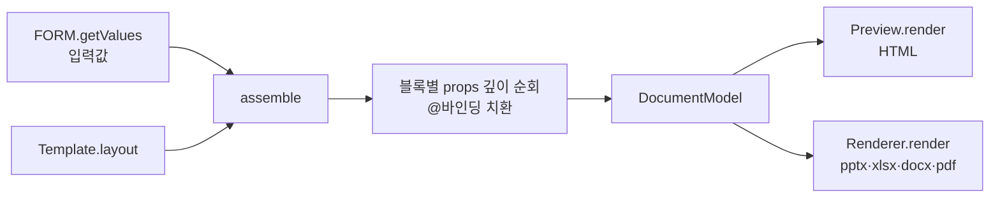

# DOCUMENT_MODEL — 렌더러 중립 문서 모델

> 소스: `autodoc/js/engine/document-model.js` · 관련: [JSON_SCHEMA.md](JSON_SCHEMA.md) · [LAYOUT_ENGINE.md](LAYOUT_ENGINE.md) · [RENDERER_SPEC.md](RENDERER_SPEC.md)

## 1. 역할

DocumentModel 은 **엔진의 단일 진실(single source of truth)** 이다.
템플릿(구조) + 사용자 입력값(데이터) + 테마(스타일 토큰)를 합쳐, 모든 렌더러와 HTML 미리보기가
**동일하게 소비하는 중립 JSON** 을 만든다. 미리보기와 산출물이 같은 모델에서 나오므로
"보이는 대로 생성된다"가 구조적으로 보장된다.

```
assemble(template, values) → DocumentModel
```

## 2. 모델 구조 ✅

```js
{
  meta: { id, name, version },          // 템플릿 식별 정보 (파일명·이력 기록에 사용)
  grid: { cols: 12, rows: 8, gap: 0.1 },// 페이지 그리드 (템플릿 layout.grid, 기본값 12×8)
  pages: [                              // 페이지 배열 = PPT 슬라이드 / Excel 시트 / Word 섹션
    {
      blocks: [
        {
          component: 'header',          // ComponentRegistry 에 등록된 타입
          area: '1 / 1 / 2 / 13',       // grid-area (행시작/열시작/행끝/열끝 · 끝 미포함)
          abs:  { x, y, w, h },         // (선택) inch 절대좌표 — grid 대신 정밀 배치
          props: { title: '주간업무보고', writer: '홍길동', ... }  // 바인딩 해석 완료 상태
        }
      ]
    }
  ]
}
```

조립 시점에 **props 의 모든 `@` 바인딩은 실제 값으로 치환**된다.
`$` 테마 토큰은 남겨둔다 — 스타일 해석은 각 렌더러/컴포넌트가 렌더 시점에 수행한다
(같은 모델을 다른 테마로 재렌더할 수 있게 하기 위한 의도적 분리).

## 3. 바인딩 해석 규칙 ✅

`resolve(value, values)` 는 props 트리를 깊이 순회하며 다음을 적용한다:

| 표기 | 해석 | 예 |
|---|---|---|
| `"@key"` (문자열 전체가 바인딩) | 입력값을 **타입 그대로** 반환 — 배열·객체 유지 | `"rows": "@rows"` → 표 행 배열 |
| `"@key.sub"` | 중첩 경로 접근 | `"@user.name"` |
| `"@fn.<이름>"` | 내장 함수 호출 (아래 표) | `"date": "@fn.today"` |
| `"문자 @key 열"` (문자열 내 포함) | 문자열 보간 — 값이 객체/배열이면 빈 문자열 | `"○○ · @writer"` |
| `"$color.primary"` | **치환하지 않음** — Theme 토큰은 렌더 시점 해석 | card 의 `accent` |
| 배열/객체 | 각 원소·값에 재귀 적용 | |

없는 키는 빈 문자열이 된다(오류 아님) — 템플릿 오타가 문서 생성을 막지 않도록 하는 정책.

### 내장 함수 (`AD.Model.fn`)

| 함수 | 반환 예 |
|---|---|
| `@fn.today` | `2026-07-11` |
| `@fn.now` | `2026-07-11 14:30` |
| `@fn.currentWeek` | `7월 2주차` (월요일 기준, weekly.html 주차 로직 이관) |

📋 확장 후보: `@fn.user`(로그인 사용자명), `@fn.count(키)`(표 행 수), `@fn.sum(키.컬럼)` — [ROADMAP.md](ROADMAP.md).
`@providers.*` 프리필 바인딩은 스키마에 예약되어 있으며 폼 단계에서 처리한다(📋, [JSON_SCHEMA.md](JSON_SCHEMA.md) §prefill).

## 4. 조립 파이프라인



- 에디터는 입력 변경(250ms 디바운스)마다 재조립 → 미리보기 갱신
- 생성 버튼은 Validator 통과 후 같은 방식으로 조립한 모델을 렌더러에 전달
- 모델은 **불변으로 취급** — 렌더러는 모델을 수정하지 않는다

## 5. 소비자 계약

DocumentModel 을 입력받는 쪽이 지켜야 하는 것:

1. `pages` 순서 = 출력 순서 (슬라이드/시트/섹션)
2. 블록 좌표가 필요하면 직접 계산하지 말고 `AD.Layout.resolve(block, model.grid, theme)` 사용
3. 블록 렌더는 직접 구현하지 말고 `AD.Registry.get(block.component)` 의 포맷별 메서드에 위임
4. 미등록 컴포넌트는 **조용히 건너뛴다** (경고 없이 무시 — 하위 호환 정책)
5. props 안의 `$토큰` 은 `AD.Theme.resolve()` / `AD.Theme.token()` 으로 해석
