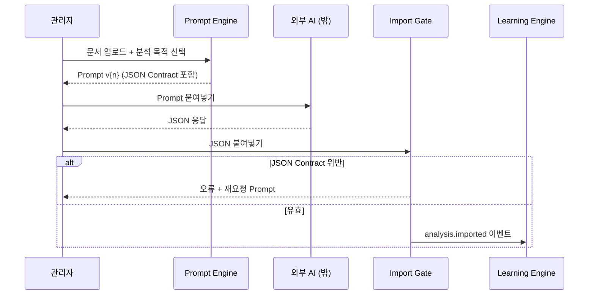

# AI Architecture — AI Provider 독립 · AI Import Mode · JSON Contract

> **문서 상태**: 📋 설계만 (v2.5 Enterprise Edition · 미구현)
> **상위 문서**: [DESIGN.md](DESIGN.md) · [ARCHITECTURE.md](ARCHITECTURE.md)
> **관련 문서**: [PROMPT_ENGINE.md](PROMPT_ENGINE.md) · [LEARNING_ENGINE.md](LEARNING_ENGINE.md) · [PLUGIN_ARCHITECTURE.md](PLUGIN_ARCHITECTURE.md)
> **한 줄 목적**: "Core는 AI를 모른다"를 실제로 성립시키는 경계 설계 — AI Import Mode 워크플로와 JSON Contract를 확정한다.

---

## 목차

1. [목적](#1-목적)
2. [책임](#2-책임)
3. [데이터 흐름 — AI Import Mode](#3-데이터-흐름--ai-import-mode)
4. [인터페이스 — JSON Contract](#4-인터페이스--json-contract)
5. [확장성 — v1 이행 경로 · 향후 AI API Plugin](#5-확장성)
6. [장점](#6-장점)
7. [단점](#7-단점)

---

## 1. 목적

| 항목 | 내용 |
|---|---|
| 절대 원칙 | **AutoDoc Core는 AI를 모른다.** OpenAI·Claude·Gemini·Copilot·DeepSeek·Qwen 등 모든 AI는 Plugin이다. |
| 기본 모드 | **AI Import Mode** — AutoDoc은 AI API를 호출하지 않는다. 사용자가 외부 AI를 직접 사용하고 JSON 결과만 가져온다. |
| 계약 | AI에게는 설명(산문)이 아니라 **항상 JSON만** 요청한다. 모든 Prompt는 동일한 JSON Contract 봉투를 사용한다. |
| 오류 규칙 | AI가 JSON이 아닌 텍스트를 반환하면 **오류로 처리**한다 — 부분 수용·자동 보정으로 위장하지 않는다. |

## 2. 책임

| 구성요소 | 책임 | 하지 않는 것 |
|---|---|---|
| Prompt Engine | Import용 Prompt 발급 (JSON Contract 지시 포함) | AI 호출 |
| Import Gate | 붙여넣은 텍스트의 JSON 파싱·Contract 검증·오류 안내 | 내용의 진위 판단(→ Learning/Approval) |
| AI Review | 문서 **생성 전** 자동 검사 — 오탈자·누락·브랜드·레이아웃·표·이미지·색상·문체·Golden Template 일치율 | 자동 수정(제안만) |
| AI Plugin (📋 향후) | 특정 AI API와의 통신을 캡슐화 | Core 수정, Contract 우회 |

**AI Review의 위치**: AI Review는 이름에 AI가 들어가지만 **외부 AI가 아니라 회사 지식(DNA·Golden Template·KB)으로 검사하는 Core 내부 기능**이다. 평가 산식은 [GOLDEN_TEMPLATE.md](GOLDEN_TEMPLATE.md) §4의 Golden Score를 사용한다.

## 3. 데이터 흐름 — AI Import Mode

```
① 회사 문서 업로드
      ↓
② Prompt 자동 생성 ── Prompt Engine이 [Analyzer × AI 프로필 × 목적 × 출력형식 × 난이도 × 언어] 조합
      ↓  (사용자는 Prompt를 복사)
③ 사용자가 원하는 AI 사용 (ChatGPT / Claude / Gemini …)  ← AutoDoc 밖
      ↓  (AI 응답에서 JSON을 복사)
④ AutoDoc에 붙여넣기
      ↓
⑤ Import Gate — JSON 파싱 → Contract 스키마 검증
      ├─ 실패 → 오류 표시 + "JSON만 다시 요청하는 재요청 Prompt" 재발급
      └─ 성공 ↓
⑥ Company Learning (Learning → Confidence → Human Approval)
      ↓
⑦ Golden Template 생성 → Knowledge Base 생성 → Company Memory 생성 → Document Model 생성
```



Import 성공/실패는 Prompt 메타데이터(정확도·성공률)에 반영된다 → [PROMPT_MARKETPLACE.md](PROMPT_MARKETPLACE.md) §4.

## 4. 인터페이스 — JSON Contract

모든 Analyzer Prompt는 아래 **공통 봉투(envelope)** 를 요구한다. `payload` 스키마만 Analyzer별로 다르다.

```json
{
  "contract": "autodoc.analysis.v1",
  "analyzer": "ppt-analyzer",
  "promptVersion": "v3",
  "language": "ko",
  "confidence": 0.92,
  "payload": { "...": "Analyzer별 스키마 (PROMPT_LIBRARY.md §4)" },
  "warnings": ["판독 불가 영역: 3페이지 하단 표"]
}
```

| 필드 | 필수 | 검증 규칙 |
|---|---|---|
| `contract` | ✅ | `autodoc.analysis.v1` 고정 — 불일치 시 오류 |
| `analyzer` | ✅ | 발급된 Prompt의 Analyzer와 일치해야 함 |
| `promptVersion` | ✅ | 발급 Prompt 버전과 일치 (Replay 근거) |
| `confidence` | ✅ | 0~1. Confidence Engine의 1차 입력 |
| `payload` | ✅ | Analyzer별 JSON Schema로 2차 검증 |
| `warnings` | — | AI가 확신하지 못한 부분의 자기 신고 |

**오류 등급**

| 등급 | 조건 | 처리 |
|---|---|---|
| E1 | JSON 파싱 불가 (산문 응답) | 즉시 거부 + 재요청 Prompt 발급 |
| E2 | 봉투 필드 누락·불일치 | 즉시 거부 |
| E3 | `payload` 스키마 위반 | 거부 + 위반 필드 목록 표시 |
| W | `warnings` 존재 | 수용하되 해당 항목 confidence 하향 |

## 5. 확장성

### v1 AI Template Builder 이행 경로

v1 Phase 4는 GAS 프록시(`ANTHROPIC_API_KEY`)로 Claude API를 직접 호출한다 ([../PHASE4.md](../PHASE4.md)). v2.5에서 이는 **폐기가 아니라 최초의 AI Plugin 선행 사례**로 재해석된다.

| 단계 | 내용 | Core 수정 |
|---|---|---|
| 현재 | v1 AI Template Builder 그대로 운영 (v1 영역, 무수정) | — |
| 이행 | GAS 프록시 호출부를 "Claude AI Plugin"으로 재포장 — 출력을 JSON Contract 봉투로 감싸 Import Gate에 투입 | 없음 |
| 최종 | Import Mode(수동)와 AI Plugin(자동)이 **같은 Import Gate**를 공유 | 없음 |

### 향후 AI API Plugin

새 AI 연결 = ① AI 프로필(데이터)을 Prompt Engine에 등록 → ② Plugin Contract 구현( [PLUGIN_ARCHITECTURE.md](PLUGIN_ARCHITECTURE.md) §4 ) → ③ Feature Flag로 Workspace별 활성화. **어느 단계에서도 Core는 수정되지 않는다.**

## 6. 장점

1. **완전한 AI 교체 자유** — 경계가 "붙여넣기 + JSON Contract"뿐이므로 어떤 AI든 즉시 사용 가능.
2. **보안·비용 통제** — 기본 모드에 API Key가 없다. 회사 문서가 AutoDoc 서버를 통해 AI로 전송되는 일 자체가 없다(사용자가 직접 통제).
3. **재현 가능성** — `promptVersion`이 응답에 박제되어 Document Replay의 근거가 된다 ([DOCUMENT_REPLAY_ENGINE.md](DOCUMENT_REPLAY_ENGINE.md)).
4. **엄격한 계약** — "JSON 아니면 오류" 단순 규칙이 하류(Learning) 오염을 차단.

## 7. 단점

1. **복사·붙여넣기 UX 마찰** — 문서 500개 학습 시 수백 회의 수동 왕복이 발생할 수 있다. (→ 배치 Prompt·묶음 Import 설계, [PROMPT_ENGINE.md](PROMPT_ENGINE.md) §5)
2. **AI별 JSON 준수율 편차** — 일부 AI는 마크다운 코드펜스·주석을 섞는다. Import Gate의 관용 범위(펜스 제거 등 **구문적** 정리만 허용, 의미 보정 금지)를 명확히 해야 한다.
3. **긴 문서의 컨텍스트 한계** — 대형 PPT/PDF는 AI 입력 한도를 초과할 수 있어 분할 Prompt 전략이 필요하다.
