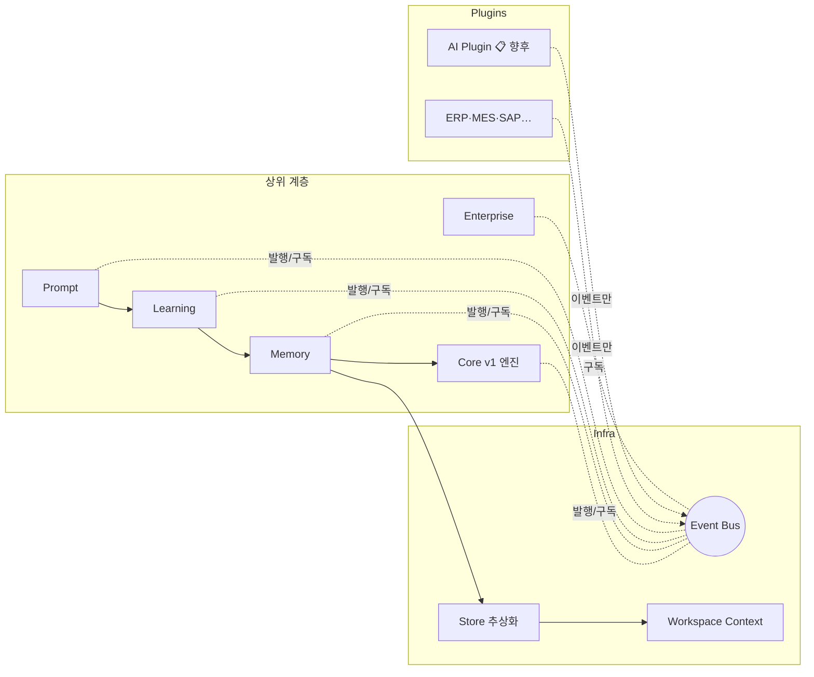

# AutoDoc v2.5 아키텍처 — 계층 · 의존 규칙 · Multi Workspace

> **문서 상태**: 📋 설계만 (v2.5 Enterprise Edition · 미구현)
> **상위 문서**: [DESIGN.md](DESIGN.md) · 문서 지도: [README.md](README.md)
> **v1 아키텍처**: [../ARCHITECTURE.md](../ARCHITECTURE.md) — v1 계층은 v2.5의 하부 계층으로 그대로 편입된다.
> **한 줄 목적**: AI-agnostic Core를 중심으로 Learning · Enterprise · Plugin 계층을 정의하고, 의존 규칙과 Multi Workspace 격리 모델을 확정한다.

---

## 목차

1. [목적](#1-목적)
2. [책임](#2-책임)
3. [데이터 흐름](#3-데이터-흐름)
4. [인터페이스](#4-인터페이스)
5. [확장성 — Multi Workspace · 저장 전략](#5-확장성)
6. [장점](#6-장점)
7. [단점](#7-단점)
8. [설계 원칙 적용표](#8-설계-원칙-적용표)

---

## 1. 목적

v2.5의 모든 모듈이 **어느 계층에 속하고, 무엇에 의존할 수 있는지**를 한 장으로 확정한다.
목표는 단 하나 — **Core가 AI·외부 시스템·특정 회사를 전혀 모르게 유지하는 것.**

## 2. 책임

### 계층 구조 (위 계층은 아래 계층에만 의존)

```
[Pages/UX]        허브 · 에디터 · 관리자 · Prompt Lab · 승인함 (📋 화면 설계는 차기)
[Enterprise]      WorkflowEngine · DocumentReplayEngine · AuditEngine · FeatureFlag
[Learning]        LearningEngine · ConfidenceEngine · HumanApproval
[Memory]          CompanyDNA · CompanyMemory · CompanyOntology · KnowledgeBase · KnowledgeGraph · RuleEngine
[Prompt]          PromptEngine · PromptLibrary · PromptMarketplace · PromptLab · GoldenPrompt
[Core(v1 계승)]   DocumentModel · LayoutEngine · ThemeEngine · ComponentRegistry · Renderers · Validator
[Infra]           EventBus · WorkspaceContext · Store(저장 추상화) · Providers
[Plugins]         AI · OCR · ERP · MES · SAP · Mail · Slack · Teams · 전자결재 · Barcode · QR · DB
```

### 계층별 책임

| 계층 | 책임 | 알아도 되는 것 | 몰라야 하는 것 |
|---|---|---|---|
| Core(v1 계승) | 문서 모델 조립·레이아웃·테마·렌더링 | Template/Theme JSON | AI, 회사 고유 규칙, 외부 시스템 |
| Prompt | Prompt 생성·버전·자산화·실험 | 문서 종류, AI **프로필(데이터)** | AI API (호출하지 않음) |
| Memory | 회사 지식의 저장·조회·버전 | DNA 스키마 | 학습 알고리즘, 화면 |
| Learning | 학습 제안 생성·신뢰도·승인 흐름 | Memory 계층의 쓰기 계약 | 렌더러, AI API |
| Enterprise | 결재 흐름·재현·감사·기능 토글 | 이벤트 스트림 | 문서 의미(주간보고/회의록 등) |
| Infra | 이벤트 중계·Workspace 격리·저장 | 없음(범용) | 상위 계층 전부 |
| Plugins | 외부 세계와의 연결 | 공개된 Plugin Contract | Core 내부 구조 |

**의존 규칙 (v1 규칙의 확장)**

1. `engine/`(Core)은 포맷을 모르고, `renderers/`는 문서 의미를 모르고, `providers/`는 화면을 모른다 — v1 규칙 유지 ([../ARCHITECTURE.md](../ARCHITECTURE.md)).
2. **모든 계층은 AI를 모른다.** AI라는 단어는 Plugin 계층과 Prompt 프로필 **데이터**에만 존재한다.
3. 계층 간 통신은 [EVENT_BUS.md](EVENT_BUS.md) 이벤트가 기본. 직접 호출은 같은 계층 내부 또는 바로 아래 계층에만 허용.
4. Memory 계층에 대한 **쓰기**는 오직 Human Approval을 통과한 Learning 제안만 가능 ([HUMAN_APPROVAL.md](HUMAN_APPROVAL.md)).
5. 모든 쓰기는 WorkspaceContext를 경유한다 — Workspace 간 데이터 교차 금지.

## 3. 데이터 흐름

### 계층 간 이벤트 흐름 (예: 학습 1건의 일생)

```
[외부 AI JSON 붙여넣기]
  ↓ analysis.imported          (Prompt 계층 발행)
[Learning Engine] 제안 생성
  ↓ learning.proposed          (confidence 포함)
[Confidence Engine] 등급 판정 → 98% / 90% / 80% / 60%
  ↓ approval.requested         (80% 이하 등급)
[Human Approval] 관리자 승인
  ↓ dna.updated                (Memory 계층 쓰기 완료)
[Golden Score 재계산] · [Preview Refresh] · [Audit 기록]
```



## 4. 인터페이스

계층 경계의 대표 계약 (개념 서명 — 구현 아님):

| 계약 | 서명(개념) | 설명 |
|---|---|---|
| `WorkspaceContext` | `resolve(workspaceId) → { dnaRef, kbRef, promptRef, ruleRef, flagRef }` | 모든 저장 접근의 진입점. 격리 보장 |
| `Store` | `read(ref, key)` / `write(ref, key, value, meta)` / `history(ref, key)` | 저장 매체(Sheets → 향후 DB Plugin) 추상화 |
| `EventBus` | `publish(event, payload)` / `subscribe(event, handler)` | [EVENT_BUS.md](EVENT_BUS.md) §4 |
| `LearningProposal` | `{ target, before, after, evidence[], confidence }` | [LEARNING_ENGINE.md](LEARNING_ENGINE.md) §4 |
| `PluginContract` | `{ manifest, capabilities[], onEvent() }` | [PLUGIN_ARCHITECTURE.md](PLUGIN_ARCHITECTURE.md) §4 |

## 5. 확장성

### Multi Workspace 격리 모델

Workspace = 회사(테넌트) 1개. 모든 지식 자산은 Workspace 단위로 완전 독립이다.

| 자산 | Workspace별 독립 | 정의 문서 |
|---|---|---|
| Company DNA | ✅ | [COMPANY_DNA.md](COMPANY_DNA.md) |
| Golden Template / Golden Prompt | ✅ | [GOLDEN_TEMPLATE.md](GOLDEN_TEMPLATE.md) |
| Knowledge Base / Graph / Ontology | ✅ | [KNOWLEDGE_BASE.md](KNOWLEDGE_BASE.md) 외 |
| Prompt (Library·Marketplace) | ✅ | [PROMPT_LIBRARY.md](PROMPT_LIBRARY.md) |
| Workflow | ✅ | [WORKFLOW_ENGINE.md](WORKFLOW_ENGINE.md) |
| Rule Set | ✅ | [RULE_ENGINE.md](RULE_ENGINE.md) |
| Company Memory | ✅ | [COMPANY_MEMORY.md](COMPANY_MEMORY.md) |
| Feature Flag 값 | ✅ (Flag 정의는 전역, 값은 Workspace별) | [FEATURE_FLAG.md](FEATURE_FLAG.md) |

### 저장 전략

- 저장 매체는 `Store` 추상화 뒤에 숨긴다. 초기 매체는 v1과 동일한 Google Sheets(Workspace별 스프레드시트 분리)를 가정하되, 용량이 큰 자산(Graph·Audit·Replay 스냅샷)은 **Database Plugin**으로 승격 가능해야 한다.
- 스키마 버전 필드(`schemaVersion`)를 모든 저장 레코드에 포함 — 마이그레이션 대비.

### 새 계층·모듈 추가

새 Engine(예: 번역 Engine)이 필요하면: ① 소속 계층 결정 → ② 이벤트 계약 정의 → ③ Feature Flag 뒤에서 활성화. Core·타 모듈 수정 없음.

## 6. 장점

1. **AI·외부 시스템 무지의 구조적 보장** — 의존 규칙 위반이 계층 그림에서 즉시 드러난다.
2. **v1 엔진 무수정 편입** — Core 계층은 v1 as-built 그대로. 재작성 리스크 없음.
3. **테넌트 안전성** — WorkspaceContext 단일 경유로 데이터 교차를 원천 차단.
4. **저장 매체 교체 자유** — Sheets 한계 도달 시 Store 뒤에서 DB Plugin으로 교체.

## 7. 단점

1. **간접화 비용** — 이벤트 기반 통신은 직접 호출보다 디버깅 추적이 어렵다. (→ Audit Engine이 이벤트 로그를 보존해 상쇄)
2. **Sheets 초기 한계** — Graph·Audit 같은 대용량 자산에 Sheets는 임시방편이다. 성장 시 이전 비용 발생.
3. **계층 수 증가** — 소규모 수정에도 "어느 계층인가"를 판단해야 한다. 문서(본 문서 §2)가 항상 최신이어야 한다.

## 8. 설계 원칙 적용표

| 원칙 | v2.5 적용 지점 |
|---|---|
| SOLID | 계층별 단일 책임(§2), 인터페이스 분리(각 문서 §4), 의존 역전(Store·Plugin Contract) |
| DRY | Prompt·Template·Rule 모두 "데이터로 1회 정의, 전역 재사용" |
| KISS | 기본 모드는 API 없는 Import Mode — 가장 단순한 경로가 기본값 |
| DDD | Bounded Context = 계층(§2). Ubiquitous Language = [KNOWLEDGE_BASE.md](KNOWLEDGE_BASE.md) 용어 |
| Component Based | v1 ComponentRegistry 계승 |
| Plugin Based | [PLUGIN_ARCHITECTURE.md](PLUGIN_ARCHITECTURE.md) |
| Interface First | 모든 문서에 §4 인터페이스 — 구현 전 계약 확정 |
| Data Driven | Template·Prompt·Rule·Flag·DNA 전부 데이터 |
| Configuration First | Feature Flag · Workspace 설정으로 동작 제어 |
| Event Driven | [EVENT_BUS.md](EVENT_BUS.md) — 직접 호출 금지 |
| Enterprise Architecture | Workflow·Audit·Replay·Multi Workspace |
