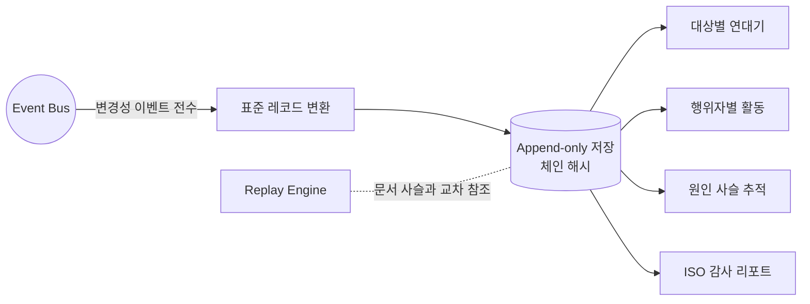

# Audit Engine — 모든 변경의 이력

> **문서 상태**: 📋 설계만 (v2.5 Enterprise Edition · 미구현)
> **관련 문서**: [DOCUMENT_REPLAY_ENGINE.md](DOCUMENT_REPLAY_ENGINE.md) · [HUMAN_APPROVAL.md](HUMAN_APPROVAL.md) · [EVENT_BUS.md](EVENT_BUS.md)
> **한 줄 목적**: 모든 변경을 기록한다 — **누가 · 언제 · 무엇을 · 왜** 변경했는지의 History를 유지한다.

---

## 목차

1. [목적](#1-목적)
2. [책임](#2-책임)
3. [데이터 흐름](#3-데이터-흐름)
4. [인터페이스](#4-인터페이스)
5. [확장성](#5-확장성)
6. [장점](#6-장점)
7. [단점](#7-단점)

---

## 1. 목적

Replay가 "문서 1건의 재현"이라면, Audit는 **"시스템 전체의 변경 연대기"** 다. 4문(問)에 항상 답한다:

| 질문 | 기록 필드 |
|---|---|
| 누가 | actor (사용자 / 관리자 / system / plugin:{id}) |
| 언제 | timestamp (서버 기준, 불변) |
| 무엇을 | target(저장소·경로·버전) + before/after 또는 diff 참조 |
| 왜 | reason (승인·반려 사유, 규칙 근거, 이벤트 원인 사슬) |

### 기록 대상 (전수)

DNA·KB·Graph·Ontology·Memory·Rule·Golden(Template/Prompt)·Prompt 자산·Workflow 정의·Feature Flag·Confidence 임계값·Plugin 등록/비활성·승인 결정·롤백·Workspace 설정. **삭제도 기록이다** — 이력에서 무언가가 사라지는 일은 없다.

## 2. 책임

| 책임 | 설명 |
|---|---|
| 수집 | Event Bus의 변경성 이벤트 전수 구독 — 각 모듈은 Audit를 직접 호출하지 않는다(결합 제거) |
| 저장 | 추가 전용(append-only). 수정·삭제 불가 |
| 조회 | 대상별 연대기·행위자별 활동·기간 검색 |
| 원인 사슬 | 이벤트 `causationId`로 "이 변경을 유발한 변경" 추적 ([EVENT_BUS.md](EVENT_BUS.md) §4) |
| 무결성 | 체인 해시(이전 레코드 해시 포함)로 변조 감지 |
| 하지 않는 것 | 기록의 평가·차단(기록은 중립), 보존 정책 결정(Workspace 설정) |

## 3. 데이터 흐름

```
모든 변경성 이벤트 (dna.updated, kb.updated, rule.registered, flag.changed, approval.decided …)
   ↓  Audit가 Event Bus에서 전수 구독
표준 레코드 변환 (누가/언제/무엇을/왜 + causationId)
   ↓
append-only 저장 (+ 체인 해시)
   ↓
[조회] 대상 연대기 / 행위자 활동 / 원인 사슬 / ISO 감사 리포트
```



## 4. 인터페이스

```json
{
  "auditId": "au-2026-07-88213",
  "timestamp": "2026-07-10T09:12:03+09:00",
  "actor": { "type": "admin", "id": "admin@company" },
  "action": "approval.decided",
  "target": { "store": "dna", "path": "tableRule.headerFill", "version": "12→13" },
  "change": { "before": "none", "after": "primary" },
  "reason": "주간보고 표 머리행 표준화 (approval ap-2026-07-0208)",
  "causationId": "evt-77120",
  "prevHash": "sha256:…", "hash": "sha256:…"
}
```

| 연산(개념) | 서명 |
|---|---|
| 기록 | (직접 호출 없음 — 이벤트 구독 자동) |
| 연대기 | `history(target, range?) → AuditRecord[]` |
| 행위자 | `byActor(actorId, range?) → AuditRecord[]` |
| 사슬 | `chain(auditId) → AuditRecord[]` — 원인부터 결과까지 |
| 검증 | `verifyIntegrity(range) → { intact, brokenAt? }` |

## 5. 확장성

- **새 기록 대상** = 새 변경성 이벤트가 생기면 자동 포섭(전수 구독) — Audit 수정 불필요. 이벤트 명명 규약이 지켜지는 한 누락이 없다 ([EVENT_BUS.md](EVENT_BUS.md) §4 명명 규약).
- **리포트 팩**: ISO 9001/13485 등 규격별 감사 리포트 서식은 조회 위에 얹는 데이터(서식 정의) 📋.
- **보존·이관**: 대용량화 시 오래된 구간을 요약+원본 이관 — 체인 해시 경계 기록으로 무결성 유지.

## 6. 장점

1. **결합 없는 전수 기록** — 모듈들은 Audit의 존재조차 모른다. 이벤트만 발행하면 기록된다.
2. **변조 저항** — append-only + 체인 해시.
3. **원인 추적** — "왜 색이 바뀌었지?" → 승인 → 제안 → Import → Prompt까지 한 사슬로.
4. **ISO 대응** — 문서 통제·기록 관리 요건의 직접 증거.

## 7. 단점

1. **볼륨** — 전수 기록은 빠르게 커진다. (→ 이관 정책 + 변경성 이벤트만 구독(조회성 이벤트 제외))
2. **개인 활동 노출** — 행위자별 조회는 직원 감시로 오용될 수 있다. (→ 조회 권한 분리, 조회 행위도 Audit 기록)
3. **이벤트 규약 의존** — 어떤 모듈이 이벤트 없이 상태를 바꾸면 구멍이 생긴다. (→ Store 쓰기 계층에서 이벤트 미발행 쓰기를 차단하는 이중 안전장치)
