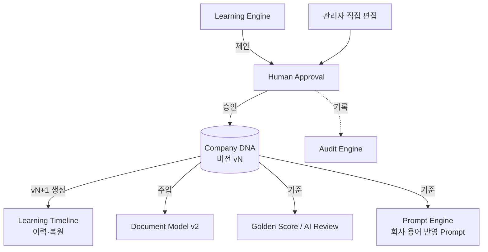

# Company DNA — 회사 운영 방식의 단일 저장소

> **문서 상태**: 📋 설계만 (v2.5 Enterprise Edition · 미구현)
> **관련 문서**: [LEARNING_ENGINE.md](LEARNING_ENGINE.md) · [COMPANY_MEMORY.md](COMPANY_MEMORY.md) · [KNOWLEDGE_BASE.md](KNOWLEDGE_BASE.md) · [GOLDEN_TEMPLATE.md](GOLDEN_TEMPLATE.md) · [RULE_ENGINE.md](RULE_ENGINE.md)
> **한 줄 목적**: 회사의 운영 방식(용어·문체·브랜드·레이아웃·보고 흐름·규칙·워크플로)을 하나의 버전 관리되는 구조로 저장한다.

---

## 목차

1. [목적](#1-목적)
2. [책임](#2-책임)
3. [데이터 흐름](#3-데이터-흐름)
4. [인터페이스 — DNA 스키마](#4-인터페이스--dna-스키마)
5. [확장성](#5-확장성)
6. [장점](#6-장점)
7. [단점](#7-단점)

---

## 1. 목적

Company DNA는 **회사의 운영 방식** 그 자체다. AI가 아니라 AutoDoc Core가 기억하는, 이 회사가 문서를 만드는 모든 방식의 단일 진실 원천(Single Source of Truth)이다.

v1에서 "DocumentModel이 렌더러의 단일 진실"이었듯 ([../DOCUMENT_MODEL.md](../DOCUMENT_MODEL.md)), v2.5에서는 **Company DNA가 회사 지식의 단일 진실**이다.

## 2. 책임

DNA는 아래 구획(Section)의 컨테이너이며, 각 구획의 상세는 담당 문서에 위임한다.

| DNA 구획 | 내용 | 상세 문서 |
|---|---|---|
| Vocabulary / Terminology | 회사 용어·표준 표기 | [KNOWLEDGE_BASE.md](KNOWLEDGE_BASE.md) |
| Writing Style | 문체(경어·개조식·수치 표기·요약 스타일) | 본 문서 §4 |
| Brand Rule / Logo Rule | 로고 위치·금지 변형·브랜드 문구 | 본 문서 §4 |
| Layout Rule / Color Rule / Font Rule | 페이지 구성·회사 색상 토큰·폰트 체계 | 본 문서 §4 (v1 Theme와 연동) |
| Table Rule / Chart Rule / Image Rule | 표 머리행 스타일·차트 종류 선호·이미지 배치 | 본 문서 §4 |
| Section Order / Report Flow | 보고서 목차 순서·보고 전개 방식 | 본 문서 §4 |
| Golden Template / Golden Prompt (참조) | 기준 문서·기준 Prompt 링크 | [GOLDEN_TEMPLATE.md](GOLDEN_TEMPLATE.md) |
| Knowledge Base / Company Memory (참조) | 용어·반복 자산 링크 | [KNOWLEDGE_BASE.md](KNOWLEDGE_BASE.md) · [COMPANY_MEMORY.md](COMPANY_MEMORY.md) |
| Rule Set (참조) | 업무 규칙 링크 | [RULE_ENGINE.md](RULE_ENGINE.md) |
| Workflow (참조) | 결재 흐름 링크 | [WORKFLOW_ENGINE.md](WORKFLOW_ENGINE.md) |

**쓰기 규칙**: DNA에 대한 모든 쓰기는 ① 승인된 Learning Proposal 또는 ② 관리자 직접 편집(역시 Audit 대상)뿐이다. AI·Plugin·일반 사용자는 DNA를 직접 쓸 수 없다.

## 3. 데이터 흐름

```
[쓰기]  Learning Engine 제안 → Confidence 등급 → Human Approval 승인 → DNA 반영(dna.updated 이벤트)
[읽기]  Document Model 조립 시 DNA 주입 → Golden Score 평가 → AI Review 검사 기준
[버전]  모든 반영은 새 DNA 버전 생성 (Learning Timeline) → 이전 버전 복원 가능
```



## 4. 인터페이스 — DNA 스키마

```json
{
  "workspaceId": "baz",
  "dnaVersion": 12,
  "schemaVersion": "dna.v1",
  "writingStyle": { "tone": "개조식", "honorific": false, "numberFormat": "1,234.5", "summaryStyle": "3줄 요약 후 상세" },
  "brandRule":  { "logoPosition": "top-right", "forbidden": ["로고 변형", "비승인 색 조합"], "slogan": "…" },
  "layoutRule": { "pageMargins": "…", "gridPreference": "12col" },
  "colorRule":  { "primary": "#0B5FFF", "accent": "#FF6B00", "danger": "#D32F2F" },
  "fontRule":   { "heading": "Noto Sans KR Bold", "body": "Noto Sans KR", "minSize": 10 },
  "tableRule":  { "headerFill": "primary", "zebra": true, "numberAlign": "right" },
  "chartRule":  { "preferred": ["bar", "line"], "colorSource": "colorRule" },
  "imageRule":  { "captionPosition": "below", "maxPerPage": 2 },
  "sectionOrder": { "weekly-report": ["요약", "실적", "이슈", "계획"], "capa": ["문제", "원인", "시정조치", "예방조치", "효과확인"] },
  "reportFlow": { "default": "결론 우선(두괄식)" },
  "refs": { "goldenTemplates": ["gt-weekly@v4"], "goldenPrompts": ["ppt-analyzer.structure@v3"],
            "knowledgeBase": "kb@v9", "memory": "mem@v7", "ruleSet": "rules@v5", "workflows": ["wf-report@v2"] },
  "confidence": { "writingStyle.tone": 0.98, "colorRule.primary": 0.99, "sectionOrder.capa": 0.86 }
}
```

| 연산(개념) | 서명 | 제약 |
|---|---|---|
| 조회 | `get(workspaceId, version?) → DNA` | 버전 생략 시 최신 |
| 반영 | `apply(approvedProposal) → dnaVersion+1` | Human Approval 통과분만 |
| 복원 | `restore(workspaceId, version) → dnaVersion+1` | 복원도 새 버전(이력 보존) |
| 항목별 신뢰도 | `confidenceOf(path) → 0~1` | [CONFIDENCE_ENGINE.md](CONFIDENCE_ENGINE.md) 등급 판정 입력 |

**v1 연동**: `colorRule`·`fontRule`은 v1 Theme JSON([../THEME_ENGINE.md](../THEME_ENGINE.md))의 토큰으로 사영(projection)되어 기존 렌더러가 무수정으로 소비한다.

## 5. 확장성

- **구획 추가** = 스키마에 새 키 + `schemaVersion` 상향. 기존 구획 불변.
- **Learning Timeline**: 연 단위 구조 변화(예: "2026 보고서 구조 변경")도 DNA 버전 이력으로 자연 기록·복원 ([LEARNING_ENGINE.md](LEARNING_ENGINE.md) §5).
- **Workspace 복제**: 신규 회사 온보딩 시 익명화된 DNA 골격(값 없는 스키마)을 시드로 제공.

## 6. 장점

1. **단일 진실** — "우리 회사 표는 어떻게 만드나"의 답이 한 곳에 있다.
2. **버전·복원** — 운영 방식의 변화가 이력으로 남고 언제든 되돌릴 수 있다.
3. **항목별 신뢰도** — 확실한 규칙(자동 적용)과 불확실한 규칙(질문)을 구분해 운영.
4. **v1 무수정 소비** — Theme 토큰 사영으로 기존 렌더러가 DNA 혜택을 그대로 받는다.

## 7. 단점

1. **스키마 경직성** — 정형 스키마에 담기 어려운 미묘한 스타일이 존재한다. (→ Company Memory의 예시 기반 보완, [COMPANY_MEMORY.md](COMPANY_MEMORY.md))
2. **버전 폭증** — 학습이 활발할수록 DNA 버전이 빠르게 늘어난다. (→ 주기적 스냅샷 + 차분 저장)
3. **초기 빈약함** — 학습 전 DNA는 비어 있어 초기 문서 품질이 낮다. (→ Company Learning Mode 50~500개 일괄 학습으로 해소, [ROADMAP.md](ROADMAP.md) §3)
