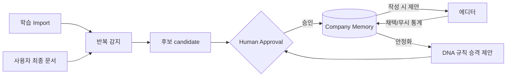

# Company Memory — 반복 사용 자산의 기억

> **문서 상태**: 📋 설계만 (v2.5 Enterprise Edition · 미구현)
> **관련 문서**: [COMPANY_DNA.md](COMPANY_DNA.md) · [LEARNING_ENGINE.md](LEARNING_ENGINE.md) · [KNOWLEDGE_BASE.md](KNOWLEDGE_BASE.md)
> **한 줄 목적**: 회사가 반복적으로 사용하는 문장·레이아웃·표·그래프·용어·보고 방식을 예시(Instance) 단위로 기억하고 재사용하게 한다.

---

## 목차

1. [목적](#1-목적)
2. [책임](#2-책임)
3. [데이터 흐름](#3-데이터-흐름)
4. [인터페이스](#4-인터페이스)
5. [확장성](#5-확장성)
6. [장점](#6-장점)
7. [단점](#7-단점)

---

## 1. 목적

DNA가 **규칙**(rule)이라면 Memory는 **예시**(instance)다. "표 머리행은 파란색"은 DNA, "매주 쓰는 바로 그 실적 표"는 Memory다. 규칙으로 일반화되기 전의 살아있는 반복 자산을 기억한다.

| 기억 대상 | 예 |
|---|---|
| 반복 사용 문장 | "본 보고서는 주간 CS 처리 현황을 요약한 것임" |
| 레이아웃 | 주간보고 1페이지의 상단 요약 4분할 배치 |
| 표 | 실적 집계 표 (열 구성·정렬·합계 행) |
| 그래프 | 월별 Call 추이 라인 차트 구성 |
| 용어 | 자주 쓰는 표현 묶음 (KB 승격 전 후보 포함) |
| 보고 방식 | "결론 → 근거 수치 → 다음 주 계획" 전개 |

## 2. 책임

| 책임 | 설명 |
|---|---|
| 수집 | 학습 Import·사용자 문서 생성 과정에서 반복 감지된 조각을 후보로 축적 |
| 승격 | 반복 횟수·유사도가 임계치를 넘으면 Memory 항목으로 제안 → Human Approval |
| 제공 | 문서 작성 시 "회사가 늘 쓰는 그것" 자동 제안 (에디터 삽입 후보) |
| 일반화 전달 | 예시가 충분히 안정되면 DNA 규칙 후보로 승격 제안 (Memory → DNA) |
| 하지 않는 것 | 자동 삽입(제안만), 규칙 저장(→ DNA), 용어 정의(→ KB) |

## 3. 데이터 흐름

```
[수집]  Analyzer payload / 사용자 최종 문서
   ↓  반복 감지 (동일·유사 조각 N회 이상)
후보 등록 (candidate, 신뢰도 낮음)
   ↓  Human Approval
Memory 항목 확정 (usageCount 추적 시작)
   ↓  사용 축적
   ├─ 문서 작성 시 제안 → 채택/무시 통계
   └─ 안정화(높은 채택률) → DNA 규칙 승격 제안
```



## 4. 인터페이스

```json
{
  "memoryId": "mem-sent-0042",
  "type": "sentence | layout | table | chart | term-usage | report-flow",
  "content": { "text": "본 보고서는 주간 CS 처리 현황을 요약한 것임" },
  "context": { "docTypes": ["weekly-report"], "position": "머리말" },
  "stats": { "seenCount": 41, "proposedCount": 18, "acceptedCount": 17 },
  "status": "candidate | active | promoted-to-dna | retired",
  "confidence": 0.93,
  "lastSeen": "2026-07-08"
}
```

| 연산(개념) | 서명 |
|---|---|
| 제안 조회 | `suggest(docType, section) → MemoryItem[]` (채택률 순) |
| 사용 보고 | `feedback(memoryId, accepted: boolean)` |
| 승격 제안 | `promoteToDNA(memoryId) → LearningProposal` |
| 은퇴 | `retire(memoryId)` — 채택률 급락 항목 (관리자 승인) |

## 5. 확장성

- **타입 추가** = `type` 열거값 확장 (예: 이미지 배치 패턴 📋).
- **레이아웃·표 Memory는 v1 Template 조각(JSON)** 형식을 그대로 사용 — 에디터 삽입 시 v1 엔진이 무수정 렌더링 ([../JSON_SCHEMA.md](../JSON_SCHEMA.md)).
- 채택/무시 통계는 Confidence Engine의 학습 입력으로 재사용 ([CONFIDENCE_ENGINE.md](CONFIDENCE_ENGINE.md) §3).

## 6. 장점

1. **즉효성** — 규칙 일반화를 기다리지 않고 "늘 쓰는 그 표"를 바로 재사용.
2. **자연 선택** — 채택률 통계로 좋은 기억은 강화되고 안 쓰는 기억은 은퇴한다.
3. **DNA의 예시 기반 보완** — 스키마에 담기 어려운 미묘한 스타일을 실물로 보존.

## 7. 단점

1. **기억 비대화** — 후보가 무한정 쌓일 수 있다. (→ 임계치 미달 후보 자동 소멸 주기)
2. **낡은 기억** — 회사 방식이 바뀌면 과거 기억이 잡음이 된다. (→ `lastSeen` 기반 감쇠 + 은퇴 절차)
3. **민감 정보 잔존** — 반복 문장에 고객명 등이 포함될 수 있다. (→ 후보 등록 시 마스킹 검사, 승인 화면에 원문 노출 경고)
