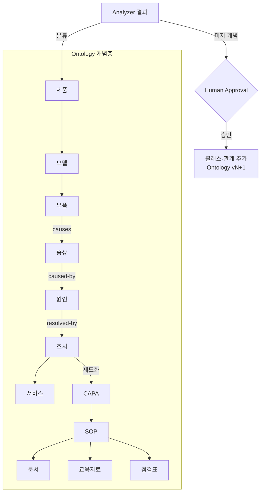

# Company Ontology — 회사 도메인의 상위 개념 체계

> **문서 상태**: 📋 설계만 (v2.5 Enterprise Edition · 미구현)
> **관련 문서**: [KNOWLEDGE_BASE.md](KNOWLEDGE_BASE.md) · [KNOWLEDGE_GRAPH.md](KNOWLEDGE_GRAPH.md) · [LEARNING_ENGINE.md](LEARNING_ENGINE.md)
> **한 줄 목적**: Knowledge Base(용어 목록)보다 한 단계 높은 개념 체계 — "이 회사에 어떤 종류의 것들이 있고 서로 어떤 관계인가"를 정의한다.

---

## 목차

1. [목적](#1-목적)
2. [책임](#2-책임)
3. [데이터 흐름](#3-데이터-흐름)
4. [인터페이스](#4-인터페이스)
5. [확장성](#5-확장성)
6. [장점](#6-장점)
7. [단점](#7-단점)

---

## 1. 목적

KB가 "Handpiece라는 용어가 있다"를 저장한다면, Ontology는 **"Handpiece는 '부품'이라는 개념 클래스에 속하고, 부품은 모델에 속하며, 증상을 일으키고, 조치와 SOP로 이어진다"** 는 상위 구조를 정의한다.

기본 개념 사슬(시드):

```
제품 → 모델 → 부품 → 증상 → 원인 → 조치 → 서비스
                                   ↓
              문서 ← SOP ← CAPA ← (조치의 제도화)
                ↓
          교육자료 · 점검표
```

모든 관계는 Graph 형태로 저장한다 ([KNOWLEDGE_GRAPH.md](KNOWLEDGE_GRAPH.md)가 저장·탐색 계층).

## 2. 책임

| 책임 | 설명 |
|---|---|
| 개념 클래스 정의 | 제품·모델·부품·증상·원인·조치·서비스·문서·SOP·CAPA·교육자료·점검표 (시드 12종) |
| 관계 타입 정의 | `belongs-to`(소속) · `causes`(유발) · `resolves`(해결) · `documented-by`(문서화) · `trains-for`(교육) · `checked-by`(점검) 등 |
| 스키마 검증 | KB 용어·Graph 엣지가 Ontology가 허용하는 클래스·관계인지 검증 |
| 학습 수용 | Analyzer(VOC/CAPA/SOP/Quality)가 발견한 새 개념·관계 후보를 승인 절차로 수용 |
| 하지 않는 것 | 인스턴스 저장(→ KB·Graph), 자동 확장(→ Human Approval 필수) |

**KB · Ontology · Graph의 3층 관계**

| 층 | 질문 | 예 |
|---|---|---|
| Ontology (개념) | 어떤 종류가 있는가? | "부품"이라는 클래스, "부품은 증상을 유발한다"는 관계 타입 |
| Knowledge Base (용어) | 그 종류의 실제 항목은? | Handpiece, 노즐, 약액 라인 |
| Knowledge Graph (관계 인스턴스) | 실제로 무엇이 무엇과 연결되는가? | Handpiece —causes→ 노즐누수 |

## 3. 데이터 흐름

```
Analyzer payload (VOC·CAPA·SOP·Quality …)
   ↓
개념 분류 시도: 기존 클래스에 매핑
   ├─ 매핑 성공 → KB/Graph 인스턴스 제안으로 전달
   └─ 미지의 개념 → "새 클래스/관계 후보" 제안 (confidence 낮음 → 관리자 질문 등급)
   ↓ Human Approval
Ontology 버전 갱신 (클래스·관계 타입 추가)
   ↓
KB·Graph 검증 규칙 자동 갱신
```



## 4. 인터페이스

```json
{
  "ontologyVersion": 3,
  "classes": [
    { "id": "part", "name": "부품", "parent": "model" },
    { "id": "symptom", "name": "증상" }
  ],
  "relations": [
    { "id": "causes", "name": "유발", "from": "part", "to": "symptom", "cardinality": "N:M" },
    { "id": "resolved-by", "name": "해결", "from": "symptom", "to": "action", "cardinality": "N:M" }
  ]
}
```

| 연산(개념) | 서명 |
|---|---|
| 분류 | `classify(termCandidate) → classId?` |
| 검증 | `validateEdge(fromClass, relation, toClass) → boolean` |
| 확장 제안 | `proposeClass(name, evidence[]) → LearningProposal` |
| 버전 조회 | `get(version?) → Ontology` |

## 5. 확장성

- **업종 시드 교체**: 의료기기 CS 시드(위 12종) 외 업종별 시드 팩 구성 가능 — Workspace 생성 시 선택.
- **다층 계층**: 클래스에 `parent`가 있어 세분화(부품 → 소모품/비소모품)가 스키마 변경 없이 가능.
- **관계 속성**: 관계에 속성(발생 빈도·심각도) 추가는 `schemaVersion` 상향으로 수용.

## 6. 장점

1. **지식의 뼈대** — 용어가 쌓이기 전에 구조가 있어, 학습이 목록이 아니라 체계로 축적된다.
2. **검증 게이트** — 엉뚱한 관계(예: 증상이 제품을 유발)를 스키마 수준에서 차단.
3. **질문 생성 근거** — "노즐누수가 증상인가요, 원인인가요?" 같은 좋은 질문을 시스템이 만들 수 있다.

## 7. 단점

1. **초기 설계 부담** — 개념 체계는 도메인 전문가(관리자)의 판단이 필요하다. (→ 시드 제공 + 점진 확장)
2. **과도한 정형화 위험** — 현실의 애매한 개념(증상이자 원인)이 존재한다. (→ 다중 클래스 소속 허용은 차기 검토 📋)
3. **버전 간 이행** — 클래스 개편 시 기존 Graph 인스턴스 재분류 비용이 크다. (→ 개편은 Learning Timeline 이벤트로 기록, 일괄 재분류 도구 필요)
