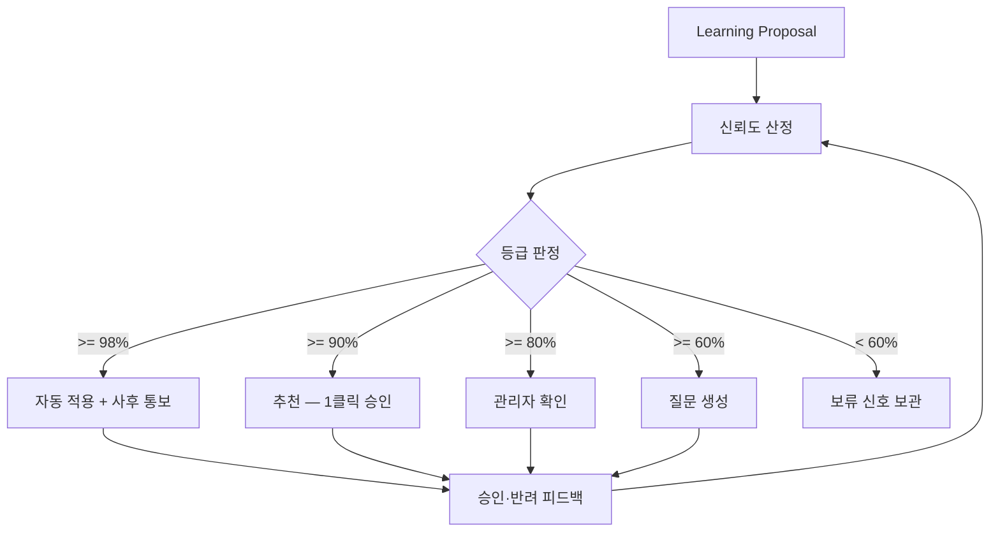

# Confidence Engine — 모든 판단의 신뢰도 등급화

> **문서 상태**: 📋 설계만 (v2.5 Enterprise Edition · 미구현)
> **관련 문서**: [LEARNING_ENGINE.md](LEARNING_ENGINE.md) · [HUMAN_APPROVAL.md](HUMAN_APPROVAL.md) · [COMPANY_DNA.md](COMPANY_DNA.md)
> **한 줄 목적**: 모든 학습 결과·판단에 신뢰도(0~1)를 저장하고, 4단계 등급(자동 적용/추천/관리자 확인/질문)으로 처리 경로를 결정한다.

---

## 목차

1. [목적](#1-목적)
2. [책임](#2-책임)
3. [데이터 흐름](#3-데이터-흐름)
4. [인터페이스](#4-인터페이스)
5. [확장성](#5-확장성)
6. [장점](#6-장점)
7. [단점](#7-단점)

---

## 1. 목적

시스템이 "얼마나 확신하는가"를 숨기지 않는다. 모든 학습 결과에는 신뢰도가 저장되고, 신뢰도가 처리 방식을 결정한다.

### 등급표 (기준선)

| 신뢰도 | 등급 | 처리 |
|---|---|---|
| ≥ 98% | **자동 적용** | 반영 후 사후 통보 (관리자는 언제든 되돌림 가능) |
| ≥ 90% | **추천** | 승인함에 "권장" 표시 — 1클릭 승인 |
| ≥ 80% | **관리자 확인** | 근거와 함께 검토 요청 |
| ≥ 60% | **질문** | 시스템이 관리자에게 질문 생성 ("노즐누수는 증상인가요, 원인인가요?") |
| < 60% | 폐기 후보 | 제안하지 않고 신호로만 보관 |

> **주의**: "자동 적용"조차 [HUMAN_APPROVAL.md](HUMAN_APPROVAL.md)의 예외가 아니다 — 관리자가 사전에 "98% 이상 자동 적용"을 **정책으로 승인**했기 때문에 가능한 것이며, 모든 자동 적용은 사후 통보·즉시 롤백 대상이다.

## 2. 책임

| 책임 | 설명 |
|---|---|
| 점수 산정 | Learning Proposal의 confidence 계산 (아래 산정 입력) |
| 등급 판정 | 점수 → 4등급 매핑 (임계값은 Workspace 설정 — Configuration First) |
| 신뢰도 갱신 | 승인/반려 결과를 피드백으로 산정 가중치 보정 |
| 질문 생성 | 60% 등급 제안을 사람이 답할 수 있는 질문 형태로 변환 |
| 하지 않는 것 | 반영 실행(→ Human Approval → Learning apply), 임계값 임의 변경(관리자 설정) |

### 산정 입력

| 입력 | 방향 | 예 |
|---|---|---|
| AI 자기 신고 confidence | 기본값 | JSON Contract의 `confidence` 필드 |
| 근거 수·다양성 | ↑ | 문서 12개에서 동일 패턴 관측 |
| 신호 종류 가중치 | ↑ | 관리자 수정 > 사용자 수정 > Import |
| 모순 신호 존재 | ↓↓ | 반대 방향 제안 병존 → 강제 '질문' 등급 |
| 과거 유사 제안의 반려율 | ↓ | 같은 경로(path) 제안이 3회 반려됨 |
| Prompt 정확도 | ↑ | 출처 Prompt의 Marketplace accuracy |

## 3. 데이터 흐름

```
Learning Proposal (confidence 미정)
   ↓
산정: 기본값(AI 신고) × 근거 보정 × 신호 가중 × 모순 검사 × 이력 보정
   ↓
등급 판정 (Workspace 임계값)
   ├─ 자동 적용  → 반영 + 사후 통보
   ├─ 추천/확인 → 승인함
   └─ 질문      → 질문함 ("A인가요 B인가요?" + 근거)
   ↓
승인/반려/답변 결과 → 산정 가중치 피드백 (다음 산정에 반영)
```



## 4. 인터페이스

```json
{
  "proposalId": "lp-2026-07-0311",
  "confidence": 0.91,
  "grade": "recommend",
  "factors": [
    { "name": "ai-self-report", "value": 0.92 },
    { "name": "evidence-count", "value": "+0.04 (문서 7개)" },
    { "name": "signal-weight",  "value": "+0.02 (관리자 수정 포함)" },
    { "name": "history",        "value": "-0.07 (유사 제안 1회 반려)" }
  ],
  "thresholds": { "auto": 0.98, "recommend": 0.90, "review": 0.80, "question": 0.60 }
}
```

| 연산(개념) | 서명 |
|---|---|
| 산정 | `score(proposal) → { confidence, grade, factors[] }` |
| 임계값 설정 | `setThresholds(workspaceId, thresholds)` — 관리자 전용, Audit 기록 |
| 피드백 | `feedback(proposalId, outcome: approved|rejected|answered)` |
| 질문 변환 | `toQuestion(proposal) → { question, options[], evidence[] }` |

`factors[]`는 승인 화면에 그대로 노출된다 — 관리자는 "왜 91%인지"를 보고 판단한다(설명 가능성).

## 5. 확장성

- **임계값은 Workspace별 설정** — 보수적 회사는 auto를 100%(사실상 비활성)로 올릴 수 있다.
- **산정 인자 추가** = factor 계산기 1개 추가. 등급 판정·하류 무수정.
- **경로별 정책**: DNA의 민감 구획(Brand Rule)은 등급과 무관하게 항상 '관리자 확인' 이상으로 강제하는 경로 정책 📋.

## 6. 장점

1. **처리 자동화와 통제의 균형** — 확실한 것은 빠르게, 애매한 것은 신중하게.
2. **설명 가능성** — 점수의 근거(factors)가 항상 함께 저장·노출된다.
3. **자기 교정** — 반려 피드백이 산정에 반영되어 과신이 줄어든다.

## 7. 단점

1. **산정의 자의성** — 가중치 초기값은 결국 설계자의 추정이다. (→ 피드백 루프로 보정, 초기엔 보수적 임계값 권장)
2. **AI 자기 신고 의존** — 기본값이 AI의 자기 평가라 과대 신고 AI에 취약하다. (→ AI 프로필별 신고 보정 계수)
3. **임계값 민감성** — 98 vs 97의 경계는 본질적으로 인위적이다. (→ 경계 ±1% 구간은 한 등급 아래로 처리하는 완충 규칙)
