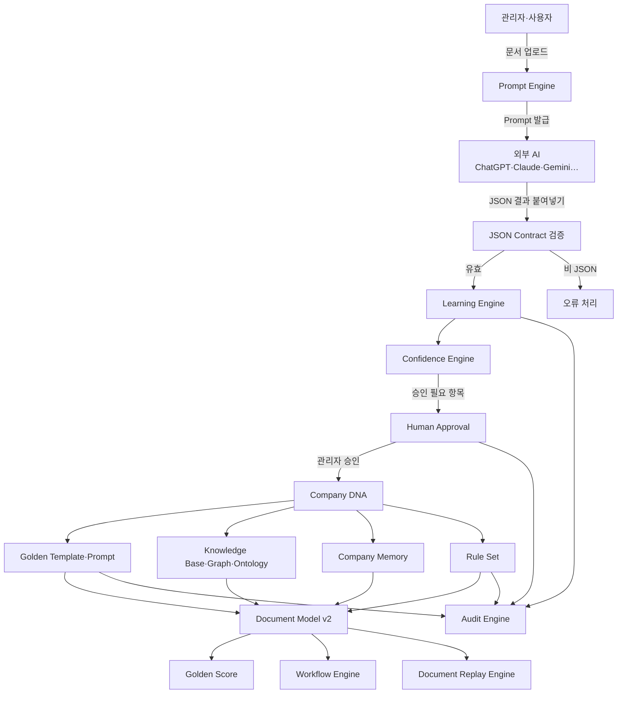

# AutoDoc v2.5 — Enterprise Document Operating System 마스터 설계

> **문서 상태**: 📋 설계만 (v2.5 Enterprise Edition · 2026-07 · **미구현**)
> **문서 스위트**: 전체 지도는 [README.md](README.md) — 26종 설계 문서의 시작점
> **v1 관계**: v1 설계·구현 기록은 [../DESIGN.md](../DESIGN.md) 참조. v1 문서·코드는 **절대 수정하지 않는다.**
> **한 줄 목적**: AutoDoc을 "문서를 생성하는 프로그램"에서 **"회사를 학습하는 Company Learning 기반 Enterprise Document Operating System"** 으로 발전시키는 설계 확정 문서.

---

## 목차

1. [목적](#1-목적)
2. [책임](#2-책임)
3. [데이터 흐름](#3-데이터-흐름)
4. [인터페이스](#4-인터페이스)
5. [확장성](#5-확장성)
6. [장점](#6-장점)
7. [단점](#7-단점)
8. [v1과의 관계](#8-v1과의-관계)

---

## 1. 목적

| 항목 | 내용 |
|---|---|
| 프로젝트명 | **AutoDoc v2.5 — Enterprise Document Operating System** |
| 정체성 | AutoDoc은 **AI Platform이 아니다.** AutoDoc은 **Company Learning Platform**이다. |
| 핵심 명제 | AI는 언제나 **외부 분석기(External Assistant)**. 회사의 지식·규칙·문체·레이아웃·업무 프로세스를 **기억하는 주체는 AutoDoc Core**다. |
| AI 독립 | Core는 AI를 모른다. OpenAI/Claude/Gemini/Copilot/DeepSeek/Qwen 등 모든 AI는 **Plugin**이다. |
| 기본 동작 | AI API를 기본적으로 사용하지 않는다 — **AI Import Mode** ([AI_ARCHITECTURE.md](AI_ARCHITECTURE.md)) |
| 이번 단계 | **설계 문서만 작성.** HTML/CSS/JS/Apps Script/Sheets 구현 절대 금지. 기존 파일 무수정. |

### 핵심 사상

> **"AutoDoc는 AI를 학습하지 않는다. 회사를 학습한다."**

v1의 사상 "새 문서 추가 = 코드가 아니라 JSON 등록"을 그대로 계승하고, 한 단계 확장한다:

> **"새 지능 추가 = 코드가 아니라 학습(Company DNA) 축적"**

문서 생성 능력(v1 엔진)은 이미 있다. v2.5는 그 위에 **회사가 어떻게 일하는지를 기억하는 층**(Company DNA · Memory · Ontology · Knowledge Graph · Rule)과 **엔터프라이즈 운영 층**(Workflow · Replay · Audit · Event Bus · Feature Flag)을 얹는다.

## 2. 책임

v2.5 시스템 전체의 책임 분할. 각 모듈의 상세 책임은 개별 문서에 위임한다.

| 영역 | 모듈 | 책임 | 문서 |
|---|---|---|---|
| AI 경계 | AI Architecture | AI Import Mode, JSON Contract, AI Provider 독립 | [AI_ARCHITECTURE.md](AI_ARCHITECTURE.md) |
| Prompt | Prompt Engine / Library / Marketplace / Lab | Prompt 자동 생성·버전·자산화·실험 | [PROMPT_ENGINE.md](PROMPT_ENGINE.md) 외 3종 |
| 학습 | Learning / Confidence Engine | 회사 학습, 신뢰도 산정 | [LEARNING_ENGINE.md](LEARNING_ENGINE.md) · [CONFIDENCE_ENGINE.md](CONFIDENCE_ENGINE.md) |
| 기억 | Company DNA / Memory / Ontology / KB / KG | 회사 운영 방식·용어·관계의 저장 | [COMPANY_DNA.md](COMPANY_DNA.md) 외 4종 |
| 기준 | Golden Template / Golden Prompt / Golden Score | 회사 문서의 기준과 품질 평가 | [GOLDEN_TEMPLATE.md](GOLDEN_TEMPLATE.md) |
| 통제 | Human Approval / Rule Engine | 자동 변경 금지, 업무 규칙 | [HUMAN_APPROVAL.md](HUMAN_APPROVAL.md) · [RULE_ENGINE.md](RULE_ENGINE.md) |
| 운영 | Workflow / Replay / Audit | 결재 흐름, 생성 과정 재현, 변경 이력 | [WORKFLOW_ENGINE.md](WORKFLOW_ENGINE.md) 외 2종 |
| 기반 | Event Bus / Feature Flag / Multi Workspace | 모듈 간 결합 해제, 기능 토글, 회사별 격리 | [EVENT_BUS.md](EVENT_BUS.md) · [FEATURE_FLAG.md](FEATURE_FLAG.md) · [ARCHITECTURE.md](ARCHITECTURE.md) §5 |
| 문서 | Document Model v2 | 렌더러 중립 문서 모델 + DNA/학습 메타데이터 | [DOCUMENT_MODEL.md](DOCUMENT_MODEL.md) |
| 확장 | Plugin Architecture | AI/OCR/ERP/MES/SAP/메일/Slack/Teams/전자결재/Barcode/QR/DB | [PLUGIN_ARCHITECTURE.md](PLUGIN_ARCHITECTURE.md) |

## 3. 데이터 흐름

### 기본 Workflow (AI Import Mode — API 호출 없음)

```
회사 문서 업로드 (PPT/Word/Excel/PDF/SOP/회의록/품질보고/점검표/CAPA/ISO …)
  ↓
Prompt 자동 생성  (Prompt Engine — 문서 종류 × AI 종류 × 분석 목적 × 출력 형식 × 난이도 × 언어)
  ↓
사용자가 원하는 AI 사용  (ChatGPT / Claude / Gemini … — AutoDoc 외부)
  ↓
JSON 결과 복사 → AutoDoc 붙여넣기  (JSON Contract 검증 — 비 JSON 은 오류)
  ↓
Company Learning  (Learning Engine + Confidence Engine + Human Approval)
  ↓
Golden Template 생성 → Knowledge Base 생성 → Company Memory 생성 → Document Model 생성
```

### 전체 시스템 흐름



모든 모듈 간 연결은 직접 호출이 아니라 [EVENT_BUS.md](EVENT_BUS.md)의 이벤트로 이루어진다.

## 4. 인터페이스

시스템 최상위 경계 인터페이스 3개. 상세 계약은 각 문서 §4에 있다.

| 경계 | 계약 | 방향 | 정의 문서 |
|---|---|---|---|
| **AI 경계** | JSON Contract (공통 응답 스키마) | 외부 AI → AutoDoc (붙여넣기) | [AI_ARCHITECTURE.md](AI_ARCHITECTURE.md) §4 |
| **학습 경계** | Learning Proposal (제안 → 승인 → 반영) | Learning Engine → Human Approval → DNA | [LEARNING_ENGINE.md](LEARNING_ENGINE.md) §4 |
| **확장 경계** | Plugin Contract (register/capabilities/events) | Plugin → Core (단방향) | [PLUGIN_ARCHITECTURE.md](PLUGIN_ARCHITECTURE.md) §4 |

핵심 불변식(Invariant):

1. Core 코드 어디에도 특정 AI 이름·API 엔드포인트가 등장하지 않는다.
2. 학습 결과는 관리자 승인 없이 Company DNA에 반영되지 않는다.
3. Plugin은 Core를 수정하지 않는다 — 이벤트 구독과 계약 구현만 한다.
4. 모든 변경은 Audit Engine에 기록되고, 모든 문서는 Replay 가능하다.

## 5. 확장성

| 시나리오 | 대응 방법 | Core 수정 |
|---|---|---|
| 새 AI 출시 (예: 신규 LLM) | AI Plugin 1개 추가 + Prompt Engine에 AI 프로필 등록 | **없음** |
| AI API 직접 연결 전환 | AI Import Mode → AI API Plugin (동일 JSON Contract) | **없음** |
| 새 문서 종류 | Analyzer Prompt + Template JSON 등록 (v1 사상 유지) | **없음** |
| 새 회사(테넌트) | Workspace 추가 — 독립 DNA/KB/Prompt/Workflow/Rule/Memory | **없음** |
| 새 외부 시스템 (ERP/MES/SAP…) | Plugin 추가 | **없음** |
| 신기능 점진 배포 | Feature Flag로 Workspace별 활성/비활성 | **없음** |

## 6. 장점

1. **AI 종속 제로** — 어떤 AI가 흥하고 망해도 Core는 불변. 비용·보안 정책에 따라 AI를 자유롭게 교체.
2. **API Key 불필요(기본)** — Import Mode는 API 비용·키 관리·보안 심사 부담이 없다. 사내 보안 정책이 엄격해도 도입 가능.
3. **회사 지식의 자산화** — Prompt·Template·DNA·KB가 모두 버전 관리되는 회사 자산이 된다.
4. **감사 대응(Audit·ISO)** — 모든 문서의 생성 과정을 Replay로 재현, 모든 변경 이력을 Audit로 추적.
5. **v1 자산 100% 보존** — 기존 엔진(Template × Renderer)을 그대로 하부 계층으로 사용. 재작성 없음.
6. **인간 통제** — Confidence + Human Approval로 AI의 자동 변경을 원천 차단.

## 7. 단점

1. **수동 단계 존재** — Import Mode는 사용자가 AI에 Prompt를 복사·결과를 붙여넣는 수작업이 필요하다. (→ 향후 AI API Plugin으로 선택적 자동화, [ROADMAP.md](ROADMAP.md) §5)
2. **AI 응답 품질 편차** — 외부 AI가 JSON Contract를 지키지 않으면 오류 처리·재시도 UX 비용이 발생한다.
3. **설계 복잡도 증가** — v1(문서 생성) 대비 모듈 수가 크게 늘어 학습 곡선이 있다. (→ Feature Flag로 단계적 활성화)
4. **저장소 부담** — DNA·Memory·Graph·Audit·Replay 스냅샷은 Sheets 기반 저장소에 부하를 준다. (→ [ARCHITECTURE.md](ARCHITECTURE.md) §5 저장 전략)
5. **초기 학습 비용** — 최초 설치 시 회사 문서 50~500개 이상 업로드·분석·승인하는 운영 노력이 필요하다.

## 8. v1과의 관계

| 구분 | v1 (as-built) | v2.5 (이번 설계) |
|---|---|---|
| 정체성 | 문서 자동화 플랫폼 | Company Learning 기반 Document OS |
| AI | GAS 프록시로 Claude API 직접 호출 (Phase 4 AI Template Builder) | Core는 AI 무지(無知). Import Mode 기본, API는 Plugin |
| 지식 | Template JSON + Theme JSON | + Company DNA·Memory·Ontology·KB·KG·Rule |
| 품질 | Validation(입력 검증) | + Golden Template·Prompt·Score, AI Review |
| 운영 | 생성 이력 시트 | + Workflow·Replay·Audit·Feature Flag·Multi Workspace |
| 문서 위치 | `autodoc/docs/` (무수정 보존) | `autodoc/docs/v2/` (신규) |

v1의 AI Template Builder는 폐기가 아니라 **"최초의 AI Plugin 선행 사례"로 재해석**된다 — 이행 경로는 [AI_ARCHITECTURE.md](AI_ARCHITECTURE.md) §5 참조.
