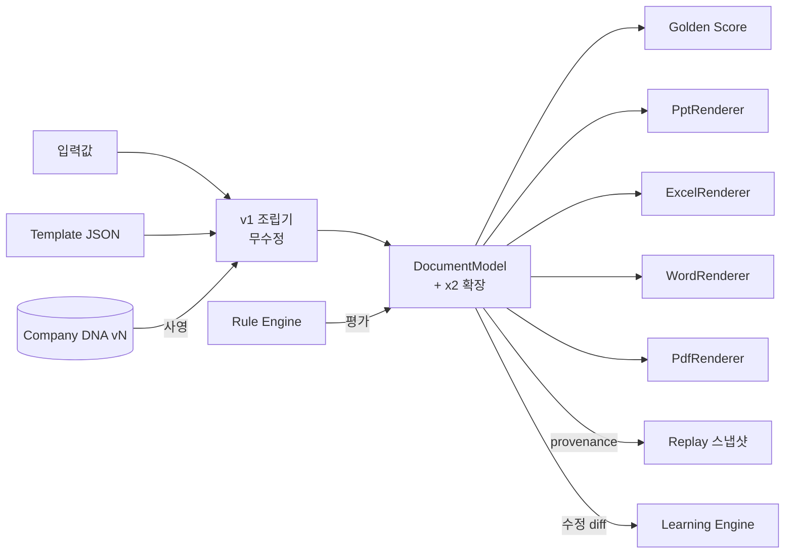

# Document Model v2 — DNA가 주입되는 렌더러 중립 문서 모델

> **문서 상태**: 📋 설계만 (v2.5 Enterprise Edition · 미구현)
> **관련 문서**: v1 [../DOCUMENT_MODEL.md](../DOCUMENT_MODEL.md) (기반 — 무수정) · [COMPANY_DNA.md](COMPANY_DNA.md) · [GOLDEN_TEMPLATE.md](GOLDEN_TEMPLATE.md) · [DOCUMENT_REPLAY_ENGINE.md](DOCUMENT_REPLAY_ENGINE.md)
> **한 줄 목적**: v1 DocumentModel(렌더러의 단일 진실)을 보존한 채, DNA 주입·학습 메타데이터·Replay 참조를 덧붙인 v2 확장 모델을 정의한다.

---

## 목차

1. [목적](#1-목적)
2. [책임](#2-책임)
3. [데이터 흐름](#3-데이터-흐름)
4. [인터페이스](#4-인터페이스)
5. [확장성](#5-확장성)
6. [장점](#6-장점)
7. [단점](#7-단점)

---

## 1. 목적

v1의 대원칙 "모든 렌더러와 미리보기는 같은 DocumentModel만 입력받는다"([../README.md](../README.md) 절대 원칙 4)를 **그대로 유지**한다. v2는 이 모델을 바꾸지 않고 **감싼다** — 조립 과정에 DNA를 주입하고, 조립 결과에 학습·재현 메타데이터를 부착한다.

```
v1:  입력값 + Template + Theme                     → DocumentModel → Renderers
v2:  입력값 + Template + Theme + Company DNA + Rule → DocumentModel (본체 불변)
                                                      + provenance(재현 메타데이터) ← 신규
```

## 2. 책임

| 구성 | 책임 | v1 대비 |
|---|---|---|
| 모델 본체 | 렌더러 중립 문서 구조 (페이지·구획·컴포넌트·바인딩) | **불변** — v1 그대로 |
| DNA 주입기 | 조립 시 DNA 규칙을 Theme 토큰·기본값으로 사영 (Color/Font → Theme, Section Order → 구획 순서 기본값, Table Rule → 표 기본 스타일) | 신규 |
| Rule 평가 훅 | 조립 완료 시 [RULE_ENGINE.md](RULE_ENGINE.md) `evaluate()` 호출, 효과를 표시 레이어에 부착 (본체 데이터 불변) | 신규 |
| provenance | 이 문서를 만든 모든 참조의 스냅샷 좌표 (아래 §4) | 신규 |
| 학습 신호 방출 | 최종본과 조립본의 diff를 `document.edited` 이벤트로 방출 → [LEARNING_ENGINE.md](LEARNING_ENGINE.md) | 신규 |

**호환성 규칙**: v2 확장 필드는 전부 최상위 `x2` 네임스페이스 아래에 둔다. v1 렌더러는 모르는 키를 무시하므로 **v1 렌더러 4종(PPT/Excel/Word/PDF)은 무수정으로 v2 모델을 소비한다** ([../RENDERER_SPEC.md](../RENDERER_SPEC.md)).

## 3. 데이터 흐름

```
Template 선택 + 사용자 입력
   ↓
DNA 주입 (Workspace 최신 DNA vN → Theme 토큰·기본값 사영)
   ↓
DocumentModel 조립 (v1 조립기 — 무수정)
   ↓
Rule 평가 → highlight/badge/suggest 부착
   ↓
Golden Score 채점 → AI Review 리포트
   ↓
미리보기 → 사용자 수정 → 생성(렌더러)
   ↓
provenance 봉인 + Replay 스냅샷 등록 · 수정 diff 학습 신호 방출
```



## 4. 인터페이스

`x2` 확장 네임스페이스:

```json
{
  "…v1 DocumentModel 본체 그대로…": "",
  "x2": {
    "provenance": {
      "workspaceId": "baz",
      "templateRef": "weekly-report@v7",
      "goldenRef": "gt-weekly@v4",
      "dnaVersion": 12,
      "learningVersion": 19,
      "ruleSetVersion": 5,
      "promptVersions": ["ppt-analyzer.structure@v3"],
      "assembledAt": "2026-07-11T10:00:00+09:00"
    },
    "ruleResults": [ { "ruleId": "rule-voc-warning", "effect": "badge", "target": "sec-2.table-1" } ],
    "goldenScore": { "ref": "gs-2026-07-118", "total": 93.4 },
    "memorySuggestions": [ "mem-sent-0042" ]
  }
}
```

| 연산(개념) | 서명 |
|---|---|
| 조립 | `assemble(templateRef, inputs, workspaceId) → DocumentModelV2` |
| 사영 | `projectDNA(dna) → { themeTokens, defaults }` — 순수 함수 (같은 DNA → 같은 결과, Replay의 전제) |
| diff | `diff(assembled, final) → EditSignal` |
| 봉인 | `seal(model) → provenance 확정 + replay.registered 이벤트` |

## 5. 확장성

- **새 메타데이터** = `x2` 아래 키 추가 — 렌더러·v1 조립기 영향 없음.
- **새 렌더러**는 v1 Renderer 계약을 그대로 구현 — `x2`를 읽으면 부가 기능(배지 인쇄 등) 가능, 안 읽어도 동작.
- **provenance 좌표 추가**: 새 참조 축(예: Plugin 공급 데이터 버전)이 생기면 provenance에 필드 추가 — Replay가 자동 수혜.

## 6. 장점

1. **v1 절대 보존** — 검증된 조립기·렌더러 4종을 단 한 줄도 고치지 않는다.
2. **재현의 뿌리** — provenance가 있어야 [DOCUMENT_REPLAY_ENGINE.md](DOCUMENT_REPLAY_ENGINE.md)가 성립한다.
3. **표시와 데이터의 분리** — Rule 효과는 부착물이라 본체 데이터의 순수성이 유지된다.
4. **학습의 시작점** — 조립본 대비 최종본 diff가 자동으로 학습 신호가 된다.

## 7. 단점

1. **모델 크기 증가** — provenance·ruleResults가 모델을 무겁게 한다. (→ 렌더러 전달 시 `x2` 스트립 옵션)
2. **이중 진실 위험** — DNA 사영값과 Template 자체 값이 충돌할 수 있다. (→ 우선순위 규칙 명문화: 사용자 입력 > Template 명시값 > DNA 기본값)
3. **순수 사영의 유지 부담** — `projectDNA`가 순수 함수여야 Replay가 성립한다 — 리뷰 시 불변 검증 필요.
