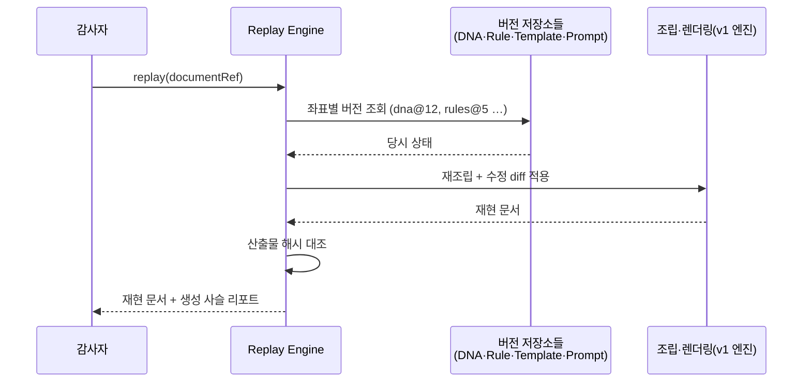

# Document Replay Engine — 문서 생성 과정의 완전 재현

> **문서 상태**: 📋 설계만 (v2.5 Enterprise Edition · 미구현)
> **관련 문서**: [DOCUMENT_MODEL.md](DOCUMENT_MODEL.md)(provenance) · [AUDIT_ENGINE.md](AUDIT_ENGINE.md) · [LEARNING_ENGINE.md](LEARNING_ENGINE.md)
> **한 줄 목적**: 모든 문서는 생성 과정을 재현할 수 있어야 한다 — Golden Template → Golden Prompt → Company DNA → Rule Set → Learning Version → 관리자 수정 → 최종 문서의 사슬을 복원한다. Audit·ISO 대응의 근거.

---

## 목차

1. [목적](#1-목적)
2. [책임](#2-책임)
3. [데이터 흐름](#3-데이터-흐름)
4. [인터페이스](#4-인터페이스)
5. [확장성](#5-확장성)
6. [장점](#6-장점)
7. [단점](#7-단점)

---

## 1. 목적

감사관(또는 1년 뒤의 우리 자신)이 묻는다: **"이 문서는 왜 이렇게 만들어졌는가?"**

Replay Engine은 이 질문에 사슬로 답한다:

```
Golden Template (gt-weekly@v4)
   ↓
Golden Prompt (ppt-analyzer.structure@v3)
   ↓
Company DNA (v12 — 당시 색·문체·용어 규칙)
   ↓
Rule Set (v5 — 당시 적용된 경고·강조 규칙)
   ↓
Learning Version (v19 — 당시까지의 학습 상태)
   ↓
관리자 수정 (approval-0208의 교정 diff)
   ↓
최종 문서
```

모든 참조가 **불변 버전**이므로(각 저장소의 버전 규칙), 같은 좌표를 다시 밟으면 같은 문서가 나온다.

## 2. 책임

| 책임 | 설명 |
|---|---|
| 스냅샷 등록 | 문서 봉인 시([DOCUMENT_MODEL.md](DOCUMENT_MODEL.md) §4 `seal`) provenance + 입력값 + 수정 diff 사슬 저장 |
| 재현 실행 | 좌표대로 재조립 → 당시 문서 재생성 (렌더러 포함) |
| 차이 설명 | "현재 규칙으로 만들면 무엇이 달라지는가" — 당시 버전 vs 현재 버전 비교 리포트 |
| 무결성 검증 | 스냅샷 해시로 변조 감지 |
| 하지 않는 것 | 과거 문서의 수정(재현은 읽기 전용), 이력 삭제 |

**재현 가능성의 3전제** (다른 문서에 부과되는 요구사항):

1. 모든 참조 저장소는 버전 불변 — DNA·Prompt·Template·Rule·Learning ([COMPANY_DNA.md](COMPANY_DNA.md) 외 각 §4)
2. DNA 사영은 순수 함수 — `projectDNA` ([DOCUMENT_MODEL.md](DOCUMENT_MODEL.md) §7)
3. 사람의 개입(수정·승인)은 diff로 기록 — [HUMAN_APPROVAL.md](HUMAN_APPROVAL.md) `correctionDiff`

## 3. 데이터 흐름

```
[기록]  문서 생성 완료 → seal → Replay 스냅샷 저장
        { provenance 좌표, 입력값, 사용자/관리자 수정 diff 사슬, 최종 산출물 해시 }
[재현]  감사 요청 "문서 X 재현"
   ↓  스냅샷 로드 → 각 저장소에서 해당 버전 조회 (DNA v12, Rule v5 …)
   ↓  재조립 (v1 조립기 + 당시 DNA 사영) → 수정 diff 순차 적용
   ↓  렌더링 → 산출물 해시 대조 (일치 = 재현 성공 검증)
[비교]  같은 입력을 현재 버전으로 조립 → 당시본과 나란히 diff 리포트
```



## 4. 인터페이스

```json
{
  "replayId": "rp-2026-07-118",
  "documentRef": "docmodel-4411",
  "coordinates": {
    "templateRef": "weekly-report@v7", "goldenRef": "gt-weekly@v4",
    "dnaVersion": 12, "ruleSetVersion": 5, "learningVersion": 19,
    "promptVersions": ["ppt-analyzer.structure@v3"]
  },
  "inputs": { "…사용자 입력 원본…": "" },
  "editChain": [
    { "by": "user:kim", "diff": "…" },
    { "by": "admin", "ref": "approval-0208", "diff": "…" }
  ],
  "outputHash": "sha256:…",
  "sealedAt": "2026-07-11T10:31:00+09:00"
}
```

| 연산(개념) | 서명 |
|---|---|
| 등록 | `register(sealedModel) → replayId` (자동 — seal 이벤트 구독) |
| 재현 | `replay(documentRef) → { document, chainReport, hashMatch }` |
| 비교 | `compareWithCurrent(documentRef) → DiffReport` |
| 검증 | `verify(replayId) → { intact: boolean }` |

## 5. 확장성

- **좌표 축 추가** — provenance에 새 축(예: Plugin 데이터 버전)이 생기면 스냅샷이 자동 포함 ([DOCUMENT_MODEL.md](DOCUMENT_MODEL.md) §5).
- **보존 정책**: ISO 요구 보존 연한을 Workspace 설정으로 — 기한 경과 스냅샷은 요약 보존(좌표만) 후 본문 이관.
- **저장 승격**: 스냅샷 용량이 커지면 Database Plugin으로 — 인터페이스 불변.

## 6. 장점

1. **ISO·감사 즉답** — 문서 통제 요건(왜·어떻게 만들어졌나)에 시스템이 직접 답한다.
2. **분쟁 종결** — "그때는 규칙이 달랐다"를 증명 가능.
3. **회귀 디버깅** — 학습이 문서 품질을 해쳤는지 버전 좌표로 역추적.
4. **설계 강제력** — 재현 가능성 3전제가 전체 시스템의 버전 규율을 강제한다.

## 7. 단점

1. **저장 비용** — 문서마다 입력·diff·해시를 전부 보존한다. (→ 좌표는 참조라 가볍고, 입력·diff만 실저장 — 그래도 대량 생성 시 부담)
2. **외부 요소 재현 한계** — 렌더러 라이브러리(PptxGenJS 등) 버전이 바뀌면 픽셀 단위 동일 재현은 보장 못 한다. (→ 라이브러리 버전도 좌표에 기록, 해시는 모델 기준)
3. **전제 위반 취약** — 어느 저장소 하나가 버전 불변을 어기면 사슬 전체가 무너진다. (→ 무결성 검증 주기 실행)
