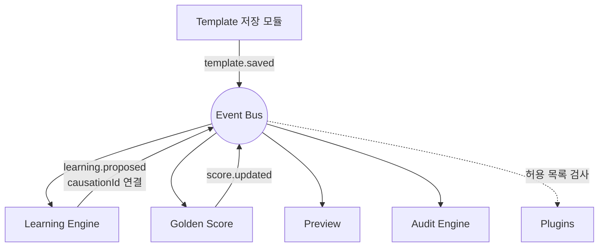

# Event Bus — 모듈 간 직접 호출 금지

> **문서 상태**: 📋 설계만 (v2.5 Enterprise Edition · 미구현)
> **관련 문서**: [ARCHITECTURE.md](ARCHITECTURE.md) · [AUDIT_ENGINE.md](AUDIT_ENGINE.md) · [PLUGIN_ARCHITECTURE.md](PLUGIN_ARCHITECTURE.md) · v1 `js/core/bus.js` ([../ARCHITECTURE.md](../ARCHITECTURE.md))
> **한 줄 목적**: 모든 모듈은 직접 호출하지 않는다 — Event 기반으로 연결한다. v1 경량 버스를 계승·확장한다.

---

## 목차

1. [목적](#1-목적)
2. [책임](#2-책임)
3. [데이터 흐름](#3-데이터-흐름)
4. [인터페이스 — 이벤트 카탈로그·명명 규약](#4-인터페이스--이벤트-카탈로그명명-규약)
5. [확장성](#5-확장성)
6. [장점](#6-장점)
7. [단점](#7-단점)

---

## 1. 목적

대표 시나리오:

```
Template Saved
   ↓
Learning Update  (관련 학습 제안 재평가)
   ↓
Golden Score Update  (열린 미리보기 재채점)
   ↓
Preview Refresh
```

Template 저장 코드는 Learning도 Score도 Preview도 **모른 채** `template.saved` 하나만 발행한다. 나머지는 각자 구독. 이 원칙이 v2.5의 모듈 수 증가(20+)를 견디게 하는 기반이다.

## 2. 책임

| 책임 | 설명 |
|---|---|
| 발행/구독 중계 | 발행자와 구독자의 상호 무지 보장 |
| 이벤트 표준 봉투 | eventId · name · payload · schemaVersion · causationId · workspaceId · timestamp |
| 순서 보장(동일 대상) | 같은 대상(예: 같은 문서)의 이벤트는 발행 순서대로 전달 |
| 구독 권한 | Plugin은 manifest 허용 목록의 이벤트만 수신 ([PLUGIN_ARCHITECTURE.md](PLUGIN_ARCHITECTURE.md) §3) |
| 실패 격리 | 구독자 1개의 오류가 다른 구독자·발행자에 전파되지 않음 |
| 하지 않는 것 | 이벤트 내용 해석, 상태 저장(버스는 무상태 — 이력은 Audit) |

## 3. 데이터 흐름

```
발행:  publish("template.saved", payload)
   ↓  봉투 부착 (eventId, causationId ← 현재 처리 중 이벤트, workspaceId)
전달:  구독자 순차 호출 (동일 대상 순서 보장)
   ├─ Learning Engine  → 재평가 → publish("learning.proposed") ← causationId 연결
   ├─ Golden Score     → 재채점 → publish("score.updated")
   ├─ Preview          → 갱신
   └─ Audit Engine     → (변경성 이벤트면) 기록
실패:  구독자 오류 → event.handler.failed 발행 → 해당 구독자만 격리 보고
```



## 4. 인터페이스 — 이벤트 카탈로그·명명 규약

**명명 규약**: `대상.동사(과거형)` — 소문자·점 구분. 변경성 이벤트(무언가의 상태를 바꿨음을 알림)는 반드시 과거형 — Audit 전수 구독의 기준.

봉투:

```json
{
  "eventId": "evt-77121",
  "name": "dna.updated",
  "schemaVersion": "1",
  "workspaceId": "baz",
  "causationId": "evt-77120",
  "timestamp": "2026-07-10T09:12:03+09:00",
  "payload": { "path": "tableRule.headerFill", "version": 13 }
}
```

핵심 이벤트 카탈로그 (발췌):

| 이벤트 | 발행자 | 주요 구독자 |
|---|---|---|
| `prompt.issued` | Prompt Engine | (AI Plugin) |
| `analysis.imported` / `import.rejected` | Import Gate | Learning · Marketplace(성공률) |
| `learning.proposed` / `learning.applied` | Learning Engine | Confidence · Approval / DNA·Score·Audit |
| `approval.requested` / `approval.decided` | Confidence / Approval | Approval / Learning·Audit·알림 Plugin |
| `dna.updated` · `kb.updated` · `graph.updated` · `rule.registered` | 각 저장소 | Score · Preview · Audit |
| `template.saved` · `golden.promoted` | Admin / Lab | Learning · Score · Preview · Audit |
| `document.generated` / `document.edited` | 에디터·렌더러 | Workflow / Learning |
| `workflow.step.completed` / `workflow.completed` | Workflow Engine | 알림 Plugin · Audit / Replay |
| `flag.changed` · `plugin.error` | Feature Flag / Host | 전 모듈 / Host(격리) |

| 연산(개념) | 서명 |
|---|---|
| 발행 | `publish(name, payload) → eventId` |
| 구독 | `subscribe(name | pattern, handler) → unsubscribe()` |
| 사슬 | `causationId`는 버스가 자동 부착 (핸들러 안에서의 발행 = 자식 이벤트) |

## 5. 확장성

- **새 이벤트 추가** = 카탈로그 등록(문서화)만 — 버스 무수정. 구독자 없는 이벤트도 유효(미래 구독 대비).
- **payload 진화**: `schemaVersion` 상향 + 전환기 병행 발행 ([PLUGIN_ARCHITECTURE.md](PLUGIN_ARCHITECTURE.md) §7).
- **v1 계승**: v1 `core/bus.js`(화면 컴포넌트 간 통신)는 그대로 두고, v2 버스는 시스템 이벤트용으로 별도 네임스페이스 — 충돌 없음. 장기적으로 v1 버스를 v2 계약의 부분집합으로 흡수 📋.

## 6. 장점

1. **결합도 최소** — 모듈 20+개가 서로의 존재를 모른다. 추가·제거가 국소적.
2. **Audit 무료 획득** — 전수 구독 하나로 시스템 연대기가 완성된다.
3. **인과 추적** — causationId 사슬이 "왜 이 일이 일어났나"를 기계적으로 답한다.
4. **Plugin 경계 일원화** — 외부 확장이 이벤트 허용 목록 하나로 통제된다.

## 7. 단점

1. **흐름 가시성 저하** — 코드만 봐서는 전체 흐름이 안 보인다. (→ 본 문서 §4 카탈로그를 유일 진실로 유지 + causationId 시각화 도구 📋)
2. **간접 디버깅** — 중단점이 아니라 이벤트 로그로 디버깅해야 한다.
3. **폭주 위험** — 이벤트가 이벤트를 낳는 연쇄 루프. (→ causation 깊이 상한 + 동일 이벤트 재진입 감지)
