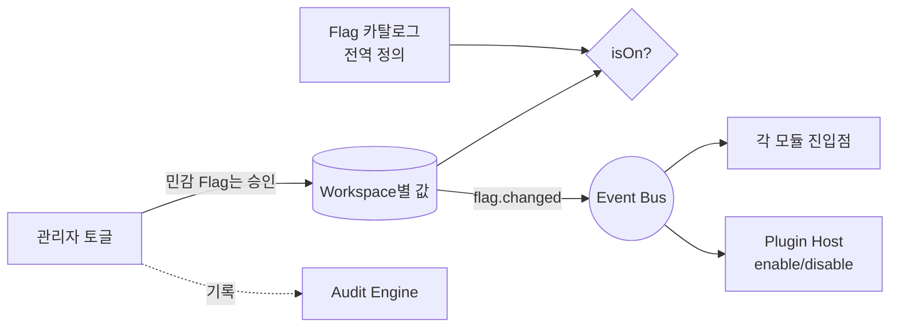

# Feature Flag — Workspace별 기능 토글

> **문서 상태**: 📋 설계만 (v2.5 Enterprise Edition · 미구현)
> **관련 문서**: [ARCHITECTURE.md](ARCHITECTURE.md) §5(Multi Workspace) · [PLUGIN_ARCHITECTURE.md](PLUGIN_ARCHITECTURE.md) · [ROADMAP.md](ROADMAP.md)
> **한 줄 목적**: 새로운 기능은 Feature Flag로 관리한다 — Workspace마다 활성/비활성 가능해야 한다.

---

## 목차

1. [목적](#1-목적)
2. [책임](#2-책임)
3. [데이터 흐름](#3-데이터-흐름)
4. [인터페이스](#4-인터페이스)
5. [확장성](#5-확장성)
6. [장점](#6-장점)
7. [단점](#7-단점)

---

## 1. 목적

v2.5는 기능이 많다. 전부 한 번에 켜지 않는다. 모든 신규 기능은 Flag 뒤에서 태어나고, Workspace(회사)마다 준비된 만큼만 켠다. [ROADMAP.md](ROADMAP.md)의 단계 전환도 코드 배포가 아니라 **Flag 전환**이다 (Configuration First).

| Flag 예 | 설명 | 기본값 |
|---|---|---|
| `learning.enabled` | Company Learning 전체 | off |
| `learning.autoApply98` | 98% 자동 적용 정책 | off (보수적) |
| `golden.score` | Golden Score 채점 | off |
| `workflow.enabled` | Workflow Engine | off |
| `plugin.ai-claude` | 특정 AI Plugin | off |
| `replay.enabled` | Replay 스냅샷 기록 | on 권장 (늦게 켜면 과거 재현 불가) |

## 2. 책임

| 책임 | 설명 |
|---|---|
| Flag 정의 | 전역 카탈로그 (이름·설명·기본값·의존 Flag) |
| 값 관리 | **정의는 전역, 값은 Workspace별** ([ARCHITECTURE.md](ARCHITECTURE.md) §5) |
| 평가 | `isOn(flag, workspaceId)` 단일 판정점 — 각 모듈은 자신의 진입점에서 1회 검사 |
| 의존 검증 | `learning.autoApply98`은 `learning.enabled` 없이 켤 수 없음 |
| 변경 통제 | Flag 변경은 관리자 권한 + Human Approval(민감 Flag) + Audit 기록 + `flag.changed` 이벤트 |
| 하지 않는 것 | 기능 자체의 구현, 사용자별 토글(Workspace 단위가 최소 입자 — KISS) |

## 3. 데이터 흐름

```
[정의]  기능 개발 시 Flag 등록 (기본 off)
[설정]  관리자: Workspace 설정 화면에서 토글 → (민감 Flag는 승인) → flag.changed 이벤트
[평가]  각 모듈 진입점: isOn("golden.score", ws) → off면 해당 경로 전체 비활성
[전파]  flag.changed 구독자들이 즉시 반영 (Plugin Host는 enable/disable 호출)
```



## 4. 인터페이스

```json
{
  "flagId": "learning.autoApply98",
  "description": "Confidence 98% 이상 제안의 자동 적용",
  "default": false,
  "requires": ["learning.enabled"],
  "sensitive": true,
  "values": { "baz": true, "acme": false }
}
```

| 연산(개념) | 서명 |
|---|---|
| 판정 | `isOn(flagId, workspaceId) → boolean` |
| 설정 | `set(flagId, workspaceId, value)` — sensitive는 승인 경유 |
| 카탈로그 | `list() → FlagDef[]` |
| 의존 검증 | `validate(flagId, workspaceId) → 위반 목록` |

## 5. 확장성

- **새 기능 = 새 Flag** — 카탈로그 행 추가뿐.
- **점진 확대**: Workspace 단위 켜기 → 전 Workspace 기본값 on → (안정기) Flag 제거. **Flag 제거도 수명주기의 일부** — 죽은 Flag를 방치하지 않는다.
- **Plugin 연동**: Plugin manifest의 `config.flag`가 이 카탈로그를 참조 — Plugin 활성이 곧 Flag ([PLUGIN_ARCHITECTURE.md](PLUGIN_ARCHITECTURE.md) §4).

## 6. 장점

1. **안전한 도입** — v2.5의 큰 기능들을 회사별로 준비된 순서대로 켠다.
2. **즉시 후퇴** — 문제 발생 시 배포 없이 끈다.
3. **로드맵의 실행 장치** — 단계 전환이 설정 변경이 된다.

## 7. 단점

1. **조합 폭발** — Flag N개 = 상태 2^N. 전 조합 검증은 불가능하다. (→ 의존 선언으로 유효 조합 축소 + 대표 조합만 검증)
2. **코드 오염** — Flag 분기가 코드 곳곳에 퍼지면 부채가 된다. (→ 진입점 1회 검사 원칙 + Flag 제거 수명주기)
3. **늦게 켠 기능의 공백** — replay를 늦게 켜면 그 이전 문서는 재현 불가. (→ 기록성 Flag는 on 기본값 권장, §1 표)
