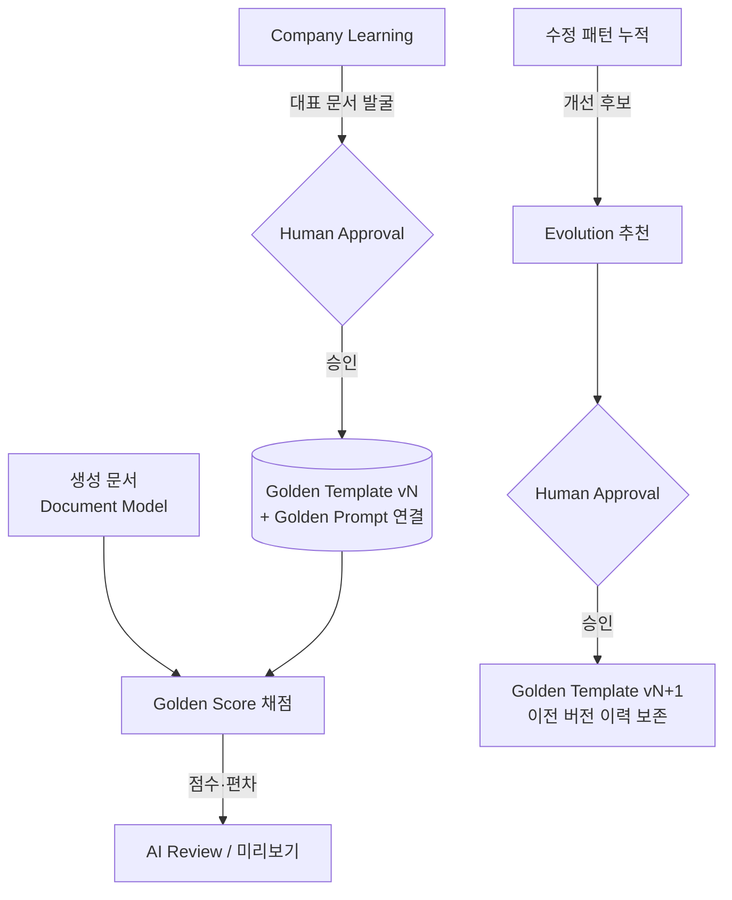

# Golden Template — 회사 문서의 기준 · Golden Prompt · Golden Score

> **문서 상태**: 📋 설계만 (v2.5 Enterprise Edition · 미구현)
> **관련 문서**: [COMPANY_DNA.md](COMPANY_DNA.md) · [PROMPT_LAB.md](PROMPT_LAB.md) · [DOCUMENT_MODEL.md](DOCUMENT_MODEL.md) · v1 [../JSON_SCHEMA.md](../JSON_SCHEMA.md)
> **한 줄 목적**: 회사에서 검증된 기준 문서(Golden Template)와 기준 Prompt(Golden Prompt)를 정의하고, 모든 문서를 기준과 비교 채점(Golden Score)한다.

---

## 목차

1. [목적](#1-목적)
2. [책임](#2-책임)
3. [데이터 흐름](#3-데이터-흐름)
4. [인터페이스 — Golden Score 산식](#4-인터페이스--golden-score-산식)
5. [확장성 — Golden Template Evolution](#5-확장성--golden-template-evolution)
6. [장점](#6-장점)
7. [단점](#7-단점)

---

## 1. 목적

| 개념 | 정의 |
|---|---|
| **Golden Template** | 회사 문서의 기준. 문서 종류별로 "이렇게 만들어야 한다"의 검증된 표본. v1 Template JSON 형식([../JSON_SCHEMA.md](../JSON_SCHEMA.md))을 그대로 사용하며 `golden: true` 표식과 DNA 링크가 추가된다. |
| **Golden Prompt** | 회사에서 검증된 Prompt. Golden Template와 **항상 연결**된다(그 Template을 만들고 유지·보수하는 데 검증된 Prompt). AutoDoc은 항상 Golden Prompt를 우선 사용한다 ([PROMPT_ENGINE.md](PROMPT_ENGINE.md) §2). |
| **Golden Score** | 모든 생성 문서를 Golden Template와 비교한 채점표. AI Review의 정량 기준. |

## 2. 책임

| 책임 | 설명 |
|---|---|
| Golden 지정 | 문서 종류별 Golden Template 1개(+이력) 관리. 지정·교체는 Human Approval |
| Golden Prompt 연결 | Template ↔ Prompt의 쌍 유지 (Lab 승격 시 자동 갱신 제안) |
| Golden Score 채점 | 생성 전(미리보기)·생성 시 문서를 채점하고 항목별 편차 표시 |
| Evolution 제안 | 더 좋은 구조가 반복 관측되면 개선을 **추천만** 한다 — **자동 변경 금지** |
| 하지 않는 것 | 자동 교체, 점수 미달 문서의 무단 수정(경고·제안까지) |

## 3. 데이터 흐름

```
[지정]  Company Learning에서 대표 문서 발굴 → 관리자 승인 → Golden Template 등록 (+ Golden Prompt 연결)
[채점]  문서 미리보기/생성 → Golden Score 계산 → 항목별 점수 + 편차 하이라이트 → AI Review 표시
[진화]  사용자·관리자 수정 패턴 누적 → "Golden보다 나은 구조" 후보 감지 → 개선 추천 → 승인 시 새 Golden 버전
```



## 4. 인터페이스 — Golden Score 산식

평가 항목과 기준 출처:

| 평가 항목 | 기준 출처 | 예시 검사 |
|---|---|---|
| 레이아웃 | Golden Template layout + DNA Layout Rule | 구획 배치 일치율 |
| 폰트 | DNA Font Rule | 지정 외 폰트·최소 크기 위반 |
| 색상 | DNA Color Rule | 비승인 색 사용 |
| 표 | DNA Table Rule | 머리행 스타일·정렬 |
| 브랜드 | DNA Brand/Logo Rule | 로고 위치·금지 변형 |
| 문체 | DNA Writing Style | 경어/개조식 혼용, 수치 표기 |
| 회사 용어 | Knowledge Base | 비표준 표기 수 |
| 보고 순서 | DNA Section Order/Report Flow | 목차 순서 편차 |
| **총점** | 가중 합 | 아래 스키마 |

```json
{
  "scoreId": "gs-2026-07-118",
  "documentRef": "docmodel-4411",
  "goldenRef": "gt-weekly@v4",
  "items": {
    "layout": 0.96, "font": 1.0, "color": 0.9, "table": 0.88,
    "brand": 1.0, "style": 0.94, "terminology": 0.85, "sectionOrder": 1.0
  },
  "weights": { "layout": 2, "brand": 2, "terminology": 1.5, "...": 1 },
  "total": 93.4,
  "deviations": [
    { "item": "terminology", "detail": "'핸드 피스' 2회 — 표준: Handpiece", "suggestion": "kb-0102" }
  ]
}
```

| 연산(개념) | 서명 |
|---|---|
| 채점 | `score(documentModel) → GoldenScore` |
| 기준 조회 | `golden(docType) → { template, prompt }` |
| 진화 제안 | `proposeEvolution(docType, evidence[]) → 승인 요청` |

가중치는 Workspace 설정(Configuration First). AI Review([AI_ARCHITECTURE.md](AI_ARCHITECTURE.md) §2)는 이 채점 결과에 오탈자·누락·이미지 검사를 더해 생성 전 리포트를 구성한다.

## 5. 확장성 — Golden Template Evolution

**Golden Template는 고정이 아니다.** 그러나 스스로 변하지도 않는다.

| 단계 | 내용 | 자동? |
|---|---|---|
| 관측 | 사용자들이 Golden과 다르게 반복 수정하는 패턴 감지 | ✅ (감지만) |
| 검증 | Prompt Lab 절차 재사용 — 기존 Golden vs 후보 비교 ([PROMPT_LAB.md](PROMPT_LAB.md) §5) | 관리자 주도 |
| 추천 | "새 구조가 채택률 +23%" 근거와 함께 추천 | ✅ (추천만) |
| 교체 | Human Approval → 새 버전, 이전 Golden은 이력 보존·복원 가능 | ❌ 수동 |

새 평가 항목 추가 = `items` 키 + 검사기 1개 + 가중치 — 산식 구조 불변.

## 6. 장점

1. **품질의 정량화** — "회사답게 만들었는가"가 총점으로 보인다.
2. **교육 효과** — 편차 목록이 신입에게 회사 문서 작법을 가르친다.
3. **기준의 진화** — 고정 표준의 노후화를 Evolution이 방지하되, 통제는 사람이 유지.
4. **v1 완전 호환** — Golden Template은 v1 Template JSON이므로 기존 엔진이 그대로 렌더링.

## 7. 단점

1. **점수 만능주의 위험** — 높은 점수가 좋은 내용을 보장하지 않는다(형식 채점일 뿐). (→ 점수는 게이트가 아니라 참고 기본값, block 규칙은 관리자 선택)
2. **채점 비용** — 매 미리보기마다 8개 항목 비교는 연산 부담. (→ 변경된 구획만 증분 채점)
3. **초기 Golden의 대표성** — 첫 Golden이 나쁜 표본이면 나쁜 기준이 강화된다. (→ 지정 시 복수 후보 비교 필수)
