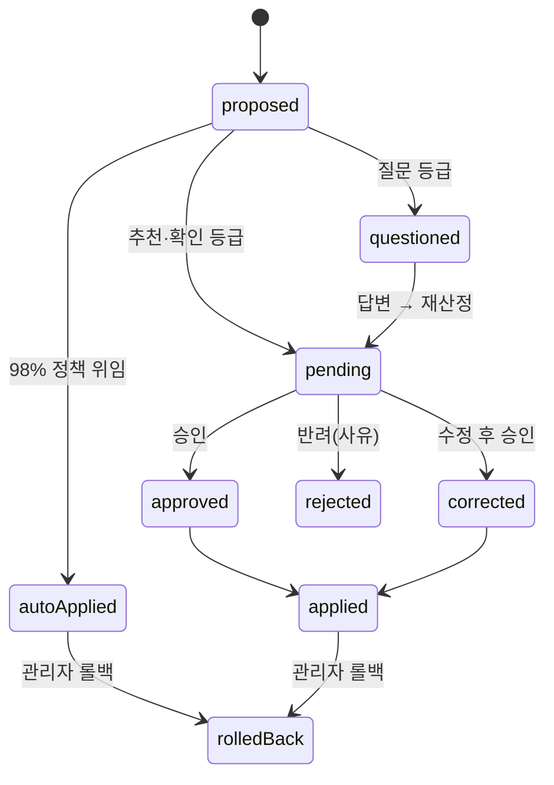

# Human Approval — 인간 승인 워크플로

> **문서 상태**: 📋 설계만 (v2.5 Enterprise Edition · 미구현)
> **관련 문서**: [CONFIDENCE_ENGINE.md](CONFIDENCE_ENGINE.md) · [LEARNING_ENGINE.md](LEARNING_ENGINE.md) · [AUDIT_ENGINE.md](AUDIT_ENGINE.md)
> **한 줄 목적**: **AI는 절대 자동 변경하지 않는다.** 회사 지식(DNA·KB·Graph·Rule·Golden)에 대한 모든 변경은 관리자 승인을 거친다.

---

## 목차

1. [목적](#1-목적)
2. [책임](#2-책임)
3. [데이터 흐름 — 승인 상태 머신](#3-데이터-흐름--승인-상태-머신)
4. [인터페이스](#4-인터페이스)
5. [확장성](#5-확장성)
6. [장점](#6-장점)
7. [단점](#7-단점)

---

## 1. 목적

v2.5의 헌법 조항이다:

> **AI(및 학습 시스템)는 절대 자동 변경하지 않는다. 모든 변경은 관리자가 승인해야 한다.**

이 원칙이 지켜지는 한, AI가 아무리 틀려도 회사 지식은 오염되지 않는다. 유일한 완화 장치는 [CONFIDENCE_ENGINE.md](CONFIDENCE_ENGINE.md) §1의 "98% 자동 적용"이며, 이는 관리자가 **사전 정책 승인 + 사후 통보 + 즉시 롤백**의 3중 조건으로 위임한 것이다.

### 승인 대상

| 대상 | 근거 문서 |
|---|---|
| Learning Proposal (DNA·KB·Memory·Rule·Graph 변경) | [LEARNING_ENGINE.md](LEARNING_ENGINE.md) |
| Golden Prompt 승격 / Golden Template 개선 반영 | [PROMPT_LAB.md](PROMPT_LAB.md) · [GOLDEN_TEMPLATE.md](GOLDEN_TEMPLATE.md) |
| Ontology 클래스·관계 추가 | [COMPANY_ONTOLOGY.md](COMPANY_ONTOLOGY.md) |
| Rule 등록·변경 (learning 출처는 필수) | [RULE_ENGINE.md](RULE_ENGINE.md) |
| Confidence 임계값·Feature Flag 변경 | [CONFIDENCE_ENGINE.md](CONFIDENCE_ENGINE.md) · [FEATURE_FLAG.md](FEATURE_FLAG.md) |

## 2. 책임

| 책임 | 설명 |
|---|---|
| 승인함 운영 | 등급별(추천/확인/질문) 대기열 + 근거(evidence·factors) 표시 |
| 결정 처리 | 승인 / 반려 / **수정 후 승인**(교정 diff는 강한 학습 신호로 회수) |
| 묶음 처리 | 동일 유형 제안의 일괄 승인 (예: KB 용어 30건) |
| 롤백 | 자동 적용 포함 모든 반영의 되돌림 (새 버전으로 복원 — 이력 보존) |
| 기록 위임 | 모든 결정은 [AUDIT_ENGINE.md](AUDIT_ENGINE.md)에 누가/언제/무엇을/왜 |
| 하지 않는 것 | 신뢰도 산정(→ Confidence), 반영 실행의 소유(→ 각 저장소의 apply) |

## 3. 데이터 흐름 — 승인 상태 머신

```
proposed ──(등급: 자동 적용)──→ auto-applied ──(사후 통보)──→ [롤백 가능]
proposed ──(등급: 추천/확인)──→ pending ──승인──→ approved ──→ applied
                                   │ ├─ 수정 후 승인 → corrected → applied (+교정 diff 학습 신호)
                                   │ └─ 반려 → rejected (사유 필수)
proposed ──(등급: 질문)──→ questioned ──답변──→ (재산정) → pending 또는 rejected
```



## 4. 인터페이스

```json
{
  "approvalId": "ap-2026-07-0208",
  "proposalId": "lp-2026-07-0311",
  "queue": "recommend",
  "decision": "approved | rejected | corrected",
  "correctionDiff": { "after": "accent" },
  "reason": "표 머리행은 primary가 아니라 accent 사용이 최신 지침",
  "decidedBy": "admin@company",
  "decidedAt": "2026-07-10T09:12:00+09:00"
}
```

| 연산(개념) | 서명 | 비고 |
|---|---|---|
| 대기열 | `queue(grade?) → Approval[]` | 등급·유형 필터 |
| 결정 | `decide(approvalId, decision, reason, correction?)` | 반려는 reason 필수 |
| 묶음 결정 | `decideBatch(approvalIds[], decision)` | 동일 유형만 |
| 롤백 | `rollback(appliedRef, reason)` | 새 버전 생성 방식 |

## 5. 확장성

- **승인 권한 위임**: 유형별 승인자 분리(용어는 QA팀, 브랜드는 마케팅) — 승인 라우팅 테이블 📋.
- **다단계 승인**: 민감 구획(Brand Rule)은 2인 승인 요구 — [WORKFLOW_ENGINE.md](WORKFLOW_ENGINE.md)의 결재 체인 재사용.
- **알림 Plugin**: 승인 대기 알림을 Mail/Slack/Teams Plugin으로 발송 ([PLUGIN_ARCHITECTURE.md](PLUGIN_ARCHITECTURE.md)).

## 6. 장점

1. **오염 원천 차단** — 틀린 AI 결과는 승인 게이트에서 멈춘다.
2. **수정이 자산** — "수정 후 승인"의 교정 내용이 최고 품질의 학습 신호가 된다.
3. **감사 완결성** — 모든 지식 변경에 결정자·사유가 남는다 (ISO 대응).

## 7. 단점

1. **관리자 부하** — 학습 초기(문서 수백 개)에는 승인량이 폭증한다. (→ 묶음 승인 + 등급 임계값 상향으로 조절)
2. **속도 저하** — 즉시 반영 대비 지식 갱신이 느리다. (→ 의도된 트레이드오프 — 신뢰가 속도보다 우선)
3. **승인 형식화 위험** — 대기열이 길면 무성의한 일괄 승인이 일어난다. (→ 묶음 승인은 동일 유형 한정 + 표본 검증 UI)
