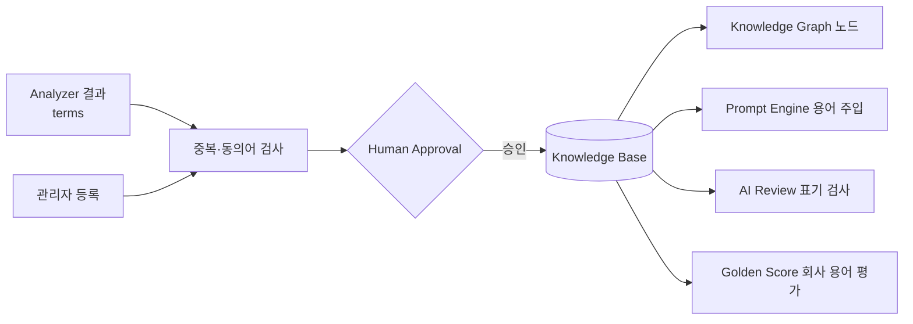

# Knowledge Base — 회사 용어 저장소

> **문서 상태**: 📋 설계만 (v2.5 Enterprise Edition · 미구현)
> **관련 문서**: [COMPANY_ONTOLOGY.md](COMPANY_ONTOLOGY.md) · [KNOWLEDGE_GRAPH.md](KNOWLEDGE_GRAPH.md) · [COMPANY_DNA.md](COMPANY_DNA.md)
> **한 줄 목적**: 회사 용어(제품명·부품명·서비스명·증상 용어 등)를 표준 표기·동의어·정의와 함께 저장하는 Ubiquitous Language 저장소.

---

## 목차

1. [목적](#1-목적)
2. [책임](#2-책임)
3. [데이터 흐름](#3-데이터-흐름)
4. [인터페이스](#4-인터페이스)
5. [확장성](#5-확장성)
6. [장점](#6-장점)
7. [단점](#7-단점)

---

## 1. 목적

회사에는 회사만의 말이 있다. KB는 그 말의 **표준 표기와 의미**를 저장한다.

| 용어 예 | 분류(Ontology 클래스) | 비고 |
|---|---|---|
| VOC | 문서/프로세스 용어 | Voice of Customer |
| N-care | 서비스명 | 표준 표기 고정 ("엔케어" ✗) |
| Handpiece | 부품명 | 동의어: 핸드피스 |
| 노즐누수 | 증상 | 관련: 약액유입 |
| 약액유입 | 증상 | — |
| 제품명·부품명·서비스명 | 각 클래스 | Analyzer가 지속 발굴 |

## 2. 책임

| 책임 | 설명 |
|---|---|
| 용어 등록 | 표준 표기 + 동의어 + 정의 + Ontology 클래스 + 출처 문서 |
| 표기 통일 | 문서 작성·AI Review 시 비표준 표기를 감지하고 표준 표기 제안 |
| Prompt 주입 | Prompt Engine에 회사 용어 목록 제공 — AI가 회사 말로 답하게 함 |
| Graph 노드 공급 | KB 항목이 Knowledge Graph의 노드가 된다 |
| 하지 않는 것 | 관계 저장(→ Graph), 개념 체계 정의(→ Ontology), 자동 치환(제안만 — Human Approval 원칙) |

## 3. 데이터 흐름

```
[수집]  Analyzer payload.terms[] / 관리자 직접 등록
   ↓
중복·동의어 검사 (기존 항목과 유사도 비교)
   ├─ 신규 → 후보 등록 (confidence에 따라 추천/확인/질문 등급)
   └─ 동의어 추정 → "기존 용어의 동의어로 병합?" 질문 생성
   ↓ Human Approval
KB 반영 (kb.updated 이벤트) → Graph 노드 생성 가능 상태
   ↓
[활용]  문서 작성 표기 검사 · Prompt 용어 주입 · Golden Score '회사 용어' 항목 평가
```



## 4. 인터페이스

```json
{
  "termId": "kb-0102",
  "canonical": "Handpiece",
  "synonyms": ["핸드피스", "HP"],
  "forbidden": ["핸드 피스"],
  "class": "part",
  "definition": "시술부에 장착되는 …",
  "sources": ["doc-017", "doc-101"],
  "confidence": 0.97,
  "status": "candidate | active | merged | retired",
  "createdBy": "learning | admin",
  "lastModified": "2026-07-09"
}
```

| 연산(개념) | 서명 |
|---|---|
| 검색 | `lookup(text) → { canonical, isStandard }` |
| 등록 제안 | `propose(term, evidence[]) → LearningProposal` |
| 병합 | `merge(termId, intoTermId)` — 관리자 승인 필수, 이력 보존 |
| 용어집 발급 | `glossary(class?) → Term[]` — Prompt 주입·문서 부록용 |

## 5. 확장성

- **다국어 표기**: `canonical`에 언어별 표기 맵 확장 (`{ ko, en }`) — `schemaVersion` 상향.
- **부서별 용어**: 같은 Workspace 내 부서 스코프 태그 📋.
- **외부 사전 연동**: ERP 품목 마스터를 Plugin으로 받아 후보 자동 공급 ([PLUGIN_ARCHITECTURE.md](PLUGIN_ARCHITECTURE.md)).

## 6. 장점

1. **말의 통일** — 같은 부품을 세 가지로 부르는 문서가 사라진다.
2. **AI 응답 품질 향상** — Prompt에 회사 용어를 주입하면 AI가 회사 말로 답한다.
3. **DDD Ubiquitous Language의 실체화** — 설계 원칙이 데이터로 존재한다.

## 7. 단점

1. **동의어 판정의 어려움** — "노즐누수"와 "노즐 미세누수"는 같은가? (→ 자동 병합 금지, 반드시 질문)
2. **용어 정치학** — 부서마다 선호 표기가 다를 수 있다. 표준 확정은 기술이 아니라 운영 문제다.
3. **초기 공백** — 학습 전에는 비어 있어 표기 검사가 무력하다. (→ Company Learning Mode에서 우선 축적)
