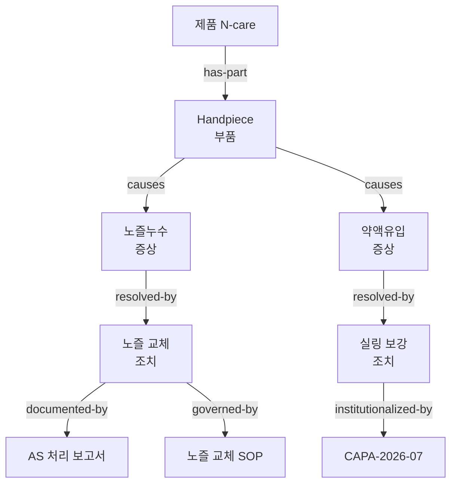

# Knowledge Graph — 회사 지식의 관계형 저장 · 탐색

> **문서 상태**: 📋 설계만 (v2.5 Enterprise Edition · 미구현)
> **관련 문서**: [KNOWLEDGE_BASE.md](KNOWLEDGE_BASE.md) · [COMPANY_ONTOLOGY.md](COMPANY_ONTOLOGY.md) · [ARCHITECTURE.md](ARCHITECTURE.md) §5(저장 전략)
> **한 줄 목적**: KB 용어를 단순 목록이 아니라 Node · Edge · Relation · Hierarchy를 갖춘 Graph로 관리하고 탐색 인터페이스를 제공한다.

---

## 목차

1. [목적](#1-목적)
2. [책임](#2-책임)
3. [데이터 흐름](#3-데이터-흐름)
4. [인터페이스](#4-인터페이스)
5. [확장성](#5-확장성)
6. [장점](#6-장점)
7. [단점](#7-단점)

---

## 1. 목적

목록은 "무엇이 있는지"만 답한다. Graph는 **"무엇이 무엇과 어떻게 이어지는지"** 를 답한다.

```
Handpiece
   ↓ 관련 제품        (belongs-to)
   ↓ 관련 부품        (has-part)
   ↓ 관련 불량        (causes)         예: 노즐누수 · 약액유입
   ↓ 관련 조치        (resolved-by)
   ↓ 관련 보고서      (documented-by)
   ↓ 관련 SOP         (governed-by)
   ↓ 관련 CAPA        (institutionalized-by)
```

이 연쇄가 있으면 "노즐누수 보고서 작성" 시 관련 부품·과거 조치·해당 SOP를 즉시 제안할 수 있다.

## 2. 책임

| 책임 | 설명 |
|---|---|
| 노드 관리 | KB 용어(active 상태)를 노드로 등재. 노드 자체 속성은 KB가 원본 |
| 엣지 관리 | Ontology가 허용한 관계 타입만 저장 (`validateEdge` 통과 필수) |
| Hierarchy | `belongs-to` / `has-part` 계층 탐색 (제품 → 모델 → 부품) |
| 탐색 제공 | 이웃 조회·경로 조회·서브그래프 추출 |
| 문서 연결 | 노드 ↔ 생성 문서·Golden Template 연결 (예: 이 증상을 다룬 보고서들) |
| 하지 않는 것 | 자동 엣지 확정(제안 → Human Approval), 개념 체계 정의(→ Ontology) |

## 3. 데이터 흐름

```
Analyzer payload (예: CAPA Analyzer의 원인-조치 쌍)
   ↓
엣지 후보 생성: (nodeA) -[relation]→ (nodeB) + evidence
   ↓ Ontology.validateEdge 검증
   ↓ Confidence 등급 → Human Approval
Graph 반영 (graph.updated 이벤트)
   ↓
[활용] 에디터 연관 제안 · Rule Engine 조건 참조 · 문서 자동 링크
```



## 4. 인터페이스

노드는 KB 참조, 엣지는 독립 레코드:

```json
{
  "edgeId": "e-0331",
  "from": "kb-0102",            
  "relation": "causes",
  "to": "kb-0217",
  "evidence": ["doc-017 §3", "voc-2026-014"],
  "weight": 12,
  "confidence": 0.91,
  "status": "candidate | active | retired"
}
```

| 연산(개념) | 서명 | 용도 |
|---|---|---|
| 이웃 | `neighbors(nodeId, relation?, depth=1) → Node[]` | 에디터 연관 제안 |
| 경로 | `path(fromId, toId) → Edge[]?` | "이 증상에서 SOP까지" 추적 |
| 서브그래프 | `subgraph(nodeId, depth) → { nodes, edges }` | 시각화·보고서 부록 |
| 엣지 제안 | `proposeEdge(from, relation, to, evidence[]) → LearningProposal` | 학습 유입 |
| 가중치 갱신 | `reinforce(edgeId)` | 재관측 시 weight+1 |

`weight`(관측 횟수)는 제안 순위에, `confidence`는 승인 등급에 쓰인다 — 두 값의 역할을 혼동하지 않는다.

## 5. 확장성

- **저장 매체**: 초기 Sheets(엣지 = 행)로 시작하되, 노드 수천·엣지 수만 규모부터 Database Plugin으로 승격 ([ARCHITECTURE.md](ARCHITECTURE.md) §5). 탐색 인터페이스(§4)는 불변이므로 상위 계층 무수정.
- **관계 타입 추가**: Ontology 확장에 자동 추종 — Graph 코드 수정 없음.
- **시각화**: 서브그래프 JSON을 그대로 그리는 뷰어는 차기 화면 설계 📋.

## 6. 장점

1. **맥락 있는 제안** — "노즐누수" 입력만으로 부품·조치·SOP·과거 보고서가 딸려 나온다.
2. **근거 보존** — 모든 엣지에 evidence(출처 문서)가 있어 감사 대응 가능.
3. **지식의 복리** — 문서가 쌓일수록 엣지 weight가 강화되어 제안 정확도가 오른다.

## 7. 단점

1. **Sheets 표현력 한계** — 깊은 경로 탐색은 행 기반 저장에서 느리다. (→ 메모리 적재 후 탐색 + DB Plugin 승격 경로)
2. **엣지 폭증** — N:M 관계는 조합적으로 늘어난다. (→ weight 하위·미승인 후보의 주기적 정리)
3. **잘못된 연결의 파급** — 틀린 엣지 하나가 잘못된 제안을 반복 생산한다. (→ 승인 필수 + retire 절차 + evidence 역추적)
