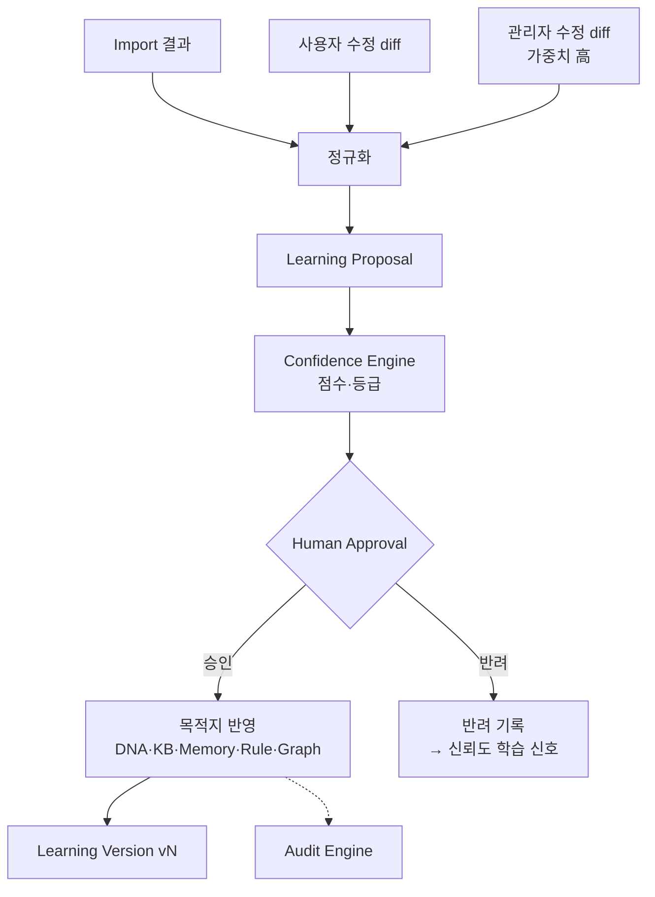

# Learning Engine — 회사를 학습하는 엔진

> **문서 상태**: 📋 설계만 (v2.5 Enterprise Edition · 미구현)
> **관련 문서**: [CONFIDENCE_ENGINE.md](CONFIDENCE_ENGINE.md) · [HUMAN_APPROVAL.md](HUMAN_APPROVAL.md) · [COMPANY_DNA.md](COMPANY_DNA.md) · [AI_ARCHITECTURE.md](AI_ARCHITECTURE.md)
> **한 줄 목적**: AutoDoc은 AI를 학습하지 않는다 — **회사를 학습한다.** 학습 대상·파이프라인·Learning Version을 정의한다.

---

## 목차

1. [목적](#1-목적)
2. [책임](#2-책임)
3. [데이터 흐름](#3-데이터-흐름)
4. [인터페이스 — Learning Proposal](#4-인터페이스--learning-proposal)
5. [확장성 — Learning Timeline](#5-확장성--learning-timeline)
6. [장점](#6-장점)
7. [단점](#7-단점)

---

## 1. 목적

"학습"이라는 말의 의미를 명확히 한다: 모델 가중치 훈련이 아니라, **회사의 일하는 방식을 구조화된 데이터(DNA·KB·Memory·Rule)로 축적**하는 것이다.

### 학습 대상

| 대상 | 학습 결과의 목적지 |
|---|---|
| 문장 | Company Memory (반복 문장) / DNA(Writing Style) |
| 표 | Memory(표 인스턴스) / DNA(Table Rule) |
| 레이아웃 | Memory(레이아웃) / DNA(Layout Rule) / Golden Template |
| 폰트 · 색상 | DNA(Font Rule · Color Rule) |
| 보고 순서 | DNA(Section Order · Report Flow) |
| 브랜드 | DNA(Brand Rule · Logo Rule) |
| 입력 항목 | Template inputs 스키마 개선 제안 |
| **사용자 수정** | 생성 문서를 사용자가 고친 차이 → Memory·Rule 후보 |
| **관리자 수정** | 승인 화면에서의 교정 → 강한 학습 신호 (가중치 높음) |

## 2. 책임

| 책임 | 설명 |
|---|---|
| 신호 수집 | ① Analyzer payload(Import) ② 사용자 수정 diff ③ 관리자 수정 diff |
| 제안 생성 | 신호 → 정규화된 Learning Proposal (목적지·before/after·근거 포함) |
| 신뢰도 산정 위임 | 각 제안의 confidence는 [CONFIDENCE_ENGINE.md](CONFIDENCE_ENGINE.md)가 계산 |
| 승인 위임 | 반영 여부는 [HUMAN_APPROVAL.md](HUMAN_APPROVAL.md) — **Learning Engine은 절대 직접 반영하지 않는다** |
| Learning Version | 승인·반영의 묶음 단위 버전 관리 (Replay의 참조 축) |
| 하지 않는 것 | AI 모델 훈련, DNA 직접 쓰기, 자동 적용 결정 |

## 3. 데이터 흐름

```
① 신호 유입
     Import: analysis.imported (Analyzer payload)
     사용자: document.edited  (생성문서 vs 사용자 최종본 diff)
     관리자: approval.corrected (승인 시 교정 diff)
   ↓
② 정규화 — learningMap(PROMPT_LIBRARY.md §4) / diff 분석
   ↓
③ Learning Proposal 생성 (evidence 첨부)
   ↓
④ Confidence Engine 점수 산정 → 등급 (98/90/80/60)
   ↓
⑤ Human Approval (등급별 절차)
   ↓
⑥ 승인분만 목적지 반영 (DNA / KB / Memory / Rule / Graph) + Learning Version 채번
   ↓
⑦ 이벤트: learning.applied → Golden Score 재계산 · Audit 기록
```



## 4. 인터페이스 — Learning Proposal

모든 학습은 이 단일 형식을 통과한다 (시스템 전체의 학습 경계 계약):

```json
{
  "proposalId": "lp-2026-07-0311",
  "target": { "store": "dna", "path": "tableRule.headerFill" },
  "before": "none",
  "after": "primary",
  "evidence": [
    { "type": "import", "ref": "doc-017", "promptVersion": "v3" },
    { "type": "admin-edit", "ref": "approval-0208" }
  ],
  "signalWeight": { "import": 5, "userEdit": 2, "adminEdit": 1 },
  "confidence": 0.91,
  "grade": "recommend",
  "status": "proposed | approved | rejected | applied",
  "learningVersion": null
}
```

| 연산(개념) | 서명 |
|---|---|
| 제안 생성 | `propose(signal) → LearningProposal` |
| 반영 | `apply(proposalId) → learningVersion` — Human Approval 통과분만 호출 가능 |
| 버전 조회 | `versionLog(workspaceId) → LearningVersion[]` |

## 5. 확장성 — Learning Timeline

AutoDoc은 **회사의 변화도 기억한다.**

```
2026-03  Learning v1~v18  : 최초 Company Learning (문서 312개)
2026-07  Learning v19     : 보고서 구조 변경 (Section Order 개편)  ← 표식(milestone)
   ↓ History 저장 — 이전 버전 복원 가능 (COMPANY_DNA.md §4 restore)
```

- Learning Version은 단조 증가하며 불변. 큰 변화는 관리자가 **milestone 표식**을 붙인다.
- 복원은 "과거로 덮어쓰기"가 아니라 "과거 상태를 새 버전으로 재반영" — 이력은 절대 사라지지 않는다.
- 새 신호 종류(예: Plugin이 공급하는 ERP 데이터 패턴) 추가 = 정규화기 1개 추가. 하류(제안 이후)는 무수정.

## 6. 장점

1. **정직한 학습** — 반영된 모든 지식에 근거(evidence)와 승인자가 있다.
2. **수정이 곧 교사** — 사용자가 문서를 고칠수록 시스템이 좋아진다. 별도 학습 작업이 없다.
3. **시간 축 보존** — 회사의 방식 변화가 버전으로 남아 "작년 방식으로 복원"이 가능하다.
4. **AI 독립** — 학습 신호 중 AI 산출물은 Import 결과 하나뿐이며 그마저 승인 게이트를 거친다.

## 7. 단점

1. **승인 병목** — 학습량이 많으면 관리자 승인함이 밀린다. (→ Confidence 98% 등급의 자동 적용 + 묶음 승인 UI)
2. **모순 신호** — 사용자 A와 B가 반대로 수정하면 제안이 충돌한다. (→ 충돌 제안은 자동으로 '질문' 등급 강등)
3. **천천히 좋아짐** — 즉각적 지능이 아니라 축적형이다. 초기 기대치 관리가 필요하다.
