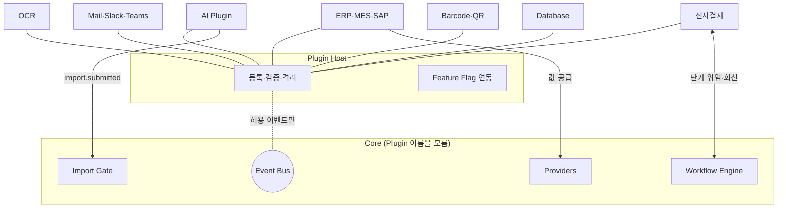

# Plugin Architecture — Core 무수정 확장

> **문서 상태**: 📋 설계만 (v2.5 Enterprise Edition · 미구현)
> **관련 문서**: [ARCHITECTURE.md](ARCHITECTURE.md) · [EVENT_BUS.md](EVENT_BUS.md) · [AI_ARCHITECTURE.md](AI_ARCHITECTURE.md) · v1 [../PLUGIN_SPEC.md](../PLUGIN_SPEC.md)
> **한 줄 목적**: AI·OCR·ERP·MES·SAP·Slack·Teams·Mail·전자결재·Barcode·QR·Database — 모든 외부 연결을 **Core를 수정하지 않는** Plugin으로 정의한다.

---

## 목차

1. [목적](#1-목적)
2. [책임](#2-책임)
3. [데이터 흐름](#3-데이터-흐름)
4. [인터페이스 — Plugin Contract](#4-인터페이스--plugin-contract)
5. [확장성](#5-확장성)
6. [장점](#6-장점)
7. [단점](#7-단점)

---

## 1. 목적

헌법 조항:

> **Plugin은 Core를 수정하지 않는다.**

Plugin은 Event Bus 구독과 공개 계약 구현으로만 시스템에 참여한다. v1 [../PLUGIN_SPEC.md](../PLUGIN_SPEC.md)의 인터페이스 정의를 계승하고, v2.5에서 능력(capability) 분류와 이벤트 참여 규칙을 확정한다.

### 지원 Plugin 카탈로그

| Plugin | 능력 분류 | 역할 예 |
|---|---|---|
| AI (OpenAI/Claude/Gemini/Copilot/DeepSeek/Qwen…) | `analyzer-transport` | Import Mode의 수동 왕복을 자동화 — **동일 JSON Contract** |
| OCR | `ingest` | 스캔 문서 → 텍스트 → Analyzer 투입 |
| ERP / MES / SAP | `data-source` | 재고·생산 데이터를 Provider로 공급 |
| Mail / Slack / Teams | `notify` | 승인 대기·생성 완료·Workflow 단계 알림 |
| 전자결재 | `workflow-gateway` | Workflow 승인 단계를 사내 결재 시스템에 위임 |
| Barcode / QR | `ingest` | 코드 스캔 → 제품·부품 식별 → KB/Graph 조회 |
| Database | `storage` | Sheets를 대체하는 Store 백엔드 ([ARCHITECTURE.md](ARCHITECTURE.md) §5) |

## 2. 책임

| 주체 | 책임 |
|---|---|
| Plugin Host (Infra 계층) | manifest 검증 · 등록 · 활성/비활성(Feature Flag 연동) · 이벤트 중계 · 권한 경계 |
| Plugin | manifest 선언 · 계약 구현 · 자신의 오류를 Core에 전파하지 않기(격리) |
| 하지 않는 것 | Plugin이 Core 내부 함수 호출 ❌ · Core가 특정 Plugin 이름 인지 ❌ · Plugin의 DNA 직접 쓰기 ❌ (모든 쓰기는 Learning Proposal 경유) |

### 권한 경계

| 능력 | 읽기 | 쓰기 |
|---|---|---|
| `analyzer-transport` | 발급된 Prompt | Import Gate 투입만 (Contract 검증 동일 적용) |
| `data-source` | — | Provider 값 공급만 |
| `notify` | 통보용 이벤트 payload | 없음 |
| `workflow-gateway` | Workflow 단계 상태 | 단계 결과 회신만 |
| `storage` | Store 계약 전체 | Store 계약 전체 (단일 예외 — 그래서 별도 심사) |

## 3. 데이터 흐름

```
[등록]  manifest 제출 → Host 검증(능력·권한) → 관리자 승인 → Feature Flag 뒤에 배치
[가동]  Event Bus 구독 시작 → 허용된 이벤트만 수신
[참여 예 — AI Plugin]
        prompt.issued 수신 → 외부 AI API 호출(Plugin 내부) → 응답을 JSON Contract 봉투로
        → import.submitted 발행 → Import Gate가 수동 붙여넣기와 동일하게 검증
[장애]  Plugin 오류 → plugin.error 이벤트 → Host가 격리(비활성) → Core 무영향
```



## 4. 인터페이스 — Plugin Contract

```json
{
  "manifest": {
    "pluginId": "ai-claude",
    "name": "Claude AI Transport",
    "version": "1.0.0",
    "capabilities": ["analyzer-transport"],
    "subscribes": ["prompt.issued"],
    "publishes": ["import.submitted", "plugin.error"],
    "config": { "requires": ["apiKeyRef"], "flag": "plugin.ai-claude" }
  }
}
```

| 계약(개념) | 서명 | 비고 |
|---|---|---|
| 수명주기 | `install()` / `enable()` / `disable()` / `uninstall()` | Host만 호출 |
| 이벤트 | `onEvent(event, payload) → void` | 허용 목록 외 이벤트는 전달되지 않음 |
| 상태 | `health() → { ok, detail }` | Host 주기 점검 |
| 저장(storage 한정) | Store 계약 구현 ([ARCHITECTURE.md](ARCHITECTURE.md) §4) | 별도 승인 절차 |

**향후 AI API 연결**: 새 AI가 나와도 ① manifest 작성 ② `analyzer-transport` 구현 ③ Feature Flag 활성 — 3단계로 끝난다. **Core 변경 없음.** v1의 GAS AI 프록시는 이 계약의 첫 구현 사례로 재포장된다 ([AI_ARCHITECTURE.md](AI_ARCHITECTURE.md) §5).

## 5. 확장성

- **새 능력 분류** 추가 = 권한 경계표(§2)에 행 추가 + Host 검증 규칙 — 기존 Plugin 무영향.
- **Workspace별 Plugin 구성**: 같은 Plugin도 Workspace마다 활성/설정이 다르다 (Feature Flag 값이 Workspace별이므로 자동 성립).
- **Plugin 간 조합**: OCR(ingest) → Analyzer → AI Plugin(transport) 파이프라인이 이벤트 체인으로 자연 구성 — 조정 코드 불필요.

## 6. 장점

1. **Core 동결** — 외부 세계가 아무리 바뀌어도 Core 코드는 불변.
2. **장애 격리** — Plugin 오류는 비활성화로 끝난다. 문서 생성 본연 기능은 계속 동작.
3. **보안 심사 단위** — 권한 경계가 능력 분류로 명확해 도입 심사가 Plugin 단위로 가능.
4. **v1 계승** — PLUGIN_SPEC의 인터페이스 우선 접근을 그대로 발전.

## 7. 단점

1. **간접화 오버헤드** — 단순 연동도 manifest·이벤트 규약을 갖춰야 한다. (→ 시드 manifest 템플릿 제공)
2. **버전 매트릭스** — Core 이벤트 스키마 변경 시 Plugin 호환성 관리 필요. (→ 이벤트 payload에 `schemaVersion`, 구버전 병행 발행 기간)
3. **storage Plugin의 특권** — Store 전체 권한은 위험하다. (→ 별도 승인 + Audit 전수 기록)
