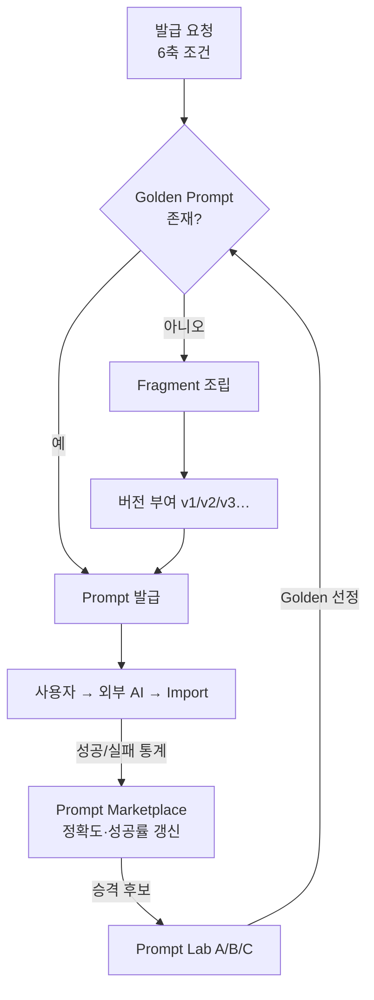

# Prompt Engine — 조건 조합 기반 Prompt 자동 생성 · 버전 관리

> **문서 상태**: 📋 설계만 (v2.5 Enterprise Edition · 미구현)
> **관련 문서**: [AI_ARCHITECTURE.md](AI_ARCHITECTURE.md) · [PROMPT_LIBRARY.md](PROMPT_LIBRARY.md) · [PROMPT_MARKETPLACE.md](PROMPT_MARKETPLACE.md) · [PROMPT_LAB.md](PROMPT_LAB.md)
> **한 줄 목적**: 문서 종류 × AI 종류 × 분석 목적 × 출력 형식 × 난이도 × 언어의 6개 축으로 최적 Prompt를 자동 생성하고, 모든 Prompt를 버전 관리한다.

---

## 목차

1. [목적](#1-목적)
2. [책임](#2-책임)
3. [데이터 흐름](#3-데이터-흐름)
4. [인터페이스](#4-인터페이스)
5. [확장성](#5-확장성)
6. [장점](#6-장점)
7. [단점](#7-단점)

---

## 1. 목적

Prompt를 사람이 매번 손으로 쓰지 않는다. **6개 축의 선택만으로** 검증된 조각(Fragment)을 조립해 최적 Prompt를 발급한다.

| 축 | 값 예시 | 출처 |
|---|---|---|
| 문서 종류 | PPT / Excel / Word / PDF / VOC / SOP / CAPA … | [PROMPT_LIBRARY.md](PROMPT_LIBRARY.md) Analyzer 14종 |
| AI 종류 | ChatGPT / Claude / Gemini / Copilot / DeepSeek / Qwen | AI 프로필 (데이터 — API 아님) |
| 분석 목적 | 구조 추출 / 문체 학습 / 용어 추출 / 규칙 발견 / 품질 진단 | 목적 카탈로그 |
| 출력 형식 | JSON Contract `payload` 스키마 지정 | [AI_ARCHITECTURE.md](AI_ARCHITECTURE.md) §4 |
| 난이도 | 요약형 / 표준형 / 정밀형 | 정밀도·토큰량 트레이드오프 |
| 언어 | ko / en / … | 사용자·문서 언어 |

## 2. 책임

| 책임 | 설명 |
|---|---|
| Prompt 조립 | Fragment(역할 지시 + Analyzer 본문 + AI별 어투 보정 + JSON Contract 지시 + 언어 지시) 조합 |
| 버전 관리 | 발급된 모든 Prompt는 `v1, v2, v3 …` 불변(immutable) 버전. 수정 = 새 버전 |
| Golden Prompt 우선 | 같은 조건에 Golden Prompt가 존재하면 **항상 Golden을 우선 발급** ([GOLDEN_TEMPLATE.md](GOLDEN_TEMPLATE.md) §2) |
| 재요청 Prompt | Import Gate 오류(E1~E3) 시 위반 내용을 반영한 교정 Prompt 재발급 |
| 하지 않는 것 | AI 호출, Prompt 성능 평가(→ Prompt Lab), 저장 정책(→ Marketplace) |

## 3. 데이터 흐름

```
[요청]  문서 종류 + 분석 목적 (+ AI 종류·난이도·언어 기본값)
   ↓
Golden Prompt 존재? ──예──→ Golden Prompt 발급
   ↓ 아니오
Fragment 조립: 역할 + Analyzer 본문 + AI 프로필 보정 + 출력 스키마 + 언어
   ↓
버전 부여 (기존 최신 vN → 그대로 재사용 / 조합 변경 시 vN+1)
   ↓
발급 → 사용 결과(Import 성공/실패)가 Marketplace 메타데이터로 회신
```



## 4. 인터페이스

```json
{
  "promptId": "ppt-analyzer.structure.claude.ko",
  "version": "v3",
  "axes": {
    "docType": "ppt", "ai": "claude", "purpose": "structure",
    "output": "autodoc.analysis.v1/ppt", "level": "정밀형", "language": "ko"
  },
  "fragments": ["role.analyst", "analyzer.ppt.v2", "ai.claude.tone", "contract.v1", "lang.ko"],
  "golden": false,
  "body": "…(발급되는 Prompt 전문)…"
}
```

| 연산(개념) | 서명 | 비고 |
|---|---|---|
| 발급 | `issue(axes) → PromptInstance` | Golden 우선 규칙 내장 |
| 재요청 | `reissue(promptId, importError) → PromptInstance` | E1~E3 교정 지시 포함 |
| 버전 조회 | `versions(promptId) → [v1, v2, …]` | 버전은 불변 |
| 조각 등록 | `registerFragment(fragment)` | 관리자 전용, Audit 기록 |

## 5. 확장성

| 시나리오 | 대응 |
|---|---|
| 새 AI 등장 | AI 프로필(어투 보정 Fragment) 1개 추가 — 데이터만 |
| 새 문서 종류 | Analyzer Fragment 추가 → [PROMPT_LIBRARY.md](PROMPT_LIBRARY.md) 등록 |
| 대량 학습(문서 50~500개+) | **배치 Prompt**: 동일 Analyzer 문서 N개를 1회 왕복으로 처리하는 묶음 발급 + 묶음 Import |
| 새 언어 | 언어 Fragment 추가 |
| 새 출력 스키마 | Contract `payload` 스키마 버전업 (`autodoc.analysis.v2`) — 봉투는 유지 |

## 6. 장점

1. **일관성** — 모든 Prompt가 같은 골격·같은 Contract를 갖는다. AI 응답 편차가 줄어든다.
2. **재현성** — `promptVersion`이 불변이라 "그때 그 Prompt"를 언제나 다시 볼 수 있다 ([DOCUMENT_REPLAY_ENGINE.md](DOCUMENT_REPLAY_ENGINE.md)).
3. **개선의 누적** — Fragment 1개 개선이 그 조각을 쓰는 모든 Prompt에 파급(DRY).
4. **Golden 우선 규칙** — 검증된 Prompt가 자동으로 기본값이 된다.

## 7. 단점

1. **조립식 Prompt의 한계** — 특수 문서는 조각 조합만으로 최적이 아닐 수 있다. (→ 수제 Prompt를 Marketplace에 직접 등록하는 우회로 허용)
2. **Fragment 품질 의존** — 나쁜 조각 하나가 광범위하게 파급된다. (→ 조각 수정도 버전·Audit 대상)
3. **버전 폭증** — 6축 조합 × 버전으로 관리 대상이 늘어난다. (→ 사용횟수 0인 조합은 발급 시점 생성(lazy)으로 억제)
