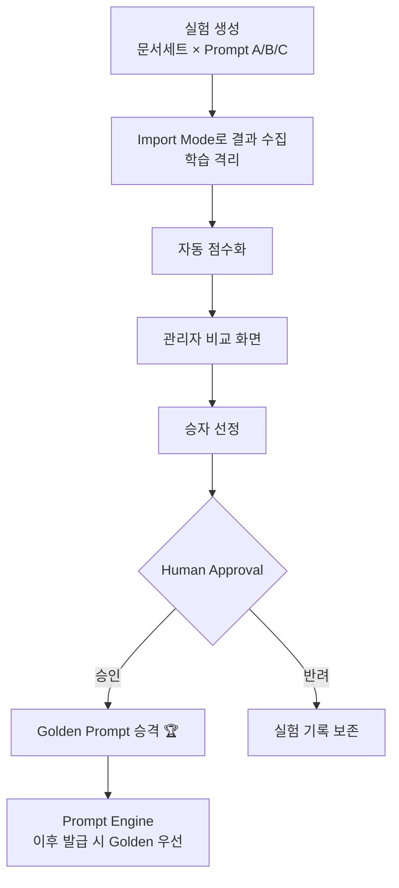

# Prompt Lab — Prompt 비교 실험 · Golden Prompt 선정

> **문서 상태**: 📋 설계만 (v2.5 Enterprise Edition · 미구현)
> **관련 문서**: [PROMPT_MARKETPLACE.md](PROMPT_MARKETPLACE.md) · [GOLDEN_TEMPLATE.md](GOLDEN_TEMPLATE.md) · [HUMAN_APPROVAL.md](HUMAN_APPROVAL.md)
> **한 줄 목적**: Prompt A/B/C를 같은 조건에서 비교 실험하고, 가장 좋은 Prompt를 Golden Prompt로 승격하는 절차를 정의한다.

---

## 목차

1. [목적](#1-목적)
2. [책임](#2-책임)
3. [데이터 흐름](#3-데이터-흐름)
4. [인터페이스](#4-인터페이스)
5. [확장성](#5-확장성)
6. [장점](#6-장점)
7. [단점](#7-단점)

---

## 1. 목적

Prompt의 우열을 주장이 아니라 **실험**으로 가린다. 관리자는 동일한 입력 문서에 대해 Prompt A · B · C의 AI 결과를 나란히 비교하고, 검증된 승자를 **Golden Prompt**로 승격한다.

## 2. 책임

| 책임 | 설명 |
|---|---|
| 실험 설계 | 비교 대상 Prompt(2~N개) + 기준 문서 세트(고정) + 평가 기준 선택 |
| 결과 수집 | 각 Prompt의 AI 결과 JSON을 Import Gate와 동일한 검증으로 수집 (**실험 결과는 학습에 반영하지 않음** — 격리) |
| 비교 평가 | 평가 기준별 점수화 + 관리자 육안 비교 화면 |
| 승격 절차 | 승자 선정 → Human Approval → `golden: true` 부여 + 기존 Golden 강등(이력 보존) |
| 하지 않는 것 | 자동 승격(반드시 관리자 승인), AI 호출(결과는 Import Mode로 수집) |

### 평가 기준

| 기준 | 측정 |
|---|---|
| Contract 준수 | E1~E3 오류 발생 여부 (탈락 조건) |
| 스키마 충실도 | payload 필수 필드 충족률 |
| 추출 정확도 | 관리자가 정답지(기준 문서에 대한 기대 결과)와 대조 |
| 안정성 | 같은 Prompt 반복 실행 시 결과 일관성 |
| 경제성 | Prompt 길이·응답 길이 (수동 왕복 부담) |

## 3. 데이터 흐름

```
실험 생성: [기준 문서 세트] × [Prompt A, B, C] × [대상 AI]
   ↓  (각 조합마다 Import Mode 왕복)
결과 수집 (격리 저장 — Company DNA 미반영)
   ↓
자동 점수화 + 관리자 육안 비교
   ↓
승자 선정 → Human Approval
   ├─ 승인 → Golden Prompt 승격 (Marketplace `golden: true`, 기존 Golden은 이력으로)
   └─ 반려 → 실험 기록만 보존
   ↓
Audit Engine 기록 (실험·승격 모두)
```



## 4. 인터페이스

```json
{
  "experimentId": "exp-2026-07-001",
  "analyzer": "ppt-analyzer",
  "documents": ["doc-017", "doc-024", "doc-101"],
  "candidates": ["ppt-analyzer.structure@v2", "ppt-analyzer.structure@v3", "custom-ppt@v1"],
  "targetAI": ["chatgpt", "claude"],
  "results": [
    { "prompt": "ppt-analyzer.structure@v3", "ai": "claude",
      "scores": { "contract": 1.0, "schema": 0.97, "accuracy": 0.95, "stability": 0.9, "economy": 0.8 } }
  ],
  "winner": "ppt-analyzer.structure@v3",
  "approval": { "status": "approved", "by": "admin@company", "at": "2026-07-10" }
}
```

| 연산(개념) | 서명 |
|---|---|
| 실험 생성 | `create(analyzer, documents[], candidates[], targetAI[]) → experimentId` |
| 결과 투입 | `importResult(experimentId, prompt, ai, json)` — Contract 검증 동일 적용 |
| 승격 요청 | `promote(experimentId, winner) → approvalRequest` |

## 5. 확장성

- **회귀 실험**: 새 AI 버전 출시 시 기존 Golden Prompt를 같은 문서 세트로 재실험 — Golden의 유효성 상시 검증.
- **기준 문서 세트의 자산화**: 정답지가 붙은 문서 세트 자체를 버전 관리 — 실험의 재현성 확보.
- **Golden Template Evolution과 연동**: Template 개선 실험도 같은 Lab 절차를 재사용 ([GOLDEN_TEMPLATE.md](GOLDEN_TEMPLATE.md) §5).

## 6. 장점

1. **증거 기반 승격** — "좋아 보이는" Prompt가 아니라 측정된 Prompt가 Golden이 된다.
2. **학습 격리** — 실험 데이터가 Company DNA를 오염시키지 않는다.
3. **재현 가능** — 고정 문서 세트 + 불변 Prompt 버전으로 실험 자체가 재현된다.

## 7. 단점

1. **수동 왕복 비용** — 실험 조합 수만큼 Import 왕복이 필요하다(문서 3 × Prompt 3 × AI 2 = 18회). (→ 배치 Prompt로 완화, 향후 AI Plugin 자동화)
2. **정답지 작성 비용** — 추출 정확도 평가에는 관리자가 만든 기대 결과가 필요하다.
3. **AI 비결정성** — 같은 Prompt도 실행마다 결과가 다를 수 있어 안정성 판정에 반복 실행이 필요하다.
