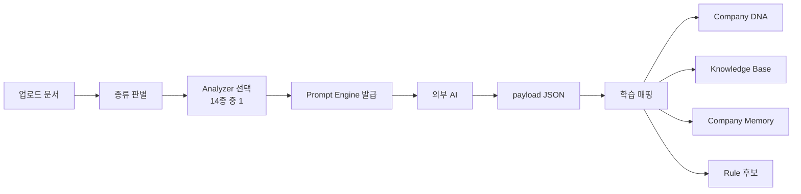

# Prompt Library — 문서별 Analyzer 14종 카탈로그

> **문서 상태**: 📋 설계만 (v2.5 Enterprise Edition · 미구현)
> **관련 문서**: [PROMPT_ENGINE.md](PROMPT_ENGINE.md) · [PROMPT_MARKETPLACE.md](PROMPT_MARKETPLACE.md) · [AI_ARCHITECTURE.md](AI_ARCHITECTURE.md)
> **한 줄 목적**: Prompt를 문서 종류별 Analyzer로 독립 관리한다 — 문서마다 물어봐야 할 것이 다르기 때문이다.

---

## 목차

1. [목적](#1-목적)
2. [책임](#2-책임)
3. [데이터 흐름](#3-데이터-흐름)
4. [인터페이스](#4-인터페이스)
5. [확장성](#5-확장성)
6. [장점](#6-장점)
7. [단점](#7-단점)

---

## 1. 목적

Prompt는 문서마다 **독립 관리**한다. PPT에서 배워야 할 것(레이아웃·색·슬라이드 흐름)과 VOC에서 배워야 할 것(증상·원인·조치·용어)은 완전히 다르다. Analyzer는 "이 문서 종류에서 무엇을 추출할 것인가"의 명세다.

## 2. 책임

### Analyzer 14종 카탈로그

| # | Analyzer | 추출 대상(핵심) | 주요 수혜 모듈 |
|---|---|---|---|
| 1 | PPT Analyzer | 슬라이드 구조·레이아웃·색·폰트·표·차트·로고 위치 | Golden Template · DNA(Layout/Brand) |
| 2 | Excel Analyzer | 시트 구조·표 규칙·수식 패턴·조건부 서식 | DNA(Table Rule) · Rule Engine |
| 3 | Word Analyzer | 섹션 순서·제목 체계·문체·서식 | DNA(Writing Style/Section Order) |
| 4 | PDF Analyzer | 페이지 구성·양식 필드·직인/서명 위치 | Golden Template |
| 5 | VOC Analyzer | 고객 불만 유형·증상·제품·조치 용어 | Knowledge Base · Ontology |
| 6 | Inspection Analyzer | 점검 항목·판정 기준·주기 | Rule Engine · KB |
| 7 | Meeting Analyzer | 안건·결정·액션아이템 구조 | Company Memory(보고 방식) |
| 8 | Quality Analyzer | 품질 지표·불량 분류·판정 흐름 | Rule Engine · Ontology |
| 9 | ISO Analyzer | 조항 매핑·문서 통제 규칙·기록 요건 | Audit · Replay 요건 |
| 10 | Manual Analyzer | 목차 체계·경고문 스타일·그림 규칙 | DNA(Image Rule) |
| 11 | Training Analyzer | 교육 단원 구조·평가 항목 | Company Memory |
| 12 | SOP Analyzer | 절차 단계·책임자(R&R)·개정 이력 규칙 | Workflow Engine · Ontology |
| 13 | CAPA Analyzer | 원인 분석 구조·시정/예방조치·효과성 확인 | Ontology(증상→원인→조치) |
| 14 | Report Analyzer | 보고 순서·요약 스타일·수치 표기 규칙 | DNA(Report Flow) |

각 Analyzer는 ① Prompt 본문 Fragment, ② `payload` JSON Schema, ③ 학습 매핑(payload → DNA/KB 필드) 3요소를 가진다.

## 3. 데이터 흐름

```
문서 업로드 → 문서 종류 판별(확장자 + 관리자 확인)
   ↓
해당 Analyzer 선택 (예: .pptx → PPT Analyzer)
   ↓
Prompt Engine이 Analyzer Fragment로 Prompt 발급
   ↓
외부 AI → JSON payload (Analyzer 스키마 준수)
   ↓
학습 매핑 실행: payload 필드 → Company DNA / KB / Memory / Rule 후보로 변환
```



## 4. 인터페이스

Analyzer 정의(데이터) 스키마:

```json
{
  "analyzerId": "voc-analyzer",
  "name": "VOC Analyzer",
  "docTypes": ["xlsx", "csv", "docx"],
  "promptFragment": "analyzer.voc.v1",
  "payloadSchema": "autodoc.analysis.v1/voc",
  "learningMap": [
    { "from": "payload.terms[]",    "to": "kb.term",            "confidenceField": "termConfidence" },
    { "from": "payload.symptoms[]", "to": "ontology.symptom",   "confidenceField": "confidence" },
    { "from": "payload.actions[]",  "to": "ontology.action",    "confidenceField": "confidence" }
  ]
}
```

| 연산(개념) | 서명 | 비고 |
|---|---|---|
| 목록 | `list() → Analyzer[]` | Workspace별 활성 목록 |
| 판별 | `detect(file) → analyzerId?` | 모호하면 관리자에게 질문 |
| 매핑 | `mapToLearning(payload) → LearningProposal[]` | [LEARNING_ENGINE.md](LEARNING_ENGINE.md) §4 형식 |

## 5. 확장성

- **새 Analyzer 추가 = 데이터 3요소 등록** (Fragment + payloadSchema + learningMap). 코드·Core 수정 없음.
- 회사 고유 문서(예: 출장보고, 작업표준서)는 기존 Analyzer 복제 후 수정으로 시작 — Marketplace의 복사 기능 사용 ([PROMPT_MARKETPLACE.md](PROMPT_MARKETPLACE.md) §2).
- Analyzer는 Workspace별로 커스터마이즈 가능(기본 14종은 전 Workspace 공통 시드).

## 6. 장점

1. **관심사 분리** — 문서 종류별 지식 요구가 서로 오염되지 않는다.
2. **학습 매핑의 명시성** — "AI 응답의 어떤 필드가 회사 지식의 어디로 가는가"가 데이터로 문서화된다.
3. **시드 제공** — 14종이 초기값이므로 최초 설치(Company Learning Mode) 즉시 가동 가능.

## 7. 단점

1. **복합 문서 처리** — 하나의 파일에 표+보고서+차트가 섞이면 단일 Analyzer로 부족하다. (→ 다중 Analyzer 순차 적용은 차기 설계)
2. **판별 오류 위험** — 확장자만으로 종류를 오판할 수 있다. (→ 판별 결과는 항상 관리자 확인을 거침)
3. **learningMap 유지비** — DNA/KB 스키마가 바뀌면 14종의 매핑을 함께 점검해야 한다.
