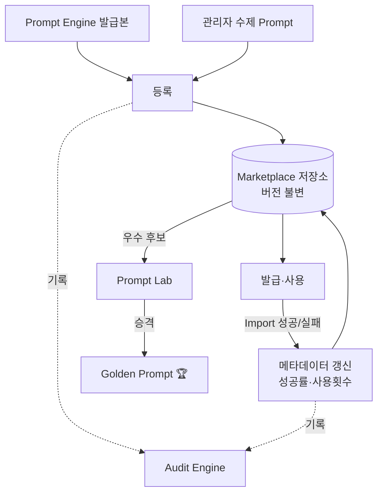

# Prompt Marketplace — Prompt의 회사 자산화

> **문서 상태**: 📋 설계만 (v2.5 Enterprise Edition · 미구현)
> **관련 문서**: [PROMPT_ENGINE.md](PROMPT_ENGINE.md) · [PROMPT_LAB.md](PROMPT_LAB.md) · [AUDIT_ENGINE.md](AUDIT_ENGINE.md)
> **한 줄 목적**: Prompt도 회사 자산이다 — 등록·공유·버전관리·복사·백업과 성과 메타데이터(정확도·성공률 등)를 관리한다.

---

## 목차

1. [목적](#1-목적)
2. [책임](#2-책임)
3. [데이터 흐름](#3-데이터-흐름)
4. [인터페이스](#4-인터페이스)
5. [확장성](#5-확장성)
6. [장점](#6-장점)
7. [단점](#7-단점)

---

## 1. 목적

좋은 Prompt는 만든 사람의 머릿속이 아니라 **회사 저장소**에 있어야 한다. Marketplace는 Prompt의 저장·유통 계층으로, 관리자가 Prompt를 **등록 · 공유 · 버전관리 · 복사 · 백업**할 수 있게 한다.

## 2. 책임

| 기능 | 설명 |
|---|---|
| 등록 | Prompt Engine 발급본 또는 수제 Prompt를 자산으로 등록 |
| 공유 | Workspace 내 공유 (기본). Workspace 간 이동은 내보내기/가져오기(관리자 승인) |
| 버전관리 | 수정 = 새 버전. 이전 버전은 불변 보존 ([PROMPT_ENGINE.md](PROMPT_ENGINE.md) §2와 동일 규칙) |
| 복사 | 기존 Prompt를 복제해 파생 Prompt 생성 (계보 `derivedFrom` 기록) |
| 백업 | 전체 Prompt 자산의 JSON 내보내기/복원 |
| 메타데이터 집계 | Import 결과·Lab 실험 결과를 받아 정확도·성공률 갱신 |
| 하지 않는 것 | Prompt 성능 비교 실험(→ [PROMPT_LAB.md](PROMPT_LAB.md)), Golden 승격 결정(→ Lab + Human Approval) |

## 3. 데이터 흐름

```
Prompt Engine 발급 / 관리자 수제 작성
   ↓ 등록
Marketplace 저장 (버전 v1)
   ↓ 사용될 때마다
사용횟수 +1, Import 성공/실패 → 성공률 갱신, 승인된 학습 기여 → 정확도 갱신
   ↓ 성과 우수 Prompt
Prompt Lab 실험 후보 → Golden Prompt 승격 ([PROMPT_LAB.md](PROMPT_LAB.md))
   ↓ 모든 등록·수정·삭제
Audit Engine 기록
```



## 4. 인터페이스

Prompt 자산 레코드:

```json
{
  "promptId": "voc-analyzer.terms.chatgpt.ko",
  "version": "v2",
  "name": "VOC 용어 추출 (정밀형)",
  "author": "admin@company",
  "derivedFrom": "voc-analyzer.terms.chatgpt.ko@v1",
  "golden": false,
  "metadata": {
    "accuracy": 0.94,
    "successRate": 0.98,
    "supportedAI": ["chatgpt", "claude", "gemini"],
    "supportedAIVersion": { "chatgpt": ">=4", "claude": ">=3.5" },
    "usageCount": 132,
    "lastModified": "2026-07-10"
  }
}
```

| 메타데이터 | 정의 | 갱신 시점 |
|---|---|---|
| 정확도(accuracy) | 이 Prompt로 생성된 학습 제안 중 관리자 **승인** 비율 | Human Approval 처리 시 |
| 성공률(successRate) | Import Gate 통과율 (E1~E3 미발생 비율) | Import 시 |
| 지원 AI / 지원 버전 | 검증된 AI·버전 목록 | Lab 실험·관리자 갱신 |
| 작성자 / 사용횟수 / 최종 수정일 | 계보·활용도 추적 | 등록·사용·수정 시 |

## 5. 확장성

- **Workspace 간 유통**: 다중 회사 운영 시 "공용 카탈로그(익명화된 Prompt 골격만)"로 승격하는 2단계 유통 구조 확장 가능 — 회사 고유 용어가 포함된 Prompt는 내보내기 시 자동 마스킹 검사.
- **평점·리뷰**: 사용자 피드백 필드는 스키마에 예약(`review[]` 📋).
- **백업 자동화**: 백업 파일은 Replay 스냅샷과 함께 보관 ([DOCUMENT_REPLAY_ENGINE.md](DOCUMENT_REPLAY_ENGINE.md) §5).

## 6. 장점

1. **암묵지의 형식지화** — 개인의 Prompt 노하우가 회사 자산으로 축적된다.
2. **데이터 기반 선별** — 감이 아니라 정확도·성공률 수치로 좋은 Prompt가 드러난다.
3. **계보 추적** — `derivedFrom`으로 어떤 Prompt에서 파생·개선됐는지 이력 보존.
4. **재해 복구** — 백업/복원으로 Prompt 자산 유실 방지.

## 7. 단점

1. **지표의 왜곡 가능성** — 사용횟수가 적은 Prompt의 정확도는 통계적으로 불안정하다. (→ 최소 표본 수 미달 시 지표를 "잠정"으로 표기)
2. **중복 등록** — 유사 Prompt 난립 가능. (→ 등록 시 유사도 경고, 정리 권한은 관리자)
3. **운영 부담** — 메타데이터 집계 이벤트 처리량이 늘어난다. (→ Event Bus 비동기 집계)
