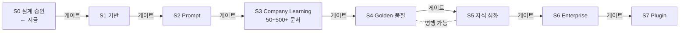

# AutoDoc v2.5 Roadmap — 단계 계획 · 승인 게이트

> **문서 상태**: 📋 설계만 (v2.5 Enterprise Edition · 미구현)
> **관련 문서**: [DESIGN.md](DESIGN.md) · [FEATURE_FLAG.md](FEATURE_FLAG.md) · v1 이력: [../ROADMAP.md](../ROADMAP.md) · [../PHASE_PLAN.md](../PHASE_PLAN.md)
> **한 줄 목적**: 설계 승인부터 Plugin 시대까지의 단계 계획. **모든 단계는 사용자(관리자) 승인 게이트를 통과해야 시작한다. 이번 산출물은 설계 문서까지다 — 구현은 승인 전 절대 시작하지 않는다.**

---

## 목차

1. [목적](#1-목적)
2. [책임 — 단계 정의](#2-책임--단계-정의)
3. [데이터 흐름 — 단계 전환 규칙](#3-데이터-흐름--단계-전환-규칙)
4. [인터페이스 — 단계별 산출물·게이트 기준](#4-인터페이스--단계별-산출물게이트-기준)
5. [확장성](#5-확장성)
6. [장점](#6-장점)
7. [단점](#7-단점)

---

## 1. 목적

v1은 MVP → Phase 4까지 구현 완료된 상태다([../ROADMAP.md](../ROADMAP.md)). v2.5는 그 위에 얹는 별도 트랙이며, 원칙은 셋이다:

1. **설계 우선** — 각 단계는 구현 전 설계 승인.
2. **Flag 뒤에서 성장** — 모든 신기능은 off로 태어난다 ([FEATURE_FLAG.md](FEATURE_FLAG.md)).
3. **v1 무수정** — 어느 단계도 v1 코드·문서를 건드리지 않는다.

## 2. 책임 — 단계 정의

| 단계 | 이름 | 핵심 내용 | 관련 문서 |
|---|---|---|---|
| **S0** | 설계 승인 | 본 26종 설계 문서 검토·승인 ← **지금 여기** | 전체 |
| **S1** | 기반 계층 | Event Bus · Workspace Context · Store 추상화 · Feature Flag · Audit(수집) | [EVENT_BUS.md](EVENT_BUS.md) 외 |
| **S2** | Prompt 계층 | Prompt Engine · Library(14종 시드) · Marketplace · Import Gate(JSON Contract) | [PROMPT_ENGINE.md](PROMPT_ENGINE.md) 외 |
| **S3** | Company Learning 최초 설치 | 회사 문서 **50~500개 이상** 업로드 → Import Mode 학습 → DNA·KB·Memory 초기 구축 + Confidence·Human Approval 가동 | [LEARNING_ENGINE.md](LEARNING_ENGINE.md) 외 |
| **S4** | 기준·품질 | Golden Template 지정 · Golden Prompt(Lab) · Golden Score · AI Review · Document Model v2(provenance) | [GOLDEN_TEMPLATE.md](GOLDEN_TEMPLATE.md) 외 |
| **S5** | 지식 심화 | Ontology · Knowledge Graph · Rule Engine · Company Memory 제안 가동 | [COMPANY_ONTOLOGY.md](COMPANY_ONTOLOGY.md) 외 |
| **S6** | Enterprise Engines | Workflow · Replay · Audit(리포트) · Learning Timeline 운영 | [WORKFLOW_ENGINE.md](WORKFLOW_ENGINE.md) 외 |
| **S7** | Plugin 시대 | Plugin Host · 알림(Mail/Slack/Teams) → AI Transport → ERP/OCR/전자결재/DB | [PLUGIN_ARCHITECTURE.md](PLUGIN_ARCHITECTURE.md) |

## 3. 데이터 흐름 — 단계 전환 규칙

```
설계(해당 단계 상세) → 사용자 승인 게이트 → 구현 → 검증 기준 통과 → Flag on (파일럿 Workspace)
   → 운영 관찰 → 승인 게이트 → 다음 단계
   실패 시: Flag off (즉시 후퇴) → 원인 분석 → 재시도
```



의존이 없는 단계(S4↔S5 일부)는 승인하에 병행 가능. 단, S1(기반)과 S3(학습)은 모든 후속의 전제다.

## 4. 인터페이스 — 단계별 산출물·게이트 기준

| 단계 | 산출물 | 게이트 통과 기준(발췌) |
|---|---|---|
| S0 | 설계 문서 26종 | 사용자 승인. **구현 산출물 0개 확인** |
| S1 | 버스·컨텍스트·Flag·Audit 수집 | 이벤트 발행→구독→Audit 기록 왕복 검증. v1 화면 무영향 확인 |
| S2 | Prompt 발급·Import Gate | 14종 Analyzer Prompt 발급, E1~E3 오류 처리, 비 JSON 거부 검증 |
| S3 | 초기 DNA·KB·Memory | 문서 ≥50개 학습, 승인 처리율·KB 용어 수 목표치, 관리자 부하 보고 |
| S4 | Golden 3종·Score·provenance | 문서 종류 ≥3에 Golden 지정, 채점 편차 리포트 검증 |
| S5 | Ontology·Graph·Rule | 시드 12클래스 가동, 엣지 제안→승인 흐름, 규칙 3종 이상 운영 |
| S6 | Workflow·Replay | 결재 1주기 완주, 문서 1건 완전 재현(해시 일치) |
| S7 | Plugin ≥2종 | 알림 1종 + AI Transport 1종, 장애 격리 시험 통과 |

모든 게이트 결정 자체가 Audit 기록 대상이다.

## 5. 확장성

- 단계는 재계획 가능 — 본 문서의 버전을 올려 갱신하고, 변경 사유를 Audit·문서 이력에 남긴다.
- 새 요구(예: 다국어)는 기존 단계에 끼워 넣지 않고 S8+로 후속 부여 — 게이트 규율 유지.
- 다중 Workspace 확장은 별도 단계가 아니다 — S1의 Workspace Context가 전제라서, 신규 회사는 어느 시점이든 온보딩 가능.

## 6. 장점

1. **위험의 계단화** — 큰 비전을 승인 게이트 8개로 쪼개 한 번에 걸리는 위험이 작다.
2. **가치 조기 도달** — S3만 끝나도 "회사 용어·스타일을 아는 AutoDoc"이라는 체감 가치가 나온다.
3. **후퇴 가능** — 모든 단계가 Flag 뒤라 실패해도 v1 운영에 영향이 없다.

## 7. 단점

1. **전체 기간 장기화** — 게이트마다 대기가 생긴다. (→ 병행 가능 단계 명시로 완화)
2. **S3의 운영 부담 집중** — 최초 학습의 승인량이 관리자에게 몰린다. (→ 묶음 승인 + 임계값 보수 설정, [HUMAN_APPROVAL.md](HUMAN_APPROVAL.md) §7)
3. **설계-현실 간극** — 후행 단계 설계는 선행 단계 운영에서 배운 것으로 수정될 것이다. (→ 이는 결함이 아니라 계획 — 각 단계 시작 전 상세 설계 재확정)
