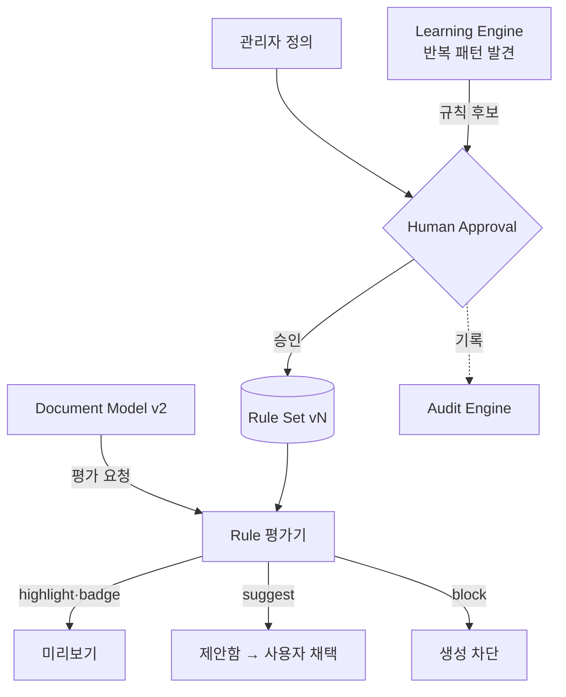

# Rule Engine — 회사 업무 규칙의 데이터화

> **문서 상태**: 📋 설계만 (v2.5 Enterprise Edition · 미구현)
> **관련 문서**: [COMPANY_DNA.md](COMPANY_DNA.md) · [LEARNING_ENGINE.md](LEARNING_ENGINE.md) · [HUMAN_APPROVAL.md](HUMAN_APPROVAL.md) · v1 [../VALIDATION_SPEC.md](../VALIDATION_SPEC.md)
> **한 줄 목적**: "VOC > 20이면 경고" 같은 회사 업무 규칙을 코드가 아니라 데이터로 정의·평가·관리한다.

---

## 목차

1. [목적](#1-목적)
2. [책임](#2-책임)
3. [데이터 흐름](#3-데이터-흐름)
4. [인터페이스](#4-인터페이스)
5. [확장성](#5-확장성)
6. [장점](#6-장점)
7. [단점](#7-단점)

---

## 1. 목적

회사에는 문서에 적용되는 암묵적 판단 규칙이 있다. Rule Engine은 이를 **선언적 데이터**로 만든다.

| 규칙 예 | 조건 | 효과 |
|---|---|---|
| VOC 경고 | `VOC > 20` | 경고 배지 표시 |
| 재고 소진 | `재고 = 0` | 해당 셀 빨간색 |
| Call 급증 | `Call 증가율 > 30%` | 자동 강조 + 요약문 삽입 제안 |

v1 Validation([../VALIDATION_SPEC.md](../VALIDATION_SPEC.md))이 "입력이 올바른가"를 검사한다면, Rule Engine은 **"데이터가 무엇을 의미하는가"** 를 판단한다.

## 2. 책임

| 책임 | 설명 |
|---|---|
| 규칙 정의 | 조건(condition) + 효과(effect) + 적용 범위(scope)의 선언적 레코드 |
| 평가 | Document Model 조립·미리보기 시 규칙 평가 → 효과 적용 목록 산출 |
| 학습 수용 | **Learning Engine은 관리자 승인 후 Rule을 생성할 수 있다** — 반복 패턴(예: 관리자가 항상 재고 0 셀을 빨갛게 수정)에서 규칙 후보 발굴 |
| 이력 | 규칙의 생성·수정·비활성은 버전 + Audit 기록 |
| 하지 않는 것 | 문서 내용 자동 변경(효과는 표시·강조·**제안**까지 — 값 변경은 Human Approval 원칙 적용) |

### 효과(effect) 종류

| effect | 설명 | 자동 실행 |
|---|---|---|
| `highlight` | 색·굵기 등 시각 강조 | ✅ (표시일 뿐 내용 불변) |
| `badge` | 경고·주의 배지 | ✅ |
| `suggest` | 문장·조치 삽입 제안 | 제안만 (사용자 채택) |
| `block` | 생성 차단 (필수 규칙 위반) | ✅ (관리자 정의 시) |

## 3. 데이터 흐름

```
[정의]  관리자 직접 등록 / Learning Engine 규칙 후보 → Human Approval → Rule Set 반영
[평가]  Document Model 조립 완료
          ↓ rule.evaluate(model)
        조건 일치 규칙 목록 → effect 적용 (highlight/badge 즉시, suggest는 제안함으로)
          ↓
        미리보기·Golden Score·AI Review에 결과 전달
```



## 4. 인터페이스

```json
{
  "ruleId": "rule-voc-warning",
  "name": "VOC 20건 초과 경고",
  "scope": { "docTypes": ["weekly-report"], "field": "voc.count" },
  "condition": { "op": ">", "left": "$voc.count", "right": 20 },
  "effect": { "type": "badge", "level": "warning", "message": "VOC 20건 초과 — 원인 분석 첨부 권장" },
  "origin": "admin | learning",
  "version": 2,
  "enabled": true,
  "confidence": 0.95
}
```

| 연산(개념) | 서명 |
|---|---|
| 평가 | `evaluate(documentModel) → RuleResult[]` |
| 등록 | `register(rule) → 승인 요청` (learning 출처는 필수 승인) |
| 비활성 | `disable(ruleId, reason)` — Audit 기록 |
| 조건 문법 | `op ∈ { >, >=, <, <=, =, !=, contains, changed-by(%) }` — v1 Validation 문법 확장 |

## 5. 확장성

- **조건 연산 추가** = 연산자 카탈로그 확장(데이터 + 평가기 1곳). 규칙 레코드는 불변.
- **복합 조건**: `and/or` 중첩은 `condition`을 트리로 확장 — `schemaVersion` 상향.
- **Graph 참조 조건**: "이 증상의 관련 CAPA가 미종결이면 경고" 같은 Knowledge Graph 참조 조건 📋 차기.
- **외부 데이터 조건**: ERP 재고 등 Plugin 공급 값도 `$` 경로로 동일 평가.

## 6. 장점

1. **암묵 규칙의 명문화** — "팀장님이 늘 지적하던 것"이 시스템 규칙이 된다.
2. **코드 없는 규칙 추가** — 조건+효과 데이터 등록만으로 동작 (Data Driven).
3. **학습과의 결합** — 관리자의 반복 수정이 규칙 후보로 자동 발굴된다.

## 7. 단점

1. **표현력의 한계** — 선언적 조건으로 못 담는 복잡한 판단이 있다. (→ 무리하게 담지 않고 사람 판단으로 남긴다 — KISS)
2. **규칙 충돌** — 두 규칙이 같은 셀에 다른 색을 지시할 수 있다. (→ 우선순위 필드 + 충돌 감지 경고)
3. **과잉 경고 피로** — 규칙이 늘수록 배지가 범람한다. (→ 채택률 통계로 무시되는 규칙 정리 제안)
