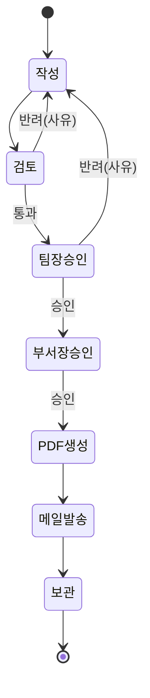

# Workflow Engine — 문서 생성 이후의 업무 흐름

> **문서 상태**: 📋 설계만 (v2.5 Enterprise Edition · 미구현)
> **관련 문서**: [COMPANY_DNA.md](COMPANY_DNA.md) · [PLUGIN_ARCHITECTURE.md](PLUGIN_ARCHITECTURE.md) · [AUDIT_ENGINE.md](AUDIT_ENGINE.md) · [EVENT_BUS.md](EVENT_BUS.md)
> **한 줄 목적**: 문서가 생성된 뒤의 흐름(검토→승인→발송→보관)을 Template별로 정의 가능한 선언적 Workflow로 관리한다.

---

## 목차

1. [목적](#1-목적)
2. [책임](#2-책임)
3. [데이터 흐름](#3-데이터-흐름)
4. [인터페이스](#4-인터페이스)
5. [확장성](#5-확장성)
6. [장점](#6-장점)
7. [단점](#7-단점)

---

## 1. 목적

문서는 생성으로 끝나지 않는다. 회사에는 생성 이후의 정해진 흐름이 있다:

```
작성 → 검토 → 팀장 승인 → 부서장 승인 → PDF 생성 → 메일 발송 → 보관
```

이 흐름을 코드가 아니라 **Workflow 정의(데이터)** 로 만들고, **Template별로 다른 Workflow**를 연결할 수 있게 한다. (주간보고는 팀장 전결, CAPA는 2단 결재 + ISO 보관)

## 2. 책임

| 책임 | 설명 |
|---|---|
| Workflow 정의 | 단계(step) 목록 + 단계별 담당(role) + 완료 조건 + 다음 단계 |
| 인스턴스 실행 | 문서 1건마다 Workflow 인스턴스 생성·단계 진행·상태 추적 |
| Template 연결 | Template → Workflow 매핑 (DNA `refs.workflows`, [COMPANY_DNA.md](COMPANY_DNA.md) §4) |
| 자동 단계 실행 | `generate-pdf`·`send-mail`·`archive` 같은 시스템 단계는 이벤트로 위임 (발송은 Mail Plugin) |
| 반려 흐름 | 반려 시 지정 단계로 회귀 + 사유 기록 |
| 하지 않는 것 | 승인 판단 대행(사람 단계는 반드시 사람이), 결재 시스템 자체 구현(전자결재 Plugin에 위임 가능) |

### 단계 종류

| type | 실행 주체 | 예 |
|---|---|---|
| `human` | 지정 role의 사용자 | 검토, 팀장 승인, 부서장 승인 |
| `system` | 이벤트 발행으로 위임 | PDF 생성, 메일 발송, 보관 |
| `gateway` | 외부 결재 Plugin | 사내 전자결재 왕복 |
| `condition` | Rule 평가 | "Golden Score < 80이면 검토 단계 추가" |

## 3. 데이터 흐름

```
문서 생성 완료 (document.generated)
   ↓
Template의 Workflow 조회 → 인스턴스 생성 (단계 1: 작성 완료 상태)
   ↓
검토(human) → 팀장 승인(human) → 부서장 승인(human)
   │  각 단계: workflow.step.completed 이벤트 + Audit 기록
   ├─ 반려 → 지정 회귀 단계 + 사유 (작성자에게 알림 Plugin)
   ↓
PDF 생성(system) → 메일 발송(system→Mail Plugin) → 보관(system)
   ↓
workflow.completed → Replay 스냅샷에 최종 상태 봉인
```



## 4. 인터페이스

```json
{
  "workflowId": "wf-report",
  "version": 2,
  "appliesTo": ["weekly-report", "trip-report"],
  "steps": [
    { "id": "draft",    "type": "human",  "role": "author",   "next": "review" },
    { "id": "review",   "type": "human",  "role": "reviewer", "next": "team-approve", "rejectTo": "draft" },
    { "id": "team-approve", "type": "human", "role": "team-lead", "next": "dept-approve", "rejectTo": "draft" },
    { "id": "dept-approve", "type": "human", "role": "dept-head", "next": "make-pdf",  "rejectTo": "review" },
    { "id": "make-pdf", "type": "system", "action": "generate-pdf", "next": "send" },
    { "id": "send",     "type": "system", "action": "send-mail", "config": { "to": "$recipients" }, "next": "archive" },
    { "id": "archive",  "type": "system", "action": "archive", "next": null }
  ]
}
```

| 연산(개념) | 서명 |
|---|---|
| 시작 | `start(workflowId, documentRef) → instanceId` |
| 진행 | `complete(instanceId, stepId, decision, comment?)` |
| 상태 | `status(instanceId) → { currentStep, history[] }` |
| 정의 등록 | `register(workflow)` — Human Approval + Audit |

## 5. 확장성

- **단계 종류 추가** = type 카탈로그 확장 (예: `parallel` 병렬 합의 📋).
- **전자결재 이관**: `human` 단계를 `gateway`로 바꾸면 사내 결재 시스템이 대신 처리 — Workflow 정의만 수정, 엔진 무수정.
- **조건 분기**: `condition` 단계가 Rule Engine을 재사용 — "금액 > 100만원이면 임원 승인 추가".
- **Human Approval 재사용**: 지식 변경 승인의 다단계화([HUMAN_APPROVAL.md](HUMAN_APPROVAL.md) §5)는 본 엔진의 결재 체인을 그대로 쓴다.

## 6. 장점

1. **부서 현실 반영** — Template마다 다른 결재 경로를 코드 없이 구성.
2. **추적 가능성** — 문서가 지금 어디 있는지, 누가 얼마나 잡고 있는지 보인다.
3. **자동화 지점 명확** — 사람 단계와 시스템 단계가 타입으로 구분되어 자동화 범위가 명시적.

## 7. 단점

1. **조직 변경 취약** — 조직 개편 시 role 매핑 일괄 정비가 필요하다. (→ role은 사람이 아니라 역할명에 바인딩, 역할→사람 매핑은 별도 테이블)
2. **BPM 범위 침범 위험** — 복잡한 분기·병렬을 다 담으면 엔진이 비대해진다. (→ KISS — 문서 흐름에 필요한 최소 타입만, 그 이상은 전자결재 Plugin으로)
3. **정체 문서** — 승인자가 방치하면 흐름이 멈춘다. (→ 단계별 기한 + 알림 Plugin 에스컬레이션)
