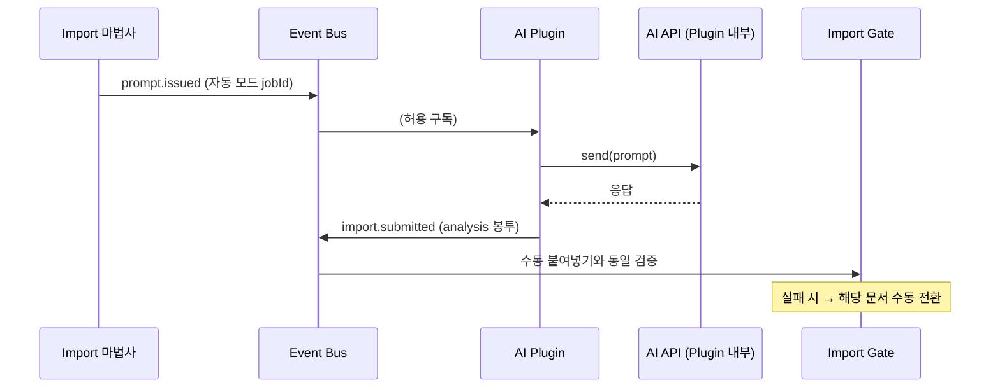

# AI Plugin Spec — analyzer-transport 계약

> **문서 상태**: 📋 설계만 (v2.5 Technical Specification · 미구현 · MVP 제외)
> **관련 문서**: [PLUGIN_SPEC.md](PLUGIN_SPEC.md) · [../AI_ARCHITECTURE.md](../AI_ARCHITECTURE.md) · [JSON_SCHEMA.md](JSON_SCHEMA.md)(analysis 봉투) · [SECURITY_SPEC.md](SECURITY_SPEC.md)
> **한 줄 목적**: 수동 Import Mode를 자동화하는 AI Plugin(능력 `analyzer-transport`)의 계약 — 어떤 AI가 와도 이 계약 하나로 붙는다.

---

## 목차

1. [목적](#1-목적) · 2. [책임](#2-책임) · 3. [인터페이스](#3-인터페이스) · 4. [입력](#4-입력) · 5. [출력](#5-출력) · 6. [데이터 흐름](#6-데이터-흐름) · 7. [의존성](#7-의존성) · 8. [확장성](#8-확장성) · 9. [장점](#9-장점) · 10. [단점](#10-단점)

---

## 1. 목적

AI Plugin은 **운송자(transport)일 뿐**이다: 발급된 Prompt를 특정 AI API로 보내고, 응답을 analysis 봉투로 감싸 Import Gate에 투입한다. 분석의 의미·검증·학습은 전부 기존 경로(수동 붙여넣기와 동일) — Core는 Plugin 유무를 모른다 (I1).

## 2. 책임

| 책임 | 규칙 |
|---|---|
| Prompt 수신 | `prompt.issued` 구독 — **자동 모드가 켜진 작업(jobId)의 Prompt만** 처리 (수동 병행 허용) |
| API 호출 | Plugin 내부에서만 — 엔드포인트·모델명·인증은 Plugin 설정 (Core 코드 어디에도 없음) |
| 봉투 포장 | 응답 → `autodoc.analysis.v1` 봉투 (`promptVersion` 반드시 발급본과 일치) |
| 투입 | `import.submitted` 발행 → Import Gate가 **수동 붙여넣기와 완전 동일하게** 검증 (우회 금지) |
| 실패 처리 | API 오류 = retryable 재시도 → 초과 시 해당 문서를 "수동 처리로 전환" 표시 (마법사가 이어받음) |
| 시크릿 | API Key는 GAS Script Properties 보관, Plugin은 참조 키만 — 클라이언트 저장 금지 |

## 3. 인터페이스

manifest (계약 예시):

```json
{ "pluginId": "ai-claude", "version": "1.0.0",
  "capabilities": ["analyzer-transport"],
  "subscribes": ["prompt.issued"],
  "publishes": ["import.submitted", "plugin.error"],
  "config": { "requires": ["apiKeyRef", "model"], "flag": "plugin.ai-claude" } }
```

| transport 구현 의무 | 내용 |
|---|---|
| `send(prompt) → rawResponse` | Plugin 내부 — 시간 초과·재시도 자체 관리 |
| `wrap(rawResponse, promptMeta) → analysisEnvelope` | 구문 정리만 허용(코드펜스 제거 등) — **의미 보정 금지** ([../AI_ARCHITECTURE.md](../AI_ARCHITECTURE.md) §7) |
| 처리량 | 배치 작업 시 순차 처리 + 진행 보고(진행판 연동 — [../ui/LEARNING_MODE_UX.md](../ui/LEARNING_MODE_UX.md) §5) |

## 4. 입력

`prompt.issued` payload(promptId·version·body·jobId) · Plugin 설정(모델·키 참조) · AI API 응답.

## 5. 출력

`import.submitted` (analysis 봉투) · `plugin.error` · 진행 상태 보고.

## 6. 데이터 흐름

```
관리자: Import 마법사에서 "자동 처리(설치된 AI)" 선택
  → prompt.issued(jobId) → AI Plugin: send → AI API → 응답
  → wrap(봉투) → import.submitted
  → Import Gate: 수동과 동일 검증 (E1~E3 동일 적용)
  → 이후 학습·승인 경로 동일 — 마법사 ②~④가 "자동 처리 카드"로 접힘
```



## 7. 의존성

AI Plugin → Host ctx(publish·config·logger)만. Import Gate·Learning은 Plugin의 존재를 모른다 — `import.submitted`의 발신자가 사람인지 Plugin인지 구분하지 않는다(출처는 Audit 메타에만).

## 8. 확장성

- **새 AI 추가** = manifest 1개 + transport 구현 + Flag — Core·Gate·Prompt Engine 무수정 (v2.5 핵심 약속의 실행 형태).
- 다중 AI 병행: 문서별 대상 AI 선택은 마법사 옵션 — Prompt Engine의 AI 프로필 축과 자동 정합.

## 9. 장점

1. **검증 우회 불가 구조** — 자동이든 수동이든 같은 Gate — 자동화가 품질 게이트를 약화시키지 않는다.
2. **시크릿 서버 보관** — API Key가 브라우저에 없다.
3. **수동 폴백 내장** — Plugin 장애 = 수동 모드로 자연 강등, 기능 정지 없음.

## 10. 단점

1. **클라이언트 발 API 호출의 CORS** — 일부 AI API는 브라우저 직호출 불가. (→ 그 경우 GAS 경유 프록시 변형을 Plugin 내부 선택지로 — v1 Phase 4 프록시 패턴 재사용)
2. **비용 통제** — 자동 배치는 API 비용을 빠르게 쓴다. (→ 작업당 상한·진행판 비용 표시)
3. **응답 품질 책임 경계** — 나쁜 응답은 Plugin 탓인지 Prompt 탓인지 모호. (→ Marketplace 통계가 AI별로 분리 집계되어 판별 근거 제공)
