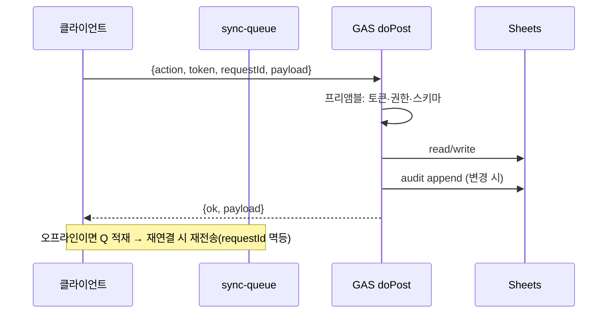

# API Spec — 클라이언트 ↔ GAS 전 API 정의

> **문서 상태**: 📋 설계만 (v2.5 Technical Specification · 미구현)
> **관련 문서**: [GOOGLE_APPS_SCRIPT_SPEC.md](GOOGLE_APPS_SCRIPT_SPEC.md) · [JSON_SCHEMA.md](JSON_SCHEMA.md) · [SECURITY_SPEC.md](SECURITY_SPEC.md) · [ERROR_SPEC.md](ERROR_SPEC.md) · v1: [../../API_SPEC.md](../../API_SPEC.md)(14액션 — 무수정)
> **한 줄 목적**: 모든 API의 Request·Response·Error Code·권한·Timeout·Retry·Version을 정의한다.

---

## 목차

1. [목적](#1-목적) · 2. [책임 — 액션 카탈로그](#2-책임--액션-카탈로그) · 3. [인터페이스](#3-인터페이스) · 4. [입력](#4-입력) · 5. [출력](#5-출력) · 6. [데이터 흐름](#6-데이터-흐름) · 7. [의존성](#7-의존성) · 8. [확장성](#8-확장성) · 9. [장점](#9-장점) · 10. [단점](#10-단점)

---

## 1. 목적

v1 규약(POST `text/plain` preflight 회피 + `?action=` 라우팅)을 계승한 v2 전용 API(`autodoc_v2_gas.gs`)를 정의한다. v1 14액션은 무수정 병존.

## 2. 책임 — 액션 카탈로그

| action | 권한 | 요지 | MVP |
|---|---|---|---|
| `v2.bootstrap` | user | 로그인 직후 일괄 로드: Workspace 설정·Template 목록·Golden·Flag·DNA 최신 | ✅ |
| `v2.template.list / get / save / publish` | user(읽기)·admin(쓰기) | Template CRUD(버전 불변 — save=새 버전) | ✅ |
| `v2.golden.designate` | admin | Golden 지정·교체(이력 보존) | ✅ |
| `v2.prompt.list / save / stats` | admin | Prompt 자산·메타데이터 갱신 | ✅ |
| `v2.import.submit` | admin | 검증 통과한 analysis payload 접수 → 제안 생성 | ✅ |
| `v2.learning.queue / decide` | admin | 승인함 조회·결정(승인/수정/반려) | ✅ |
| `v2.dna.get / snapshot` | user(읽기) | DNA 최신·특정 버전 | ✅ |
| `v2.kb.list / decide / merge` | user(읽기)·admin | 용어 조회·후보 처리·병합 | ✅ |
| `v2.memory.suggest / feedback` | user | 제안 조회·채택 통계 | ✅ |
| `v2.history.record / list` | user | 생성 이력 기록·내 문서 | ✅ |
| `v2.draft.sync` | user | Draft 서버 동기(기기 간 이어서) | ✅ |
| `v2.settings.get / set` | user/admin | 설정 (회사 설정은 admin) | ✅ |
| `v2.backup.export / restore` | admin | 자산 일괄 백업·복원 | ✅ |
| `v2.audit.append` | (내부) | 감사 레코드 기록 — 클라이언트 직접 호출 불가 | ✅(기록만) |
| (예약) `v2.workflow.* / v2.plugin.* / v2.graph.*` | — | MVP 제외 | ❌ |

## 3. 인터페이스

### 공통 봉투

```json
// Request (POST body, text/plain)
{ "action": "v2.learning.decide", "apiVersion": 1, "token": "…", "workspaceId": "baz",
  "requestId": "req-ulid", "payload": { "…": "" } }

// Response
{ "ok": true, "apiVersion": 1, "requestId": "req-ulid", "payload": { "…": "" } }
{ "ok": false, "error": { "code": "E-AUTH-EXPIRED", "message": "…", "retryable": false } }
```

### 공통 규약

| 항목 | 규칙 |
|---|---|
| Error Code | `E-<영역>-<원인>` — 전체 목록은 [ERROR_SPEC.md](ERROR_SPEC.md) §2 (AUTH/PERM/SCHEMA/NOTFOUND/CONFLICT/QUOTA/INTERNAL) |
| 권한 | 서버 측 재검증 필수 — 토큰→역할→액션 허용표 ([SECURITY_SPEC.md](SECURITY_SPEC.md) §3) |
| Timeout | 클라이언트 30s (bootstrap 60s) — 초과 = retryable |
| Retry | retryable 오류만 지수 백오프 2/4/8s 최대 3회 · **쓰기는 requestId 멱등** (동일 requestId 재수신 = 이전 결과 반환) |
| Version | `apiVersion` 정수 — 서버는 N·N-1 동시 지원, 미만은 E-VERSION |

## 4. 입력

공통 봉투 + 액션별 payload (계약: [JSON_SCHEMA.md](JSON_SCHEMA.md) — payload는 해당 엔티티 계약을 그대로 사용).

## 5. 출력

공통 응답 봉투. 목록형은 `{ items[], nextCursor? }` 페이지네이션(기본 50건).

## 6. 데이터 흐름

```
클라이언트: withToken → fetch POST(text/plain) → 타임아웃/재시도(멱등)
GAS: doPost → 공통 프리앰블(파싱→토큰 검증→권한표 대조→schema validate)
   → 액션 핸들러 → Sheets 읽기/쓰기 → audit.append(변경 액션)
   → 응답 봉투
오프라인: 쓰기 액션은 sync-queue 적재 → 재연결 시 순차 전송(멱등이 중복 방어)
```



## 7. 의존성

클라이언트 api 모듈(infra) → auth(토큰)·sync-queue. 서버는 [GOOGLE_APPS_SCRIPT_SPEC.md](GOOGLE_APPS_SCRIPT_SPEC.md) 라우팅·[GOOGLE_SHEETS_SPEC.md](GOOGLE_SHEETS_SPEC.md) 탭에 의존.

## 8. 확장성

- 액션 추가 = 카탈로그 행 + 핸들러 + 권한표 행 — 봉투·프리앰블 불변.
- 대량 조회(학습 통계 등)는 GAS 시간 한계 회피를 위해 **스냅샷 파일 다운로드** 패턴 예약 (액션이 파일 URL 반환) 📋.

## 9. 장점

1. **requestId 멱등** — 오프라인 큐·재시도가 중복 쓰기를 만들지 않는다 (분산 환경의 핵심 방어).
2. **v1 규약 계승** — preflight 회피·action 라우팅은 운영 검증됨.
3. **봉투 단일화** — 오류·버전·권한 처리가 프리앰블 한 곳에 집중.

## 10. 단점

1. **GAS 지연** — 콜드스타트·쿼터로 응답이 느릴 수 있다. (→ bootstrap 일괄 로드 + 로컬 캐시 우선 — [CACHE_SPEC.md](CACHE_SPEC.md))
2. **text/plain의 비표준성** — 표준 REST 도구와 어긋난다. (→ CORS preflight 제약의 의도된 선택 — v1 검증)
3. **멱등 저장 비용** — requestId 대장 유지 필요. (→ 최근 N일 창구만 유지, 초과분 정리)
