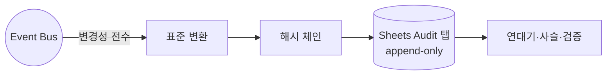

# Audit Spec — 감사 기록 구현

> **문서 상태**: 📋 설계만 (v2.5 Technical Specification · 미구현 · MVP: 기록만, 화면 차기)
> **관련 문서**: [../AUDIT_ENGINE.md](../AUDIT_ENGINE.md)(개념) · [GOOGLE_SHEETS_SPEC.md](GOOGLE_SHEETS_SPEC.md) · [SECURITY_SPEC.md](SECURITY_SPEC.md) · [LOGGING_SPEC.md](LOGGING_SPEC.md)
> **한 줄 목적**: 변경성 이벤트 전수 구독 → append-only 해시 체인 기록의 구현 계약과 로깅과의 경계를 정의한다.

---

## 목차

1. [목적](#1-목적) · 2. [책임](#2-책임) · 3. [인터페이스](#3-인터페이스) · 4. [입력](#4-입력) · 5. [출력](#5-출력) · 6. [데이터 흐름](#6-데이터-흐름) · 7. [의존성](#7-의존성) · 8. [확장성](#8-확장성) · 9. [장점](#9-장점) · 10. [단점](#10-단점)

---

## 1. 목적

"누가·언제·무엇을·왜"를 변조 불가 형태로 남긴다. Audit는 **비즈니스 변경 사실**(지식·설정·승인)을 기록하며, [LOGGING_SPEC.md](LOGGING_SPEC.md)의 기술 로그(성능·디버깅)와 명확히 구분된다.

| 구분 | Audit | Logging |
|---|---|---|
| 대상 | 비즈니스 변경·권한 사건 | 기술 이벤트·오류·성능 |
| 저장 | Sheets `Audit` 탭 (영구·해시 체인) | 로컬/GAS 실행 로그 (순환) |
| 변조 | 불가(체인) | 허용(순환 폐기) |

## 2. 책임

| 책임 | 규칙 |
|---|---|
| 전수 수집 | Event Bus의 **변경성 이벤트 전수 구독** (`*.updated`·`*.registered`·`approval.decided`·`flag.changed`·`golden.promoted`·`template.saved` 등) — 모듈은 Audit를 직접 호출하지 않음 |
| 표준 변환 | 이벤트 → AuditRecord(`audit.v1` — 누가/언제/무엇을/왜 + causationId) |
| 해시 체인 | `hash = H(prevHash + record)` — 변조 감지 |
| append-only | `v2.audit.append`는 내부 전용, 수정·삭제 API 없음 |
| 무결성 검증 | 구간 해시 재계산 대조 |

## 3. 인터페이스

| 연산(개념) | 서명 |
|---|---|
| 기록 | (직접 호출 없음 — 이벤트 구독 자동) |
| 연대기 | `history(target, range?) → AuditRecord[]` (MVP: 기록만, 조회 화면 차기) |
| 사슬 | `chain(auditId) → 원인~결과 레코드[]` |
| 검증 | `verifyIntegrity(range) → { intact, brokenAt? }` |

## 4. 입력

변경성 이벤트(봉투 — causationId 포함) · 이전 레코드 해시.

## 5. 출력

AuditRecord(Sheets append) · 무결성 판정 · (차기)감사 리포트.

## 6. 데이터 흐름

```
변경성 이벤트 → Audit 구독 → 표준 변환(actor/target/change/reason/causationId)
  → prevHash 조회 → hash 계산 → v2.audit.append (Sheets Audit 탭)
검증: 구간 로드 → 순차 해시 재계산 → 불일치 지점 보고
```



## 7. 의존성

audit(Enterprise) → bus(구독)·store(append). **역방향 없음** — 어떤 모듈도 audit에 의존하지 않는다(결합 제거 — [../AUDIT_ENGINE.md](../AUDIT_ENGINE.md) §9).

## 8. 확장성

- 새 기록 대상 = 새 변경성 이벤트가 명명 규약(과거형)을 지키면 자동 포섭 — Audit 무수정.
- 규격별 리포트(ISO 9001/13485) = 조회 위 서식 데이터 📋.
- 대용량: 분기 아카이브 시트 이관(체인 경계 기록 — [GOOGLE_SHEETS_SPEC.md](GOOGLE_SHEETS_SPEC.md) §8).

## 9. 장점

1. **결합 없는 전수 기록** — 이벤트만 발행하면 기록됨.
2. **변조 저항** — append-only + 해시 체인.
3. **Audit/Logging 분리** — 감사 증거와 디버그 로그가 섞이지 않음.

## 10. 단점

1. **볼륨** — 전수 기록 폭증. (→ 변경성만 구독 + 아카이브 정책)
2. **이벤트 규약 의존** — 이벤트 없는 상태 변경은 구멍. (→ Store 쓰기에 이벤트 미발행 차단 이중 안전장치 — [../AUDIT_ENGINE.md](../AUDIT_ENGINE.md) §10)
3. **Sheets 해시 체인 성능** — prevHash 조회 비용. (→ 최신 해시 캐시 + 배치 append)
