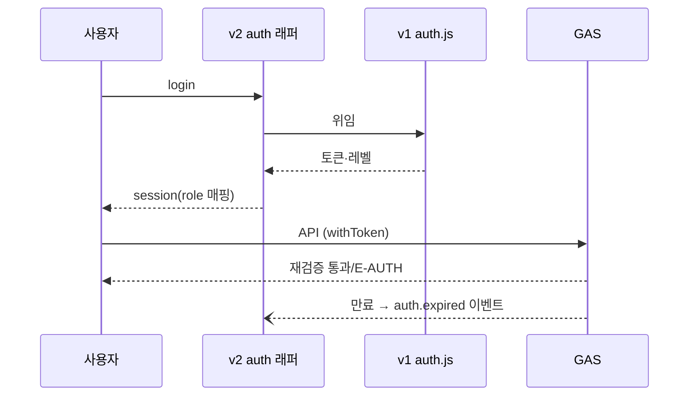

# Auth Spec — 인증 · 권한

> **문서 상태**: 📋 설계만 (v2.5 Technical Specification · 미구현)
> **관련 문서**: [SECURITY_SPEC.md](SECURITY_SPEC.md) · [API_SPEC.md](API_SPEC.md) · [ROUTING_SPEC.md](ROUTING_SPEC.md) · v1: 루트 `auth.js`(무수정 재사용)
> **한 줄 목적**: v1 `auth.js`(토큰·페이지 가드·권한 레벨)를 무수정 재사용하는 v2 인증 래퍼와 역할 모델을 정의한다.

---

## 목차

1. [목적](#1-목적) · 2. [책임](#2-책임) · 3. [인터페이스](#3-인터페이스) · 4. [입력](#4-입력) · 5. [출력](#5-출력) · 6. [데이터 흐름](#6-데이터-흐름) · 7. [의존성](#7-의존성) · 8. [확장성](#8-확장성) · 9. [장점](#9-장점) · 10. [단점](#10-단점)

---

## 1. 목적

인증을 새로 발명하지 않는다. 운영 검증된 v1 `auth.js`(토큰 발급·검증, 페이지 가드, 레벨 권한)를 **원위치 import로 재사용**하고, v2는 얇은 래퍼(`v2/js/infra/auth.js`)로 역할 매핑·이벤트화만 추가한다.

## 2. 책임

| 주체 | 책임 |
|---|---|
| v1 auth.js (동결) | 로그인·토큰 저장·만료 판정·레벨 제공 |
| v2 auth 래퍼 | 레벨→역할 매핑 · 라우터 가드 제공 · `auth.expired` 이벤트 발행 · API 호출에 토큰 첨부 |
| GAS (서버 측) | 모든 쓰기 API에서 토큰·역할 재검증 — 클라이언트 가드 불신 원칙 |

### 역할 모델 (MVP)

| 역할 | v1 레벨 매핑 | 허용 |
|---|---|---|
| `user` | 레벨 1~2 | 작성·생성·내 문서·즐겨찾기·개인 설정 |
| `admin` | 레벨 3~4 | + 승인·학습·양식/용어 관리·회사 설정·백업/복원 |
| (예약) 세분 역할 | — | 차기: 영역별 승인 권한 ([../HUMAN_APPROVAL.md](../HUMAN_APPROVAL.md) §5) |

## 3. 인터페이스

| 연산(개념) | 서명 | 비고 |
|---|---|---|
| 로그인 | `login(credentials) → session` | v1 위임 |
| 세션 | `session() → { userId, role, workspaceId, expiresAt }` | |
| 가드 | `guard(requiredRole) → boolean` | 라우터가 사용 |
| 토큰 첨부 | `withToken(request) → request` | API 클라이언트가 사용 |
| 만료 처리 | (내부) 만료 감지 → `auth.expired` 발행 | Draft 보존 후 재로그인 유도 |

## 4. 입력

사용자 자격 증명(v1 방식) · 저장된 토큰(localStorage — [LOCAL_STORAGE_SPEC.md](LOCAL_STORAGE_SPEC.md) 키 규약) · GAS 검증 응답.

## 5. 출력

세션 객체 · 가드 판정 · `auth.expired` 이벤트 · API 요청 토큰 필드.

## 6. 데이터 흐름

```
로그인 → v1 auth.js → 토큰 저장(로컬)
  ↓ 화면 진입마다 라우터 가드: session().role vs 라우트 요구
  ↓ API 호출마다 withToken → GAS가 서버 측 재검증 (실패 = E-AUTH-*)
  ↓ 만료 감지 → auth.expired → Draft 저장 확인 → 로그인 화면(returnTo)
오프라인: 마지막 유효 세션으로 로컬 기능 계속 — 동기·쓰기 API만 차단 (OFFLINE_SYNC_SPEC.md)
```



## 7. 의존성

v2 auth 래퍼 → v1 auth.js(원위치 import·무수정) · bus(이벤트) · store(토큰 키). 서버 검증은 [GOOGLE_APPS_SCRIPT_SPEC.md](GOOGLE_APPS_SCRIPT_SPEC.md) 공통 프리앰블.

## 8. 확장성

- 세분 역할 도입 = 매핑표 확장 + 가드 인자 확장 — v1 레벨 체계는 그대로.
- 다중 Workspace = session에 workspaceId 축 이미 존재 — 전환기만 추가.
- SSO 등 신규 인증은 래퍼 뒤에서 v1 대체 가능(래퍼 Interface 불변) 📋.

## 9. 장점

1. **검증된 코드 재사용** — 인증 버그는 신뢰를 죽인다. 운영 중 코드가 최선.
2. **서버 재검증 원칙** — 클라이언트 가드는 UX, 권한의 진실은 GAS ([SECURITY_SPEC.md](SECURITY_SPEC.md)).
3. **만료의 데이터 안전** — auth.expired 처리에 Draft 보존이 내장.

## 10. 단점

1. **v1 인증 방식의 한계 상속** — 토큰 방식·수명 정책이 v1에 묶인다. (→ 래퍼 경계 덕에 차후 교체 가능)
2. **MVP 2역할의 거칠음** — 부서별 위임 불가. (→ 예약 역할로 차기 대응)
3. **오프라인 세션의 시차** — 권한 회수가 오프라인 기기에 즉시 못 미친다. (→ 동기 시점 재검증 + 쓰기 API 서버 검증으로 실해 차단)
