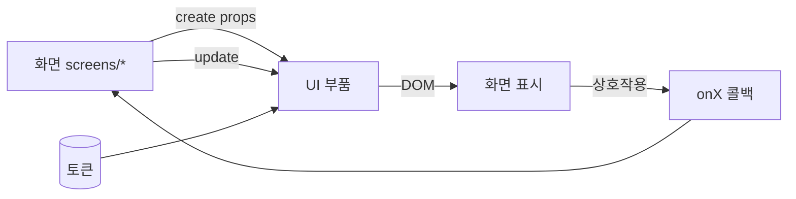

# Component Spec — 컴포넌트 인터페이스

> **문서 상태**: 📋 설계만 (v2.5 Technical Specification · 미구현)
> **관련 문서**: [../ui/COMPONENT_LIBRARY.md](../ui/COMPONENT_LIBRARY.md) · [THEME_ENGINE_SPEC.md](THEME_ENGINE_SPEC.md) · [FORM_ENGINE_SPEC.md](FORM_ENGINE_SPEC.md) · v1: [../../COMPONENT_SPEC.md](../../COMPONENT_SPEC.md)(문서 컴포넌트 — 별개)
> **한 줄 목적**: 두 컴포넌트 체계(앱 UI 부품 · 문서 컴포넌트)의 인터페이스 계약을 Vanilla JS 규약으로 정의한다.

---

## 목차

1. [목적](#1-목적) · 2. [책임](#2-책임) · 3. [인터페이스](#3-인터페이스) · 4. [입력](#4-입력) · 5. [출력](#5-출력) · 6. [데이터 흐름](#6-데이터-흐름) · 7. [의존성](#7-의존성) · 8. [확장성](#8-확장성) · 9. [장점](#9-장점) · 10. [단점](#10-단점)

---

## 1. 목적

프레임워크 없이(Vanilla JS) 재사용 컴포넌트를 만드는 표준 계약을 정의한다. **두 체계를 분리**한다: ① 앱 UI 부품(버튼·카드…, [../ui/COMPONENT_LIBRARY.md](../ui/COMPONENT_LIBRARY.md)) ② 문서 컴포넌트(표·차트…, v1 [../../COMPONENT_SPEC.md](../../COMPONENT_SPEC.md) 재사용).

## 2. 책임

### 앱 UI 부품 계약 (4요소 — [../ui/COMPONENT_LIBRARY.md](../ui/COMPONENT_LIBRARY.md) §2)

| 요소 | 규칙 |
|---|---|
| 변형(variants) | 명시된 변형만 (예: Button = primary/secondary/danger/text) |
| 상태(6종) | 기본/hover/active/focus/disabled/error — 전부 정의 필수 |
| 접근성 | role·ARIA·키보드 계약 내장 ([../ui/ACCESSIBILITY.md](../ui/ACCESSIBILITY.md) §5) |
| 반응형 | 3단 동작 규칙 |

### 문서 컴포넌트 (v1 재사용)

card/chart/footer/header/table/text/registry — v1 ComponentRegistry 무수정 사용, Renderer·Preview가 소비.

## 3. 인터페이스

### 앱 UI 부품 (Vanilla JS 규약 — 개념)

| 연산(개념) | 서명 |
|---|---|
| 생성 | `create(props) → { el, update, destroy }` — 팩토리 반환 |
| 갱신 | `update(nextProps)` — 멱등, DOM 최소 변경 |
| 파괴 | `destroy()` — 이벤트·참조 정리(누수 방지) |
| 이벤트 | props 콜백(`onClick` 등) — 부품은 bus를 직접 모름 |

**규약**: 부품은 토큰만 참조(직접 색상값 금지 — [THEME_ENGINE_SPEC.md](THEME_ENGINE_SPEC.md)) · 전역 상태 접근 금지(props 주입) · innerHTML로 사용자 데이터 삽입 금지(이스케이프 — [SECURITY_SPEC.md](SECURITY_SPEC.md) §2).

## 4. 입력

props(데이터·콜백) · 디자인 토큰(CSS 변수) · 상위 화면의 마운트 지점.

## 5. 출력

DOM 요소 · 콜백 호출 · aria-live 낭독(해당 부품).

## 6. 데이터 흐름

```
화면(screens/*) → 부품 create(props) → DOM 삽입
  → 사용자 상호작용 → props.onX 콜백 → 화면이 처리(모델 패치·라우팅·이벤트)
  → 상태 변경 → 부품 update(nextProps)
  → 화면 전환 → destroy()
```



## 7. 의존성

앱 부품 → 토큰(CSS)만 (JS 의존 최소 — bus·store 미참조). 화면이 부품을 조립하고 bus·store와 연결. 문서 컴포넌트 → v1 registry.

## 8. 확장성

- 새 부품 = 4요소 계약 작성 + 카탈로그 등록 ([../ui/COMPONENT_LIBRARY.md](../ui/COMPONENT_LIBRARY.md) §2). 기존 무수정.
- 테마 추가 = 토큰 세트 교체로 전 부품 자동 대응.
- 문서 컴포넌트 확장은 v1 registry 규약 따름.

## 9. 장점

1. **프레임워크 없는 질서** — create/update/destroy 3계약으로 Vanilla JS에 생명주기 부여.
2. **접근성·토큰 내장** — 화면에서 후처리 불필요, 품질 하한 상속.
3. **두 체계 분리** — 앱/문서 컴포넌트 혼선 방지.

## 10. 단점

1. **수동 DOM 관리** — 프레임워크의 자동 diff 없음. (→ update 멱등·최소 변경 규약 + 부품 단위 테스트)
2. **destroy 누락 위험** — 정리 안 하면 누수. (→ 화면 unmount가 자식 destroy 강제 — [ROUTING_SPEC.md](ROUTING_SPEC.md) §10)
3. **보일러플레이트** — 부품마다 팩토리 패턴 반복. (→ 공통 헬퍼 1개로 완화 — 코드 아님, 구현 단계)
