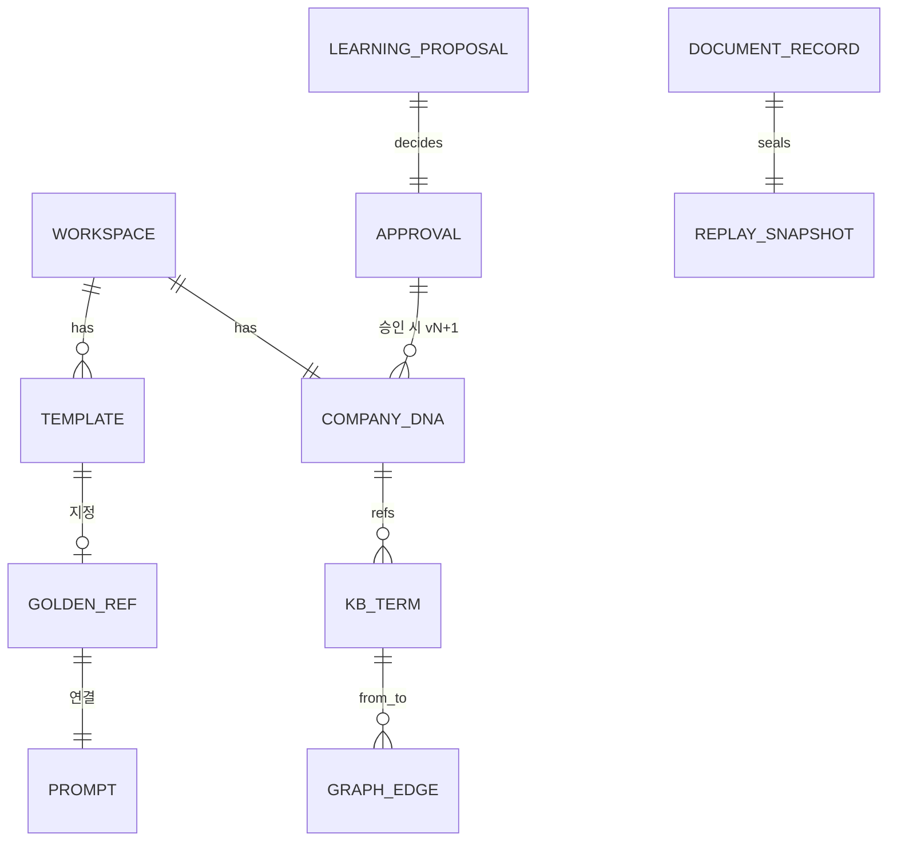

# Data Model — 엔티티 · 관계

> **문서 상태**: 📋 설계만 (v2.5 Technical Specification · 미구현)
> **관련 문서**: [JSON_SCHEMA.md](JSON_SCHEMA.md)(계약 상세) · [GOOGLE_SHEETS_SPEC.md](GOOGLE_SHEETS_SPEC.md)(물리 배치) · [STORAGE_SPEC.md](STORAGE_SPEC.md)
> **한 줄 목적**: 시스템의 모든 엔티티와 관계·버전 규칙을 한 장으로 정의한다 — JSON_SCHEMA는 이 모델의 직렬화다.

---

## 목차

1. [목적](#1-목적) · 2. [책임](#2-책임) · 3. [인터페이스](#3-인터페이스) · 4. [입력](#4-입력) · 5. [출력](#5-출력) · 6. [데이터 흐름](#6-데이터-흐름) · 7. [의존성](#7-의존성) · 8. [확장성](#8-확장성) · 9. [장점](#9-장점) · 10. [단점](#10-단점)

---

## 1. 목적

저장 매체(Sheets→향후 DB)와 무관한 논리 데이터 모델을 확정한다. 원칙: **자산 엔티티는 버전 불변**(수정=새 버전), **행위 엔티티는 append-only**.

## 2. 책임

### 엔티티 카탈로그

| 엔티티 | 분류 | 버전 규칙 | 원본 문서 |
|---|---|---|---|
| Workspace | 구성 | 가변(설정) | [../ARCHITECTURE.md](../ARCHITECTURE.md) §5 |
| User | 구성 | 가변 | [AUTH_SPEC.md](AUTH_SPEC.md) |
| Template / Theme | 자산 | 불변 버전 | v1 [../../JSON_SCHEMA.md](../../JSON_SCHEMA.md) 계승 |
| GoldenRef | 자산 | 불변 버전(지정 이력) | [../GOLDEN_TEMPLATE.md](../GOLDEN_TEMPLATE.md) |
| Prompt / PromptFragment | 자산 | 불변 버전 | [../PROMPT_MARKETPLACE.md](../PROMPT_MARKETPLACE.md) |
| CompanyDNA | 자산 | 불변 버전(dnaVersion) | [../COMPANY_DNA.md](../COMPANY_DNA.md) |
| KBTerm / OntologyClass / GraphEdge | 자산 | 상태 전이 + 이력 | [../KNOWLEDGE_BASE.md](../KNOWLEDGE_BASE.md) 외 |
| MemoryItem / Rule / Workflow정의 | 자산 | 불변 버전 | 각 Architecture 문서 |
| LearningProposal / Approval | 행위 | append-only + status | [../LEARNING_ENGINE.md](../LEARNING_ENGINE.md) |
| DocumentRecord (생성 이력) | 행위 | append-only | [DOCUMENT_ENGINE_SPEC.md](DOCUMENT_ENGINE_SPEC.md) |
| ReplaySnapshot / AuditRecord | 행위 | append-only·불변 | [AUDIT_SPEC.md](AUDIT_SPEC.md) |
| Draft / SyncQueueItem | 로컬 | 가변(기기 로컬) | [LOCAL_STORAGE_SPEC.md](LOCAL_STORAGE_SPEC.md) |

## 3. 인터페이스

공통 필드 (전 엔티티):

| 필드 | 규칙 |
|---|---|
| `id` | 접두사+ULID ([TECH_SPEC.md](TECH_SPEC.md) §3) |
| `workspaceId` | 필수 — 격리 축 (로컬 엔티티 제외) |
| `schemaVersion` | 필수 (I7) |
| `createdAt/By` · `modifiedAt/By` | 감사 최소 필드 |
| `version` | 자산 엔티티만 — 정수 단조 증가 |
| `status` | 상태 전이 엔티티만 — 전이표는 각 스키마에 |

## 4. 입력

엔티티 생성 경로: 관리자 등록(자산) · 승인된 학습(자산 갱신) · 시스템 기록(행위) · 사용자 작성(로컬).

## 5. 출력

직렬화 형식은 [JSON_SCHEMA.md](JSON_SCHEMA.md) 12계약 · 물리 저장 위치는 [GOOGLE_SHEETS_SPEC.md](GOOGLE_SHEETS_SPEC.md) 탭 매핑.

## 6. 데이터 흐름

```
관계도 (버전 참조는 항상 "id@version" — 불변 좌표)

Workspace 1─N Template ─1 GoldenRef ─1 Prompt(golden)
Workspace 1─1 CompanyDNA ─참조─ KBTerm·MemoryItem·Rule·Workflow
KBTerm N─N KBTerm (GraphEdge, OntologyClass가 관계 타입 제약)
LearningProposal 1─1 Approval → (승인 시) 대상 자산 version+1
DocumentRecord ─좌표─ Template@v · DNA@v · Rule@v · Prompt@v (ReplaySnapshot)
```



## 7. 의존성

본 모델 → 없음(최상류). JSON_SCHEMA·SHEETS·STORAGE가 본 문서를 참조한다 — 역방향 정의 금지.

## 8. 확장성

- 엔티티 추가 = 카탈로그 행 + 공통 필드 준수 + JSON_SCHEMA 계약 추가.
- 관계 추가는 참조 필드(id@version)로 — 외래키 제약은 앱 레벨 검증(스프레드시트 한계).

## 9. 장점

1. **버전 불변 원칙의 전면화** — Replay·Audit·학습 이력이 모두 이 원칙 위에서 공짜로 성립.
2. **매체 독립** — Sheets 한계와 무관한 논리 모델이라 DB 이전 시 재설계 불필요.
3. **id@version 좌표계** — 모든 참조가 시점 고정이라 "그때 그 규칙" 추적이 기계적.

## 10. 단점

1. **버전 누적 용량** — 불변 원칙은 저장량과 교환된다. (→ 차분 저장·이관 정책, [GOOGLE_SHEETS_SPEC.md](GOOGLE_SHEETS_SPEC.md) §8)
2. **앱 레벨 무결성** — FK·트랜잭션 없는 저장소라 검증 코드 부담. (→ 쓰기 경로를 store 1곳으로 수렴해 검증 집중)
3. **로컬 엔티티의 이중성** — Draft는 서버 모델 밖이라 충돌 규칙 별도 필요 ([OFFLINE_SYNC_SPEC.md](OFFLINE_SYNC_SPEC.md) §6).
