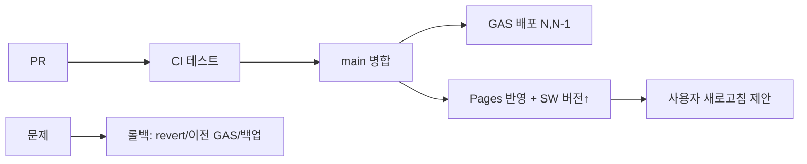

# Deployment Spec — 배포 · 버전 · 롤백

> **문서 상태**: 📋 설계만 (v2.5 Technical Specification · 미구현)
> **관련 문서**: [FILE_STRUCTURE.md](FILE_STRUCTURE.md) · [PWA_SPEC.md](PWA_SPEC.md) · [GOOGLE_APPS_SCRIPT_SPEC.md](GOOGLE_APPS_SCRIPT_SPEC.md) · [ROADMAP_SPEC.md](ROADMAP_SPEC.md)
> **한 줄 목적**: GitHub → GitHub Pages(정적) + Google Apps Script(백엔드)의 배포·버전·롤백 절차를 정의한다.

---

## 목차

1. [목적](#1-목적) · 2. [책임](#2-책임) · 3. [인터페이스](#3-인터페이스) · 4. [입력](#4-입력) · 5. [출력](#5-출력) · 6. [데이터 흐름](#6-데이터-흐름) · 7. [의존성](#7-의존성) · 8. [확장성](#8-확장성) · 9. [장점](#9-장점) · 10. [단점](#10-단점)

---

## 1. 목적

두 배포 대상(정적 프론트=Pages, 백엔드=GAS)의 절차를 확정한다. 무빌드 원칙상 **저장소 트리 = 배포물** — 프론트 배포는 병합이 곧 릴리스다.

## 2. 책임

| 대상 | 배포 방식 | 버전 | 롤백 |
|---|---|---|---|
| 프론트(Pages) | main 병합 → Pages 자동 반영 | SW 캐시 버전 상수 `V2_CACHE_v{N}` + git 태그 | 이전 커밋 revert → 재반영 |
| GAS(`autodoc_v2_gas.gs`) | GAS 편집기/clasp 배포 → 새 버전 게시 | GAS 배포 버전 + `apiVersion` | 이전 배포 버전으로 전환 |
| Sheets 스키마 | 수동 마이그레이션(필요 시) | `schemaVersion` | 백업 복원 ([../ui/SETTINGS_UX.md](../ui/SETTINGS_UX.md)) |

### 배포 체크리스트 (릴리스 게이트)

| 항목 | 확인 |
|---|---|
| 테스트 | Regression(불변식·v1) + 핵심 케이스 통과 ([TEST_SPEC.md](TEST_SPEC.md)) |
| SW 캐시 버전 | 프론트 변경 시 `V2_CACHE_v{N}` 상향 ([PWA_SPEC.md](PWA_SPEC.md)) |
| API 호환 | `apiVersion` N·N-1 동시 지원 유지 (프론트/GAS 배포 순서 무관하게 무중단) |
| v1 무영향 | v1 파일·시트 변경 0 확인 |
| 백업 | GAS/Sheets 변경 전 자산 백업 |

## 3. 인터페이스

| 개념 | 방식 |
|---|---|
| 프론트 릴리스 | git 태그 `v2-<날짜>` + main 병합 |
| GAS 릴리스 | 새 배포 버전 게시(웹앱 URL 고정) |
| 무중단 규칙 | GAS 먼저 배포(N,N-1 지원) → 프론트 배포 — 역전 시에도 apiVersion 협상으로 안전 |
| 롤백 | 프론트=revert 커밋 / GAS=이전 배포 선택 / 데이터=백업 복원 |

## 4. 입력

병합된 코드 · 캐시 버전 상수 · GAS 배포 · 백업 파일.

## 5. 출력

Pages 반영본 · GAS 웹앱 · 배포 태그·기록 · 롤백 결과.

## 6. 데이터 흐름

```
개발 브랜치 → PR → CI(테스트) → main 병합
  → [GAS 변경시] GAS 새 배포(N,N-1 지원 확인)
  → 프론트: Pages 자동 반영 + SW 버전 상향 → 사용자 새로고침 제안(작성 보호)
롤백: 문제 감지 → 프론트 revert / GAS 이전 버전 / 데이터 백업 복원
```



## 7. 의존성

배포 → CI([TEST_SPEC.md](TEST_SPEC.md)) · Pages · GAS(clasp) · PWA 캐시 버전. 단계 게이트는 [ROADMAP_SPEC.md](ROADMAP_SPEC.md)/[../ui/IMPLEMENTATION_PLAN.md](../ui/IMPLEMENTATION_PLAN.md).

## 8. 확장성

- Feature Flag로 코드 배포 없이 기능 on/off — 배포와 활성화 분리 ([../FEATURE_FLAG.md](../FEATURE_FLAG.md)).
- Workspace 추가 = Sheets 사본 + Props 매핑(배포 무관).
- 스테이징 환경(별도 Pages 브랜치/GAS 배포) 📋.

## 9. 장점

1. **무빌드 = 저장소가 릴리스** — 빌드 파이프라인 부재로 배포 단순.
2. **apiVersion 무중단** — 프론트/GAS 배포 순서에 강건.
3. **다층 롤백** — 코드·백엔드·데이터 각각 되돌림 경로.

## 10. 단점

1. **Pages 캐시 지연** — 반영·SW 교체 타이밍. (→ 캐시 버전 상수 + 작성 보호 새로고침)
2. **GAS 수동성** — 자동 배포가 약함(clasp로 완화). (→ 배포 체크리스트로 실수 방지)
3. **데이터 마이그레이션 위험** — 스키마 변경 시. (→ migrate 읽기 흡수 + 변경 전 백업 강제)
