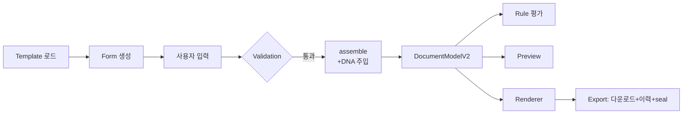

# Document Engine Spec — 문서 생성 파이프라인

> **문서 상태**: 📋 설계만 (v2.5 Technical Specification · 미구현)
> **관련 문서**: [FORM_ENGINE_SPEC.md](FORM_ENGINE_SPEC.md) · [PREVIEW_ENGINE_SPEC.md](PREVIEW_ENGINE_SPEC.md) · [RENDERER_SPEC.md](RENDERER_SPEC.md) · [../DOCUMENT_MODEL.md](../DOCUMENT_MODEL.md) · v1: [../../DOCUMENT_MODEL.md](../../DOCUMENT_MODEL.md)
> **한 줄 목적**: Template → Form → Validation → Preview → Renderer → Export의 동작 순서와 각 단계 간 계약을 정의한다.

---

## 목차

1. [목적](#1-목적) · 2. [책임](#2-책임) · 3. [인터페이스](#3-인터페이스) · 4. [입력](#4-입력) · 5. [출력](#5-출력) · 6. [데이터 흐름](#6-데이터-흐름) · 7. [의존성](#7-의존성) · 8. [확장성](#8-확장성) · 9. [장점](#9-장점) · 10. [단점](#10-단점)

---

## 1. 목적

문서 생성의 전 파이프라인을 오케스트레이션한다. 핵심: **모든 단계가 하나의 DocumentModel을 중심으로 돈다** — Preview와 Renderer가 같은 모델을 입력받는 것이 구조 일치의 근거다 (I4).

## 2. 책임

| 단계 | 책임 | 위임 |
|---|---|---|
| Template 로드 | Template JSON(+Theme·DNA 참조) 확보 | Store / [JSON_SCHEMA.md](JSON_SCHEMA.md) |
| Form 생성 | inputs 스키마 → 입력폼 | [FORM_ENGINE_SPEC.md](FORM_ENGINE_SPEC.md) |
| Validation | rules 기반 검증 | [FORM_ENGINE_SPEC.md](FORM_ENGINE_SPEC.md) §2 validator |
| DocumentModel 조립 | 입력 + Template layout + DNA 사영 → 모델(x2 확장) | 본 문서 §3 |
| Rule 평가 | 조립 후 효과 부착 | [RULE_ENGINE_SPEC.md](RULE_ENGINE_SPEC.md) |
| Preview | 모델 → HTML | [PREVIEW_ENGINE_SPEC.md](PREVIEW_ENGINE_SPEC.md) |
| Renderer | 모델 → 파일 | [RENDERER_SPEC.md](RENDERER_SPEC.md) |
| Export | 다운로드 + 이력 기록 + seal(provenance) | 본 문서 §6 |

**오케스트레이터의 불변식**: Preview와 Renderer에 넘기는 모델은 **동일 인스턴스**여야 한다 — 각자 재조립 금지 (I4 집행 지점).

## 3. 인터페이스

| 연산(개념) | 서명 | 비고 |
|---|---|---|
| 조립 | `assemble(templateRef, inputs, workspaceId) → DocumentModelV2` | 순수: 같은 입력→같은 모델 (Replay 전제) |
| DNA 사영 | `projectDNA(dna) → { themeTokens, defaults }` | 순수 함수 ([../DOCUMENT_MODEL.md](../DOCUMENT_MODEL.md) §7) |
| 봉인 | `seal(model) → provenance 확정 + replay.registered` | 생성 시 1회 |
| 우선순위 | 값 충돌 시 **사용자 입력 > Template 명시값 > DNA 기본값** | [../DOCUMENT_MODEL.md](../DOCUMENT_MODEL.md) §7 |

## 4. 입력

Template/Theme JSON · 사용자 입력값 · Company DNA 최신 버전 · Rule Set · Workspace 컨텍스트.

## 5. 출력

DocumentModelV2 (Preview·Renderer 공용) · 생성 파일(.pptx/.xlsx/.pdf) · DocumentRecord(이력) · ReplaySnapshot · `document.assembled`/`document.generated` 이벤트.

## 6. 데이터 흐름

```
Template 로드 → Form 생성 → 사용자 입력 → Validation(통과 시)
  → DNA 주입(projectDNA) → assemble → DocumentModelV2
  → Rule 평가(효과 부착) → document.assembled
  → [분기] Preview(HTML)  /  생성 버튼 → Renderer(파일)
  → Export: 다운로드 + history.record + seal → document.generated
```



## 7. 의존성

Document Engine(Core 오케스트레이터) → form-engine·validator·document-model·rule-engine·preview-engine·renderers·store. 상위 UI(Editor 화면)가 이 엔진을 호출.

## 8. 확장성

- **새 문서 종류** = Template JSON 추가만 — 파이프라인 무수정 (v1 사상 계승).
- **새 출력 형식** = Renderer 추가 → Export 분기에 형식 1개 ([RENDERER_SPEC.md](RENDERER_SPEC.md) §8).
- **새 조립 단계**(예: 번역) = 파이프라인에 단계 삽입 — 모델 중심 원칙 유지 시 국소 변경.

## 9. 장점

1. **단일 모델 오케스트레이션** — Preview·Renderer 불일치가 구조적으로 불가.
2. **순수 assemble** — Replay·테스트가 결정적.
3. **우선순위 명문화** — 값 충돌의 해석이 코드 전체에서 일관.

## 10. 단점

1. **오케스트레이터 비대 위험** — 단계가 늘면 중심 파일이 커진다. (→ 단계별 함수 분리 + 이벤트 경계)
2. **동기 조립 비용** — 대형 문서의 실시간 재조립 부담. (→ 부분 재조립 — [PREVIEW_ENGINE_SPEC.md](PREVIEW_ENGINE_SPEC.md) §6)
3. **DNA 버전 시점 문제** — 조립 중 DNA가 갱신될 수 있다. (→ 조립 시작 시 DNA 버전 고정·provenance 기록)
