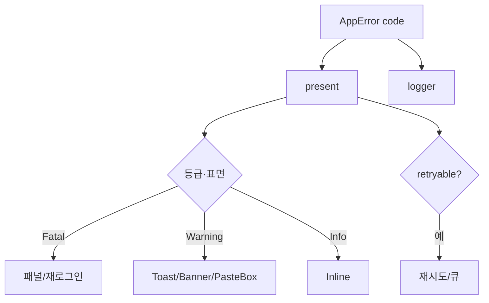

# Error Spec — 전체 Error Code 체계

> **문서 상태**: 📋 설계만 (v2.5 Technical Specification · 미구현)
> **관련 문서**: [API_SPEC.md](API_SPEC.md) · [../ui/ERROR_HANDLING.md](../ui/ERROR_HANDLING.md) · [OFFLINE_SYNC_SPEC.md](OFFLINE_SYNC_SPEC.md) · [../AI_ARCHITECTURE.md](../AI_ARCHITECTURE.md) §4
> **한 줄 목적**: 전체 Error Code(등급·재시도성·사용자 표면 매핑)를 단일 카탈로그로 정의한다.

---

## 목차

1. [목적](#1-목적) · 2. [책임 — Error Code 카탈로그](#2-책임--error-code-카탈로그) · 3. [인터페이스](#3-인터페이스) · 4. [입력](#4-입력) · 5. [출력](#5-출력) · 6. [데이터 흐름](#6-데이터-흐름) · 7. [의존성](#7-의존성) · 8. [확장성](#8-확장성) · 9. [장점](#9-장점) · 10. [단점](#10-단점)

---

## 1. 목적

모든 오류에 코드를 부여하고, 코드마다 등급(Fatal/Warning/Info)·재시도성·사용자 메시지(3요소 문법)·표면을 매핑한다. 코드는 개발자용, 메시지는 사용자용 ([../ui/ERROR_HANDLING.md](../ui/ERROR_HANDLING.md) §3).

## 2. 책임 — Error Code 카탈로그

명명: `E-<영역>-<원인>`. 등급: **Fatal**(작업 불가)·**Warning**(진행 가능하나 주의)·**Info**(안내)·재시도 플래그.

| 코드 | 등급 | 재시도 | 표면 | 사용자 메시지 요지 |
|---|---|---|---|---|
| `E-AUTH-EXPIRED` | Fatal | ✗ | 재로그인 | "다시 로그인해 주세요 — 작성 내용은 저장됨" |
| `E-PERM-ROLE` / `E-PERM-WS` | Fatal | ✗ | 안내 패널 | "권한이 없어요" + 요청 경로 |
| `E-SCHEMA-*` | Fatal | ✗ | 인라인/패널 | "형식이 올바르지 않아요" + 위반 필드 |
| `E-IMPORT-E1`(JSON 아님) | Warning | 재요청 | JsonPasteBox | "AI가 설명을 섞었어요" + 재요청 Prompt |
| `E-IMPORT-E2`(봉투 위반) | Warning | 재요청 | 〃 | "필요한 정보가 빠졌어요" |
| `E-IMPORT-E3`(payload 위반) | Warning | 재요청 | 〃 | "일부 항목 형식 오류" + 목록 |
| `E-NET-TIMEOUT` / `E-NET-OFFLINE` | Warning | ✓/큐 | Toast/Banner | "연결 문제 — 입력은 저장됨" |
| `E-CONFLICT` | Warning | 해소 | 병합 화면 | "두 버전이 있어요" |
| `E-RENDER` | Fatal(작업) | ✓ | 실패 패널 | "생성 실패 — 입력·Draft 보존" |
| `E-QUOTA` | Warning | ✓(지연) | Banner | "잠시 후 다시 시도해 주세요" |
| `E-VERSION` | Fatal | ✗ | 새로고침 안내 | "앱 업데이트가 필요해요" |
| `E-INTERNAL` | Fatal | ✓1회 | 안내 화면 | "일시 오류 — Draft 보존" + 신고 |

## 3. 인터페이스

| 연산(개념) | 서명 |
|---|---|
| 생성 | `AppError(code, detail?)` — throw 대상 |
| 매핑 | `present(code) → { grade, retryable, surface, message }` (문구 테이블 참조) |
| 재시도 판정 | `isRetryable(code) → boolean` (API·큐가 사용 — [API_SPEC.md](API_SPEC.md) §3) |

## 4. 입력

발생 지점의 코드·상세 · 문구 테이블(다국어 대비 — 데이터).

## 5. 출력

사용자 메시지(3요소) · 재시도/큐잉 지시 · 로그(코드 — [LOGGING_SPEC.md](LOGGING_SPEC.md)) · (권한 거부는 Audit).

## 6. 데이터 흐름

```
발생 → AppError(code) throw
  → 경계에서 catch → present(code) → 등급별 표면(InlineError/Toast/Banner/패널)
  → retryable이면 자동 재시도/큐 (Import은 재요청 Prompt)
  → logger.log(ERROR/WARN, code) · (권한 거부면 Audit)
```



## 7. 의존성

error 체계는 전역 규범 — API·엔진·UI가 참조. 문구는 strings 테이블([../ui/UI_SPEC.md](../ui/UI_SPEC.md) §6). 표면 처리는 UI [../ui/ERROR_HANDLING.md](../ui/ERROR_HANDLING.md).

## 8. 확장성

- 새 코드 = 카탈로그 행 + 문구 + present 매핑. 등급·표면은 기존 4종 재사용(새 표면 발명 자제).
- 다국어 = 문구 테이블 언어 세트.

## 9. 장점

1. **코드↔표면 단일 매핑** — 오류 처리의 일관성이 표에서 강제된다.
2. **재시도성 명시** — API·큐가 코드만 보고 재시도 판단.
3. **개발/사용자 언어 분리** — 코드는 로그·추적, 메시지는 3요소 사람 말.

## 10. 단점

1. **카탈로그 완전성** — 누락 오류는 E-INTERNAL로 뭉뚱그려짐. (→ 신규 실패 발견 시 코드 승격 규칙)
2. **문구 품질 의존** — 좋은 코드도 나쁜 문구면 무용. (→ 문구 리뷰를 완료 조건에 — [../ui/ERROR_HANDLING.md](../ui/ERROR_HANDLING.md) §8)
3. **등급 경계 모호** — Fatal/Warning 판단 여지. (→ "작업 계속 가능?"을 단일 판정 기준으로)
