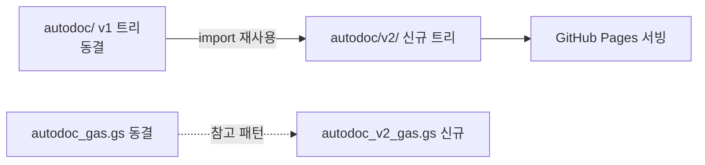

# File Structure — 최종 폴더 구조

> **문서 상태**: 📋 설계만 (v2.5 Technical Specification · 미구현)
> **관련 문서**: [MODULE_SPEC.md](MODULE_SPEC.md) · [DEPLOYMENT_SPEC.md](DEPLOYMENT_SPEC.md) · v1: [../../FOLDER_STRUCTURE.md](../../FOLDER_STRUCTURE.md)(무수정)
> **한 줄 목적**: 모든 HTML·JS·CSS·Template·Plugin·Engine의 최종 위치를 정의한다 — v1 구조를 무수정 보존하고 v2는 별도 하위 트리로 성장한다.

---

## 목차

1. [목적](#1-목적) · 2. [책임](#2-책임) · 3. [인터페이스](#3-인터페이스) · 4. [입력](#4-입력) · 5. [출력](#5-출력) · 6. [데이터 흐름](#6-데이터-흐름) · 7. [의존성](#7-의존성) · 8. [확장성](#8-확장성) · 9. [장점](#9-장점) · 10. [단점](#10-단점)

---

## 1. 목적

"이 파일은 어디 두는가"의 논쟁을 없앤다. 원칙: **v1 트리 동결, v2는 `autodoc/v2/` 신규 트리** — 기존 `autodoc/js/…`(v1 엔진)는 v2가 import로 재사용하되 한 줄도 옮기거나 수정하지 않는다.

## 2. 책임

```
autodoc/                       ← v1 루트 (전부 동결)
├── index.html · editor.html · admin.html · js/ · css/ · templates/ · themes/ · sw.js …
├── docs/                      ← v1 문서 (동결) · docs/v2/ · docs/v2/ui/ · docs/v2/spec/
└── v2/                        ← ★ v2 앱 신규 트리
    ├── index.html             #   허브(Dashboard) — S1
    ├── app.html               #   단일 셸: Catalog·Editor·내문서·Admin·Settings (해시 라우팅)
    ├── manifest.json · sw.js  #   v2 전용 PWA (scope: /autodoc/v2/) — PWA_SPEC.md
    ├── css/
    │   ├── tokens.css         #   디자인 토큰 (라이트/다크 세트)
    │   └── app.css            #   화면 스타일 (토큰만 참조)
    ├── js/
    │   ├── infra/             #   bus.js · store.js · workspace-context.js · auth.js(v1 위임 래퍼)
    │   │                      #   router.js · sync-queue.js · logger.js · flags.js
    │   ├── core/              #   document-model.js(x2 래퍼) · preview-engine.js
    │   │                      #   ※ layout/theme/renderer는 v1 모듈을 import 재사용
    │   ├── prompt/            #   prompt-engine.js · import-gate.js · analyzers/(정의 JSON)
    │   ├── memory/            #   dna.js · kb.js · memory.js · rule-engine.js
    │   ├── learning/          #   learning.js · confidence.js · approval.js
    │   ├── enterprise/        #   audit.js · (workflow.js — MVP 제외 예약)
    │   ├── plugins/           #   plugin-host.js · (개별 plugin 폴더 — MVP 제외 예약)
    │   └── ui/                #   components/(부품) · screens/(화면 조립) · strings/(문구 테이블)
    ├── templates/             #   v2 Template JSON (v1 스키마 호환)
    ├── themes/                #   Theme JSON (DNA 사영 대상)
    └── assets/                #   아이콘·정적 썸네일
루트: autodoc_gas.gs (v1 동결) · autodoc_v2_gas.gs ← ★ v2 GAS 신규 파일
```

| 자산 | 위치 규칙 |
|---|---|
| HTML | `v2/` 직하 2개뿐 (index·app) — 화면은 라우팅으로 ([ROUTING_SPEC.md](ROUTING_SPEC.md)) |
| JS | `v2/js/<계층>/<모듈>.js` — 계층 = [MODULE_SPEC.md](MODULE_SPEC.md) 카탈로그 |
| CSS | `v2/css/` 2파일 원칙 (tokens + app) |
| Template | `v2/templates/*.json` — 등록형 자산 |
| Plugin | `v2/js/plugins/<pluginId>/` + manifest.json |
| Engine | Core 엔진 중 v1 재사용분은 **원위치 import**, v2 신규분만 `v2/js/core/` |

## 3. 인터페이스

경로 규약: 모든 import는 상대 경로 명시(`../infra/bus.js`) · v1 재사용 import는 `../../js/engine/…` 형태로 원위치 참조 — 복사 금지.

## 4. 입력

배치 대상: [MODULE_SPEC.md](MODULE_SPEC.md)의 모듈 카탈로그 · UI 부품([COMPONENT_SPEC.md](COMPONENT_SPEC.md)) · 정적 자산.

## 5. 출력

GitHub Pages가 그대로 서빙하는 트리 (빌드 산출물 없음 — 저장소 = 배포물, [DEPLOYMENT_SPEC.md](DEPLOYMENT_SPEC.md) §6).

## 6. 데이터 흐름

```
개발자: 모듈 작성 → MODULE_SPEC 계층 확인 → 해당 폴더 배치
  ↓ commit/push (main 병합)
GitHub Pages 자동 반영 → sw.js 캐시 버전 갱신으로 클라이언트 배포 완료
```



## 7. 의존성

- v2 → v1: import 단방향 허용 (engine·renderers·auth 패턴). **v1 → v2 참조 절대 금지** (동결 보장).
- 폴더 간 의존은 모듈 계층 그래프([MODULE_SPEC.md](MODULE_SPEC.md) §6)를 그대로 따른다.

## 8. 확장성

- 새 화면 = `ui/screens/` 파일 + 라우트 등록. 새 Plugin = `plugins/<id>/` 폴더. 새 Template = JSON 1개 — 모두 트리 구조 불변.
- v1 엔진의 v2 개량 필요 시: 원본 수정 금지 — `v2/js/core/`에 래퍼/확장 모듈로 (예: document-model x2 래퍼).

## 9. 장점

1. **v1 동결의 물리적 보장** — v2가 전부 별도 트리라 실수로 v1을 건드릴 여지가 작다.
2. **HTML 2개 원칙** — 페이지 난립(v1의 페이지별 하드코딩 문제) 재발 방지.
3. **배포 단순** — 빌드 없는 트리 = Pages 반영 즉시 배포.

## 10. 단점

1. **v1 원위치 import의 결합** — v1 파일 경로가 v2의 의존이 된다(v1은 동결이므로 실위험 낮음). (→ 재사용 지점을 core 래퍼 1곳으로 수렴)
2. **단일 셸(app.html)의 비대화** — 화면이 늘수록 초기 로드 커짐. (→ 화면 모듈 동적 import로 지연 로드)
3. **GAS 파일 이원화** — v1/v2 GAS 병존 운영. (→ v2 GAS는 v2 시트만 접근 — 교차 금지 규칙, [GOOGLE_APPS_SCRIPT_SPEC.md](GOOGLE_APPS_SCRIPT_SPEC.md) §7)
