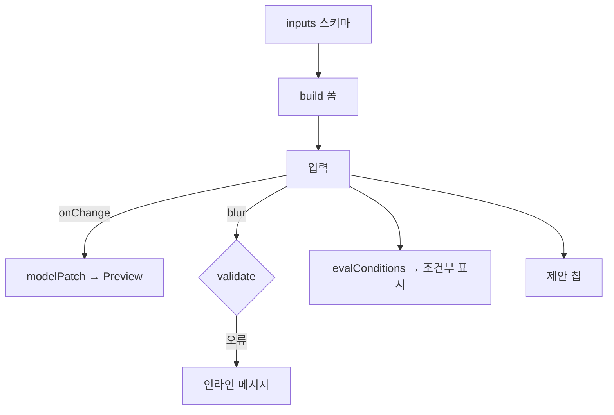

# Form Engine Spec — 폼 자동 생성 · 검증

> **문서 상태**: 📋 설계만 (v2.5 Technical Specification · 미구현)
> **관련 문서**: [../ui/FORM_GUIDE.md](../ui/FORM_GUIDE.md) · [COMPONENT_SPEC.md](COMPONENT_SPEC.md) · [DOCUMENT_ENGINE_SPEC.md](DOCUMENT_ENGINE_SPEC.md) · v1: [../../VALIDATION_SPEC.md](../../VALIDATION_SPEC.md)
> **한 줄 목적**: Template inputs 스키마에서 입력폼을 자동 생성하고, 14종 입력 타입·조건부·검증을 처리하는 엔진 계약을 정의한다.

---

## 목차

1. [목적](#1-목적) · 2. [책임](#2-책임) · 3. [인터페이스](#3-인터페이스) · 4. [입력](#4-입력) · 5. [출력](#5-출력) · 6. [데이터 흐름](#6-데이터-흐름) · 7. [의존성](#7-의존성) · 8. [확장성](#8-확장성) · 9. [장점](#9-장점) · 10. [단점](#10-단점)

---

## 1. 목적

폼은 코드가 아니라 데이터(inputs 스키마)에서 태어난다. 엔진은 스키마 → 입력 컴포넌트 트리를 생성하고, 값 바인딩·검증·조건부 표시·제안 칩을 관리한다.

## 2. 책임

| 책임 | 규칙 |
|---|---|
| 폼 생성 | inputs[] → 타입별 컴포넌트([COMPONENT_SPEC.md](COMPONENT_SPEC.md)) · 필수 펼침/선택 접힘 |
| 입력 타입 | 14종 렌더 ([../ui/FORM_GUIDE.md](../ui/FORM_GUIDE.md) §2): Text/Number/Date/Textarea/Table/Image/Signature/Checkbox/Radio/Select/File/Repeat/Dynamic/조건부 |
| 검증(validator) | v1 rules 문법 재사용([../../VALIDATION_SPEC.md](../../VALIDATION_SPEC.md)) — blur 즉시·제출 시 최종 |
| 조건부 | 조건 충족 시에만 필드/구획 표시 (조건 문법 = Rule 문법 공유) |
| 제안 칩 | Memory·Rule suggest 공급 → 채택/무시 통계 회신 |
| 값 바인딩 | 입력 → DocumentModel 경로 매핑 (Preview 부분 갱신 트리거) |

## 3. 인터페이스

| 연산(개념) | 서명 |
|---|---|
| 생성 | `build(inputsSchema) → formTree` |
| 검증 | `validate(field?, values) → { ok, errors[] }` — 필드/전체 |
| 조건 평가 | `evalConditions(values) → visibleFields[]` |
| 제안 | `suggestFor(fieldPath) → SuggestChip[]` (Memory/Rule) |
| 바인딩 | `onChange(path, value) → { modelPatch, changedPaths }` |
| 진행률 | `progress(values) → percent` (필수 기준) |

## 4. 입력

Template inputs 스키마 · 사용자 입력값 · Draft 복원값 · Memory/Rule 제안 · 검증 규칙.

## 5. 출력

폼 DOM · 검증 결과(인라인 오류) · 모델 패치(+changedPaths → Preview) · 진행률 · 제안 채택 통계.

## 6. 데이터 흐름

```
Template inputs → build → 폼(필수 펼침)
  ↓ 입력
  ├─ onChange → modelPatch → Preview.patch
  ├─ blur → validate(field) → 인라인 오류/통과
  ├─ evalConditions → 조건부 구획 표시
  └─ suggestFor → 제안 칩 → 채택 시 값 채움 + 통계
필수 100% → 생성 버튼 활성
```



## 7. 의존성

form-engine·validator(Core) → component-registry(입력 부품) · memory/rule(제안) · document-model(바인딩). Document Engine이 조율.

## 8. 확장성

- **새 입력 타입** = 컴포넌트 1개 + 스키마 타입 등록 — 엔진 생성 로직 무수정 (데이터 주도).
- 조건 문법 확장은 Rule 문법과 공유([RULE_ENGINE_SPEC.md](RULE_ENGINE_SPEC.md)) — 새 문법 발명 금지.
- 제안 공급원 추가(향후 KB 자동완성 등)는 동일 SuggestChip 인터페이스로.

## 9. 장점

1. **폼 제작 비용 0** — Template 등록만으로 입력 화면 자동 생성.
2. **검증 문법 재사용** — v1 Validation 계승으로 일관.
3. **바인딩 → Preview 즉시** — changedPaths로 부분 갱신 최소 비용.

## 10. 단점

1. **자동 폼의 한계** — 특수 배치 요구 미수용. (→ Dynamic Section까지만, 그 이상은 Template 설계 문제 — [../ui/FORM_GUIDE.md](../ui/FORM_GUIDE.md) §8)
2. **긴 폼 성능** — 30+ 필드의 조건 재평가 비용. (→ 변경 필드 관련 조건만 재평가)
3. **제안 오답 신뢰 훼손** — 나쁜 제안. (→ 채택률 낮은 제안 자동 중단 — [../COMPANY_MEMORY.md](../COMPANY_MEMORY.md) §4)
