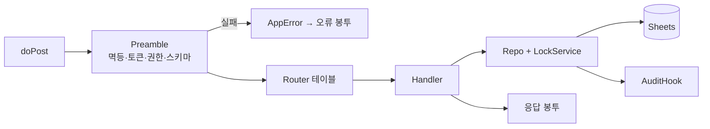

# Google Apps Script Spec — v2 GAS 백엔드

> **문서 상태**: 📋 설계만 (v2.5 Technical Specification · 미구현)
> **관련 문서**: [API_SPEC.md](API_SPEC.md) · [GOOGLE_SHEETS_SPEC.md](GOOGLE_SHEETS_SPEC.md) · [SECURITY_SPEC.md](SECURITY_SPEC.md) · [DEPLOYMENT_SPEC.md](DEPLOYMENT_SPEC.md) · v1: 루트 `autodoc_gas.gs`(무수정)
> **한 줄 목적**: 신규 파일 `autodoc_v2_gas.gs`의 내부 구조 — 라우팅·프리앰블·핸들러 규약·속성·쿼터 대응을 정의한다.

---

## 목차

1. [목적](#1-목적) · 2. [책임](#2-책임) · 3. [인터페이스](#3-인터페이스) · 4. [입력](#4-입력) · 5. [출력](#5-출력) · 6. [데이터 흐름](#6-데이터-흐름) · 7. [의존성](#7-의존성) · 8. [확장성](#8-확장성) · 9. [장점](#9-장점) · 10. [단점](#10-단점)

---

## 1. 목적

v2 백엔드는 **신규 GAS 파일 1개**(`autodoc_v2_gas.gs`)로 시작한다. v1 GAS(`autodoc_gas.gs`)는 무수정 병존 — v2는 v1의 검증된 패턴(doPost 단일 진입·action 스위치·text/plain 파싱)을 신규 파일에서 재현한다.

## 2. 책임

| 내부 구성(개념 단위) | 책임 |
|---|---|
| Entry (`doPost`/`doGet`) | 단일 진입 — 파싱·응답 직렬화만 |
| Preamble | requestId 멱등 검사 → 토큰 검증 → 권한표 대조 → schema validate ([API_SPEC.md](API_SPEC.md) §6) |
| Router | `action` → 핸들러 매핑 테이블 (스위치 비대화 방지 — 테이블 조회) |
| Handlers | 액션당 1핸들러 — Sheets 접근은 Repo 경유만 |
| Repo | 탭별 읽기/쓰기 유틸 ([GOOGLE_SHEETS_SPEC.md](GOOGLE_SHEETS_SPEC.md) 탭 매핑) — 헤더행 기반 컬럼 해석 |
| AuditHook | 변경 핸들러 종료 시 Audit 탭 append (누락 불가 — Repo 쓰기에 훅) |
| Props | Script Properties: 시트 ID·토큰 시크릿·apiVersion — 코드에 상수 금지 |

**하지 않는 것**: AI 호출(I1) · 문서 렌더링(클라이언트 소관) · v1 시트 접근(교차 금지).

## 3. 인터페이스

외부 Interface = [API_SPEC.md](API_SPEC.md) 액션 카탈로그 전부. 내부 규약:

| 규약 | 내용 |
|---|---|
| 핸들러 서명 | `(ctx {session, workspaceId, payload}) → payload | throw AppError(code)` |
| 오류 | 핸들러는 AppError만 throw — Entry가 응답 봉투로 변환 (스택은 [LOGGING_SPEC.md](LOGGING_SPEC.md) 정책으로 기록) |
| 잠금 | 쓰기 핸들러는 LockService(문서 잠금) — Sheets 동시 쓰기 경합 방어 |
| 멱등 대장 | `_Requests` 탭: requestId·응답 요약·시각 — 최근 7일 유지 |

## 4. 입력

POST body(text/plain의 JSON — [API_SPEC.md](API_SPEC.md) §3 봉투) · Script Properties · Sheets 데이터.

## 5. 출력

JSON 응답 봉투(ContentService) · Sheets 쓰기 · Audit append · 실행 로그.

## 6. 데이터 흐름

```
doPost → JSON 파싱(실패=E-SCHEMA)
  → Preamble: _Requests 멱등 → 토큰 → 권한표 → validate
  → Router 테이블 → Handler
  → Repo (LockService로 쓰기 직렬화) → Sheets
  → AuditHook(변경 시) → 응답 직렬화
```



## 7. 의존성

v2 GAS → v2 스프레드시트만 (v1 시트 접근 금지 — [FILE_STRUCTURE.md](FILE_STRUCTURE.md) §10). 클라이언트와의 계약은 API_SPEC이 유일.

## 8. 확장성

- 액션 추가 = Router 테이블 1행 + Handler 1개.
- GAS 한계 도달 시(쿼터·성능): Repo 계층만 교체해 외부 DB Plugin으로 — Handler·Preamble 불변 ([../PLUGIN_ARCHITECTURE.md](../PLUGIN_ARCHITECTURE.md) storage).
- Workspace 추가 = Props에 시트 ID 매핑 행 추가.

## 9. 장점

1. **v1 검증 패턴 재현** — 신뢰성 있는 최소 백엔드를 빠르게.
2. **Repo 수렴** — Sheets 의존이 한 계층이라 이전·테스트가 국소적.
3. **멱등·잠금 내장** — 오프라인 큐 재전송·동시 관리자 조작의 데이터 사고 방어.

## 10. 단점

1. **GAS 개발 경험 빈약** — 디버깅·버전 관리가 취약. (→ 로직 최소화: GAS는 "검증+저장"만, 지능은 클라이언트에)
2. **6분 실행 한계** — 대량 백업/복원이 위험. (→ 페이지 분할 처리 + 이어하기 커서)
3. **LockService 병목** — 쓰기 직렬화는 동시 관리자 다수 시 대기 유발. (→ 탭 단위 잠금 세분화 여지)
