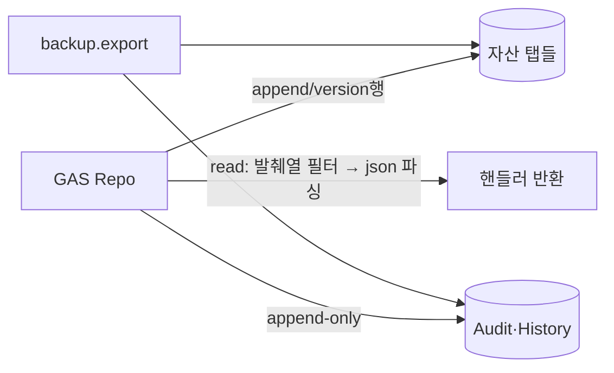

# Google Sheets Spec — 영속 저장소 탭 스키마

> **문서 상태**: 📋 설계만 (v2.5 Technical Specification · 미구현)
> **관련 문서**: [DATA_MODEL.md](DATA_MODEL.md) · [GOOGLE_APPS_SCRIPT_SPEC.md](GOOGLE_APPS_SCRIPT_SPEC.md) · [STORAGE_SPEC.md](STORAGE_SPEC.md) · v1: [../../API_SPEC.md](../../API_SPEC.md)(v1 시트 — 무수정)
> **한 줄 목적**: v2 전용 스프레드시트("AutoDoc v2 DB")의 탭 구성·행 규약·용량 정책을 정의한다.

---

## 목차

1. [목적](#1-목적) · 2. [책임 — 탭 카탈로그](#2-책임--탭-카탈로그) · 3. [인터페이스](#3-인터페이스) · 4. [입력](#4-입력) · 5. [출력](#5-출력) · 6. [데이터 흐름](#6-데이터-흐름) · 7. [의존성](#7-의존성) · 8. [확장성](#8-확장성) · 9. [장점](#9-장점) · 10. [단점](#10-단점)

---

## 1. 목적

Workspace 1개 = 스프레드시트 1개. v1 스프레드시트와 **완전 분리**된 신규 시트를 사용한다. 시트는 v1 사상("시트 탭 = 관리자 설정 저장소")을 계승하되, 레코드는 **JSON 1행** 방식으로 통일한다.

## 2. 책임 — 탭 카탈로그

| 탭 | 엔티티([DATA_MODEL.md](DATA_MODEL.md)) | 행 규약 | 성장 |
|---|---|---|---|
| `Templates` | Template(전 버전) | id·version·status·json·meta열 | 자산형(느림) |
| `Golden` | GoldenRef | 〃 | 느림 |
| `Prompts` | Prompt(+Fragment) | 〃 + stats열(집계 갱신) | 느림 |
| `DNA` | CompanyDNA(전 버전) | dnaVersion·json | 학습기 빠름 |
| `KB` | KBTerm | id·status·json | 중간 |
| `Graph` | GraphEdge | id·from·relation·to·json | 빠름(차기) |
| `Memory` | MemoryItem | id·type·status·json | 중간 |
| `Rules` | Rule | id·enabled·json | 느림 |
| `Learning` | Proposal(+Approval 결과) | id·status·grade·json | 캠페인기 폭증 |
| `History` | DocumentRecord | id·userId·templateRef·json | 꾸준 |
| `Drafts` | Draft(서버 동기본) | userId·templateId·json | 중간·순환 |
| `Audit` | AuditRecord | append-only·hash 체인 | 빠름 |
| `Workspace` | 설정·Flag·권한 | key·json | 느림 |
| `_Requests` | 멱등 대장 | requestId·시각·응답요약 | 순환(7일) |

공통 열: `A:id · B:상태/버전 축 · C:updatedAt · D:json(전체 직렬화) · E~:조회용 발췌 열` — 조회 열은 색인용 사본이며 **json 열이 진실**.

## 3. 인터페이스

시트 접근은 GAS Repo만 ([GOOGLE_APPS_SCRIPT_SPEC.md](GOOGLE_APPS_SCRIPT_SPEC.md) §2). 규약:

| 규약 | 내용 |
|---|---|
| 헤더행 | 1행 고정 — Repo는 헤더명으로 컬럼 해석(열 순서 하드코딩 금지) |
| append-only 탭 | Audit·History·_Requests — 수정·삭제 금지 |
| 버전 탭 | Templates·DNA 등 — 같은 id의 새 version 행 추가, 구 행 불변 |
| 사람 편집 금지 | 시트 직접 편집은 지원 대상 아님 — 보호 범위 설정 + 편집 감지 시 경고 |

## 4. 입력

GAS Repo의 읽기/쓰기 호출만 (사람·타 스크립트 편집 배제).

## 5. 출력

행 데이터(Repo가 JSON 역직렬화) · 백업 export의 원천.

## 6. 데이터 흐름

```
Handler → Repo.write(tab, record)
  → validate(계약) 통과분만 → 헤더 매핑 → 행 append/신버전 행
  → AuditHook(변경 탭이면 Audit append)
읽기: Repo.read(tab, filter) → 발췌 열로 후보 축소 → json 역직렬화 → 반환
```



## 7. 의존성

본 스키마 ← DATA_MODEL(논리) · JSON_SCHEMA(직렬화). v1 시트와 상호 접근 없음.

## 8. 확장성

- 탭 추가 = 카탈로그 행 + Repo 매핑 1행.
- **용량 정책**: 시트당 셀 한도 대비 — ① Learning·Audit는 분기별 아카이브 시트로 이관(체인 해시 경계 기록) ② Graph 등 대용량은 DB Plugin 승격 1순위 ([STORAGE_SPEC.md](STORAGE_SPEC.md) §8).
- Workspace 추가 = 시트 사본 생성(빈 스키마) + Props 매핑.

## 9. 장점

1. **json 1행 방식** — 스키마 진화가 열 구조 변경 없이 흡수된다(migrate는 읽기 시).
2. **눈으로 검증 가능** — 초기 운영에서 데이터를 직접 볼 수 있는 저비용 저장소.
3. **v1 분리** — v2 실험이 v1 운영 데이터를 위협하지 않는다.

## 10. 단점

1. **질의 능력 빈약** — 필터·조인이 원시적. (→ 발췌 열 + 클라이언트 측 가공, 본격 질의는 DB Plugin 이후)
2. **셀 한도** — 폭증 탭(Audit·Learning)이 한계를 친다. (→ §8 아카이브 정책)
3. **json 열 크기 한계** — 셀 5만 자 제한 대비 대형 레코드(큰 Template) 분할 저장 규칙 필요. (→ `json2` 연속 열 허용 규약)
