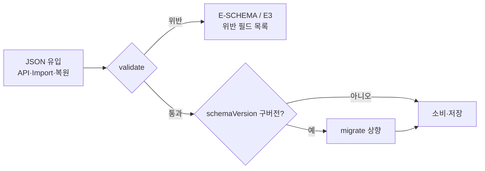

# JSON Schema — 전 JSON 계약 정의

> **문서 상태**: 📋 설계만 (v2.5 Technical Specification · 미구현)
> **관련 문서**: [DATA_MODEL.md](DATA_MODEL.md) · [API_SPEC.md](API_SPEC.md) · v1: [../../JSON_SCHEMA.md](../../JSON_SCHEMA.md)(Template·Theme v1 — 무수정 계승)
> **한 줄 목적**: 12개 JSON 계약(Template·Prompt·Golden·DNA·KB·KG·Workflow·Rule·Learning·Audit·Plugin·Workspace)의 필수 필드·검증 규칙을 정의한다.

---

## 목차

1. [목적](#1-목적) · 2. [책임](#2-책임) · 3. [인터페이스](#3-인터페이스) · 4. [입력](#4-입력) · 5. [출력](#5-출력) · 6. [데이터 흐름](#6-데이터-흐름) · 7. [의존성](#7-의존성) · 8. [확장성](#8-확장성) · 9. [장점](#9-장점) · 10. [단점](#10-단점)

---

## 1. 목적

모든 저장·통신 JSON은 여기 정의된 계약을 따른다. 공통 봉투: [DATA_MODEL.md](DATA_MODEL.md) §3 공통 필드(id·workspaceId·schemaVersion·감사 필드)가 전 계약 전제이며 아래에선 생략한다.

## 2. 책임

### 12계약 카탈로그 (대표 필드 — 전체 필드는 원본 문서의 §4 예시가 규범)

| 계약 | schemaVersion | 필수 필드(공통 외) | 규범 예시 위치 |
|---|---|---|---|
| **Template** | `template.v1` (v1 그대로) | meta·inputs[]·layout·theme참조·rules | v1 [../../JSON_SCHEMA.md](../../JSON_SCHEMA.md) — **개정 없음**, v2 부가정보는 별도 계약(GoldenRef 등)으로 |
| **Prompt** | `prompt.v1` | promptId·version·axes{6축}·fragments[]·golden·body·metadata{accuracy,successRate,supportedAI,usageCount,lastModified,author,derivedFrom} | [../PROMPT_ENGINE.md](../PROMPT_ENGINE.md) §4 · [../PROMPT_MARKETPLACE.md](../PROMPT_MARKETPLACE.md) §4 |
| **Golden Template**(GoldenRef) | `golden.v1` | docType·templateRef(id@v)·promptRef(id@v)·reason·designatedBy/At·history[] | [../GOLDEN_TEMPLATE.md](../GOLDEN_TEMPLATE.md) |
| **Company DNA** | `dna.v1` | dnaVersion·writingStyle·brandRule·layoutRule·colorRule·fontRule·tableRule·chartRule·imageRule·sectionOrder·reportFlow·refs{}·confidence{} | [../COMPANY_DNA.md](../COMPANY_DNA.md) §4 |
| **Knowledge Base**(KBTerm) | `kb.v1` | canonical·synonyms[]·forbidden[]·class·definition·sources[]·confidence·status | [../KNOWLEDGE_BASE.md](../KNOWLEDGE_BASE.md) §4 |
| **Knowledge Graph**(Edge) | `kg.v1` | from·relation·to·evidence[]·weight·confidence·status | [../KNOWLEDGE_GRAPH.md](../KNOWLEDGE_GRAPH.md) §4 |
| **Workflow** | `workflow.v1` | appliesTo[]·steps[{id,type,role/action,next,rejectTo}] | [../WORKFLOW_ENGINE.md](../WORKFLOW_ENGINE.md) §4 |
| **Rule** | `rule.v1` | scope·condition{op,left,right}·effect{type,…}·origin·enabled·confidence | [../RULE_ENGINE.md](../RULE_ENGINE.md) §4 |
| **Learning**(Proposal) | `learning.v1` | target{store,path}·before·after·evidence[]·confidence·grade·status·learningVersion | [../LEARNING_ENGINE.md](../LEARNING_ENGINE.md) §4 |
| **Audit**(Record) | `audit.v1` | timestamp·actor·action·target·change·reason·causationId·prevHash·hash | [../AUDIT_ENGINE.md](../AUDIT_ENGINE.md) §4 |
| **Plugin**(Manifest) | `plugin.v1` | pluginId·name·version·capabilities[]·subscribes[]·publishes[]·config | [../PLUGIN_ARCHITECTURE.md](../PLUGIN_ARCHITECTURE.md) §4 |
| **Workspace** | `workspace.v1` | name·branding·defaults{format,language}·flags{}·permissions | [../ARCHITECTURE.md](../ARCHITECTURE.md) §5 |

부속 계약: **Analysis 봉투** `autodoc.analysis.v1`(Import Gate — [../AI_ARCHITECTURE.md](../AI_ARCHITECTURE.md) §4) · **이벤트 봉투**([TECH_SPEC.md](TECH_SPEC.md) §3) · **API 봉투**([API_SPEC.md](API_SPEC.md) §3).

## 3. 인터페이스

| 연산(개념) | 서명 |
|---|---|
| 검증 | `validate(contract, json) → { ok, violations[] }` — 필수 필드·타입·enum·상태 전이 검사 |
| 이행 | `migrate(json, toVersion) → json` — 구버전 레코드 읽기 시 상향 변환 |
| 계약 조회 | `contract(name) → 필드 정의 테이블` |

검증 실패 처리: 저장 경로 = 거부(E-SCHEMA) · Import 경로 = E3 등급 ([ERROR_SPEC.md](ERROR_SPEC.md)).

## 4. 입력

검증 대상 JSON: API 요청/응답 · Import 붙여넣기 · 저장 전 레코드 · 백업 복원 파일.

## 5. 출력

검증 결과(위반 필드 목록 — 오류 UI가 그대로 표시) · 이행된 레코드.

## 6. 데이터 흐름

```
쓰기 요청 → validate(계약) → 통과 시 store.write → Sheets
읽기 → 레코드 schemaVersion < 현행 → migrate 상향 → 소비
Import 붙여넣기 → analysis 봉투 검증(E1~E3) → payload를 analyzer 스키마로 2차 검증
```



## 7. 의존성

본 계약 ← [DATA_MODEL.md](DATA_MODEL.md)(논리 모델) — 계약은 모델의 직렬화. Template·Theme는 v1 스키마를 동결 계승(v2가 개정하지 않음 — I6).

## 8. 확장성

- 필드 추가 = 부 버전 상향(구 레코드 migrate로 흡수). 필드 의미 변경 = 새 계약 버전(`dna.v2`) + 병행 읽기 기간.
- 새 계약 = 카탈로그 행 + validate 등록 — 12계약 구조 불변.

## 9. 장점

1. **단일 규범** — "필드가 뭐였지"의 답이 항상 이 표(및 원본 문서 §4)다.
2. **migrate 내장** — 스키마 진화가 저장 데이터를 볼모로 잡지 않는다.
3. **v1 Template 동결** — 기존 템플릿 자산·엔진과의 호환이 계약 수준에서 보장.

## 10. 단점

1. **이중 규범 위험** — 본 표와 원본 문서 §4 예시의 불일치 가능. (→ 본 표는 색인, 필드 상세의 규범은 원본 §4로 단일화 — 표에 명기함)
2. **JSON Schema 표준 미채택** — 자체 validate는 표준 도구 생태계를 못 쓴다. (→ Vanilla JS·무빌드 제약의 트레이드오프, 내부 검증기 1개로 충분)
3. **migrate 누적** — 버전이 쌓이면 이행 사슬이 길어진다. (→ 대판 개정 시 일괄 재저장 캠페인)
