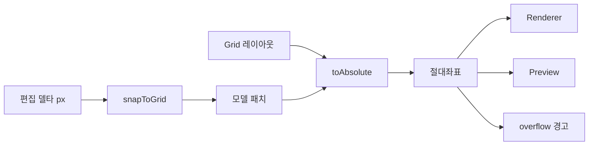

# Layout Engine Spec — 레이아웃 좌표 변환

> **문서 상태**: 📋 설계만 (v2.5 Technical Specification · 미구현)
> **관련 문서**: [DOCUMENT_ENGINE_SPEC.md](DOCUMENT_ENGINE_SPEC.md) · [RENDERER_SPEC.md](RENDERER_SPEC.md) · [../ui/EDITOR_SYSTEM.md](../ui/EDITOR_SYSTEM.md) · v1: [../../LAYOUT_ENGINE.md](../../LAYOUT_ENGINE.md)(무수정 재사용)
> **한 줄 목적**: Grid 저작 좌표를 절대좌표로 변환하는 v1 Layout Engine을 v2에서 무수정 재사용하는 계약과 편집 좌표 규약을 정의한다.

---

## 목차

1. [목적](#1-목적) · 2. [책임](#2-책임) · 3. [인터페이스](#3-인터페이스) · 4. [입력](#4-입력) · 5. [출력](#5-출력) · 6. [데이터 흐름](#6-데이터-흐름) · 7. [의존성](#7-의존성) · 8. [확장성](#8-확장성) · 9. [장점](#9-장점) · 10. [단점](#10-단점)

---

## 1. 목적

레이아웃을 새로 만들지 않는다. v1 Layout Engine([../../LAYOUT_ENGINE.md](../../LAYOUT_ENGINE.md) — Grid 저작 → 절대좌표 변환, 혼합 방식)을 **원위치 import로 재사용**한다. v2는 편집 모드(Drag·Resize)의 좌표 스냅 규약만 계약으로 추가한다.

## 2. 책임

| 주체 | 책임 |
|---|---|
| v1 layout-engine (동결) | Grid 좌표 → 절대좌표(pt/px) 변환 · 페이지 분할 계산 |
| v2 편집 좌표 규약 | Drag/Resize를 Grid 단위로 스냅 → v1 변환기 입력으로 환원 |
| 페이지 넘침 계산 | 조립된 모델의 콘텐츠가 페이지 경계 초과 여부 산출 → Preview 경고 |

## 3. 인터페이스

| 연산(개념) | 서명 | 출처 |
|---|---|---|
| 변환 | `toAbsolute(gridLayout, pageSpec) → absoluteBoxes[]` | v1 재사용 |
| 스냅 | `snapToGrid(pixelDelta, gridSpec) → gridDelta` | v2 신규(편집) |
| 넘침 | `overflow(model, pageSpec) → { page, region }[]` | v2 신규 |
| 최소 크기 | `clampSize(box, minCells) → box` | v2 신규(Resize 하한) |

## 4. 입력

Grid 레이아웃(Template layout) · 페이지 사양(A4/16:9 등) · 편집 델타(픽셀).

## 5. 출력

절대좌표 박스 목록(Renderer·Preview 공용) · 스냅된 Grid 델타 · 넘침 영역.

## 6. 데이터 흐름

```
조립 시: Template layout(Grid) → toAbsolute → 모델에 좌표 확정
편집 시: 드래그 픽셀 델타 → snapToGrid → Grid 좌표 변경 → 모델 패치 → toAbsolute 재계산
넘침: 콘텐츠 크기 vs pageSpec → overflow → Preview 경고 오버레이
```



## 7. 의존성

v2 편집 규약 → v1 layout-engine(원위치 import·무수정). document-model이 조립 시 호출.

## 8. 확장성

- 새 페이지 사양 = pageSpec 데이터 추가 (변환기 무수정).
- 정렬 보조선·스냅 가이드는 편집 규약 확장으로 (v1 변환기 불변).

## 9. 장점

1. **검증된 좌표계 재사용** — 레이아웃 버그는 문서 신뢰를 죽인다.
2. **Grid 스냅 = 망가짐 방지** — 편집이 자유 픽셀이 아니라 격자라 문서가 깨지지 않는다 ([../ui/EDITOR_SYSTEM.md](../ui/EDITOR_SYSTEM.md) §2).
3. **넘침 사전 경고** — 생성 후가 아니라 작성 중 발견.

## 10. 단점

1. **v1 Grid 표현력 한계** — 자유형 배치가 어렵다. (→ 문서 도구 특성상 격자면 충분 — KISS)
2. **혼합 방식 복잡성** — Grid+절대 혼합의 경계 케이스. (→ v1 검증 범위 내 사용, 신규 케이스는 문서화)
3. **재계산 비용** — 편집마다 toAbsolute. (→ 변경 영역만 부분 재계산)
