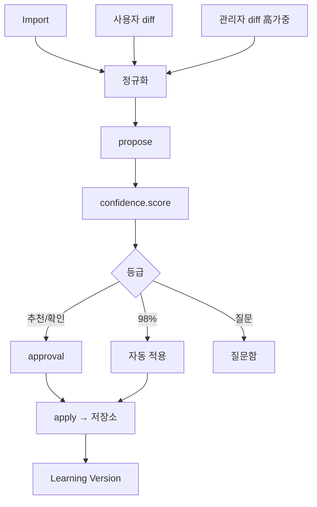

# Learning Engine Spec — 학습 엔진

> **문서 상태**: 📋 설계만 (v2.5 Technical Specification · 미구현)
> **관련 문서**: [../LEARNING_ENGINE.md](../LEARNING_ENGINE.md)(개념) · [../CONFIDENCE_ENGINE.md](../CONFIDENCE_ENGINE.md) · [../HUMAN_APPROVAL.md](../HUMAN_APPROVAL.md) · [JSON_SCHEMA.md](JSON_SCHEMA.md)
> **한 줄 목적**: 학습 신호 → Learning Proposal → 신뢰도 → 승인 → 반영 파이프라인의 구현 계약을 정의한다 (I2의 핵심 집행 경로).

---

## 목차

1. [목적](#1-목적) · 2. [책임](#2-책임) · 3. [인터페이스](#3-인터페이스) · 4. [입력](#4-입력) · 5. [출력](#5-출력) · 6. [데이터 흐름](#6-데이터-흐름) · 7. [의존성](#7-의존성) · 8. [확장성](#8-확장성) · 9. [장점](#9-장점) · 10. [단점](#10-단점)

---

## 1. 목적

3종 학습 신호(Import·사용자 수정·관리자 수정)를 정규화된 Learning Proposal로 만들고, Confidence 등급·Human Approval을 거쳐 지식 저장소에 반영한다. **엔진은 절대 직접 반영하지 않는다** — apply는 승인 통과분만 (I2).

## 2. 책임

| 모듈 | 책임 |
|---|---|
| learning | 신호 수집·정규화·Proposal 생성·apply(승인분만)·Learning Version 채번 |
| confidence | 신뢰도 산정·4등급 판정·피드백 학습 ([../CONFIDENCE_ENGINE.md](../CONFIDENCE_ENGINE.md)) |
| approval | 승인함·상태 머신·롤백 ([../HUMAN_APPROVAL.md](../HUMAN_APPROVAL.md)) |

**신호원**: `analysis.imported`(Import) · `document.edited`(사용자 diff) · `approval.corrected`(관리자 교정 — 가중치 최고).

## 3. 인터페이스

| 연산(개념) | 서명 |
|---|---|
| 제안 | `propose(signal) → LearningProposal` (`learning.v1` — [JSON_SCHEMA.md](JSON_SCHEMA.md)) |
| 산정 | `score(proposal) → { confidence, grade, factors[] }` |
| 반영 | `apply(proposalId) → learningVersion` — **Human Approval 통과분만 호출 가능** |
| 버전 로그 | `versionLog(workspaceId) → LearningVersion[]` |
| 질문 변환 | `toQuestion(proposal) → { question, options[], evidence[] }` |

## 4. 입력

3종 신호(이벤트) · learningMap(Analyzer — [../PROMPT_LIBRARY.md](../PROMPT_LIBRARY.md) §4) · 승인 결정 · Confidence 임계값(Workspace).

## 5. 출력

LearningProposal · 등급별 승인 요청 · 승인 시 지식 저장소 쓰기(DNA/KB/Memory/Rule/Graph) · `learning.proposed`/`learning.applied` 이벤트 · Learning Version.

## 6. 데이터 흐름

```
신호(Import/사용자/관리자) → 정규화(learningMap/diff) → propose
  → confidence.score → 등급
  → 98%: 자동 적용(정책 위임) + 사후 통보
    추천/확인: 승인함 / 질문: 질문함
  → approval 결정 → apply(승인분) → 저장소 쓰기 + learningVersion
  → learning.applied → Golden Score 재계산·Audit
```



## 7. 의존성

learning(Learning 계층) → confidence·approval·store(지식 쓰기, 권한표가 apply만 허용 — [STORAGE_SPEC.md](STORAGE_SPEC.md) §2)·bus. Import Gate·Editor·Approval이 신호 공급.

## 8. 확장성

- 새 신호원(Plugin ERP 패턴 등) = 정규화기 1개 추가 — 하류 무수정.
- 새 저장 대상 = learningMap의 to 경로 + Store 권한표 1행.
- Learning Timeline(마일스톤·복원) = versionLog 위 표면 ([../ui/LEARNING_MODE_UX.md](../ui/LEARNING_MODE_UX.md)).

## 9. 장점

1. **단일 Proposal 계약** — 모든 학습이 한 형식·한 게이트를 통과.
2. **apply 권한 격리** — 저장소 쓰기가 승인 통과분에만 (I2 집행).
3. **수정이 곧 교사** — 별도 학습 작업 없이 사용·수정이 학습.

## 10. 단점

1. **승인 병목** — 대량 학습 시. (→ 98% 자동 + 묶음 승인)
2. **모순 신호** — 반대 수정. (→ 자동 '질문' 등급 강등 — [../CONFIDENCE_ENGINE.md](../CONFIDENCE_ENGINE.md) §2)
3. **축적형 지연** — 즉각 지능 아님. (→ 초기 기대치 관리 + Company Learning 캠페인 선투입)
