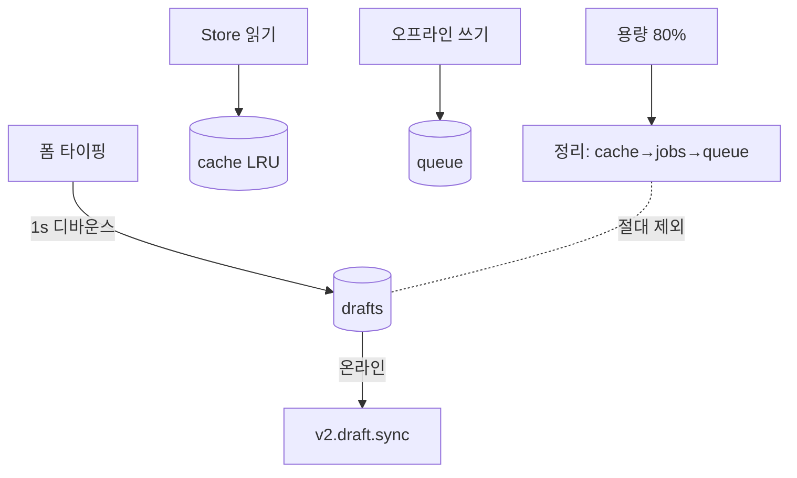

# Local Storage Spec — 브라우저 로컬 저장

> **문서 상태**: 📋 설계만 (v2.5 Technical Specification · 미구현)
> **관련 문서**: [STORAGE_SPEC.md](STORAGE_SPEC.md) · [CACHE_SPEC.md](CACHE_SPEC.md) · [OFFLINE_SYNC_SPEC.md](OFFLINE_SYNC_SPEC.md) · [SECURITY_SPEC.md](SECURITY_SPEC.md)
> **한 줄 목적**: localStorage/IndexedDB의 키 체계·매체 선택·용량·정리 정책을 정의한다 — Draft가 최우선 보호 대상이다.

---

## 목차

1. [목적](#1-목적) · 2. [책임](#2-책임) · 3. [인터페이스](#3-인터페이스) · 4. [입력](#4-입력) · 5. [출력](#5-출력) · 6. [데이터 흐름](#6-데이터-흐름) · 7. [의존성](#7-의존성) · 8. [확장성](#8-확장성) · 9. [장점](#9-장점) · 10. [단점](#10-단점)

---

## 1. 목적

로컬 저장의 무질서(임의 키 난립)를 막고, 매체별 역할을 고정한다: **localStorage = 작고 즉시(토큰·설정·포인터)** · **IndexedDB = 크고 구조적(Draft·캐시 레코드·큐)**.

## 2. 책임

### 키·저장소 카탈로그

| 데이터 | 매체 | 키/스토어 | 정리 정책 |
|---|---|---|---|
| 인증 토큰·세션 | localStorage | `ad2.auth` | 로그아웃·만료 시 삭제 |
| 개인 설정(테마·글자) | localStorage | `ad2.prefs` | 영구 |
| 마지막 라우트·복귀 포인터 | localStorage | `ad2.nav` | 세션성 |
| **Draft** | IndexedDB | store `drafts` (key: templateId+draftId) | 사용자 삭제 전 보존 — **자동 삭제 금지** |
| 자산 캐시(Template·DNA·KB…) | IndexedDB | store `cache` (key: collection+id@v) | LRU + 버전 무효화 ([CACHE_SPEC.md](CACHE_SPEC.md)) |
| 동기 큐 | IndexedDB | store `queue` (key: requestId) | 전송 성공 시 삭제 |
| Import 마법사 상태 | IndexedDB | store `jobs` (key: jobId) | 완료 30일 후 정리 |
| 문구 테이블·Analyzer 정의 | Cache Storage(SW) | 정적 자산 경로 | SW 버전 교체 |

접두사 `ad2.` — v1 키와 충돌 방지 (v1 localStorage 키 무간섭).

## 3. 인터페이스

local 드라이버(Store 내부 — [STORAGE_SPEC.md](STORAGE_SPEC.md) §3)가 유일한 접근자. 직접 localStorage 호출은 auth·prefs 2예외만 허용.

| 연산(개념) | 서명 |
|---|---|
| Draft | `saveDraft(templateId, data)`(디바운스 1s) · `listDrafts()` · `deleteDraft(id)`(사용자 명시 행동만) |
| 캐시 | `cacheGet/Put(key)` · `evict(policy)` |
| 큐 | `enqueue(request)` · `drain()` ([OFFLINE_SYNC_SPEC.md](OFFLINE_SYNC_SPEC.md)) |
| 용량 | `estimate() → { usage, quota }` — 80% 초과 시 정리 제안 이벤트 |

## 4. 입력

폼 타이핑(Draft) · Store 읽기 결과(캐시) · 오프라인 쓰기(큐) · 마법사 진행 상태.

## 5. 출력

복원된 Draft("이어서 작성") · 캐시 히트 레코드 · 재전송 요청 · 용량 경고.

## 6. 데이터 흐름

```
타이핑 → 디바운스 1s → drafts 저장 → 상태바 "저장됨 ✓"
   (온라인이면 추가로 v2.draft.sync — 기기 간 이어서)
용량 80% → 정리 순서: cache(LRU) → jobs(만료) → queue(전송 완료분)
   ※ drafts는 어떤 자동 정리에도 포함되지 않는다
```



## 7. 의존성

local 드라이버 → IndexedDB/localStorage API. 상위는 Store만 본다. SW 캐시는 [PWA_SPEC.md](PWA_SPEC.md) 소관(본 문서는 데이터 저장만).

## 8. 확장성

- 스토어 추가 = 카탈로그 행 + IndexedDB 스키마 버전 상향(onupgradeneeded 마이그레이션 규약).
- 민감 데이터 확대 시 암호화 레이어 삽입 지점은 드라이버 1곳 ([SECURITY_SPEC.md](SECURITY_SPEC.md) §8).

## 9. 장점

1. **Draft 절대 보호** — "입력이 날아갔다"를 정책 수준에서 금지.
2. **매체 역할 고정** — localStorage 남용(대형 JSON)으로 인한 성능·용량 사고 방지.
3. **접두사 격리** — v1 로컬 데이터와 무간섭.

## 10. 단점

1. **IndexedDB 복잡성** — Vanilla JS에서 장황한 API. (→ 드라이버 유틸로 1회 포장)
2. **기기 로컬의 한계** — 기기 분실 = 미동기 Draft 손실. (→ 온라인 시 draft.sync 병행이 완화책)
3. **브라우저 정리 위험** — 저장 압박 시 브라우저가 IndexedDB를 지울 수 있다. (→ persist() 저장소 고정 요청 + 동기 주기 단축)
