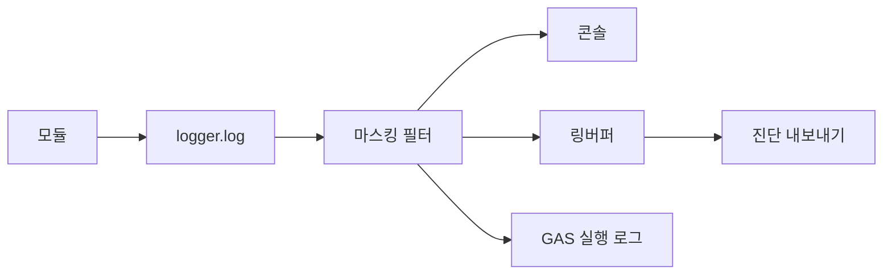

# Logging Spec — 로그 정책

> **문서 상태**: 📋 설계만 (v2.5 Technical Specification · 미구현)
> **관련 문서**: [ERROR_SPEC.md](ERROR_SPEC.md) · [AUDIT_SPEC.md](AUDIT_SPEC.md) · [SECURITY_SPEC.md](SECURITY_SPEC.md)
> **한 줄 목적**: 로그 레벨·대상·보존·개인정보 마스킹 정책을 정의한다 — 감사(Audit)와 구분되는 기술 로그의 규범.

---

## 목차

1. [목적](#1-목적) · 2. [책임](#2-책임) · 3. [인터페이스](#3-인터페이스) · 4. [입력](#4-입력) · 5. [출력](#5-출력) · 6. [데이터 흐름](#6-데이터-흐름) · 7. [의존성](#7-의존성) · 8. [확장성](#8-확장성) · 9. [장점](#9-장점) · 10. [단점](#10-단점)

---

## 1. 목적

디버깅·운영 관찰용 기술 로그의 단일 정책. Audit(비즈니스 변경 — [AUDIT_SPEC.md](AUDIT_SPEC.md))와 달리 순환·폐기 가능하며, **개인정보·문서 내용·토큰을 절대 남기지 않는다**.

## 2. 책임

### 레벨 정책

| 레벨 | 용도 | 클라이언트 | GAS |
|---|---|---|---|
| ERROR | 실패(오류 코드 동반) | 콘솔 + 로컬 링버퍼 | 실행 로그 |
| WARN | 복구된 이상·재시도 | 콘솔 + 링버퍼 | 실행 로그 |
| INFO | 주요 흐름(생성·동기·승인) | 링버퍼만 | 실행 로그 |
| DEBUG | 상세(개발 시) | 플래그 on 시만 | 비활성 |

| 항목 | 규칙 |
|---|---|
| 링버퍼 | 클라이언트 최근 N건 메모리 — "문제 신고" 시 첨부(개인정보 마스킹 후) |
| 마스킹 | 토큰·문서 내용·개인 식별정보는 로그 금지 — 값 대신 경로·길이·해시 |
| 상관 | requestId·causationId를 로그에 포함(추적) |
| 보존 | 로컬 링버퍼는 순환 · GAS 로그는 플랫폼 정책 |

## 3. 인터페이스

| 연산(개념) | 서명 |
|---|---|
| 로그 | `log(level, code?, { requestId, causationId, meta })` — meta는 마스킹 규약 준수 |
| 신고 | `exportDiagnostics() → 마스킹된 링버퍼` (사용자 "문제 신고") |
| 레벨 | `setLevel(level)` (DEBUG는 설정 플래그) |

## 4. 입력

모듈의 log 호출 · 오류 이벤트 · 성능 마커.

## 5. 출력

콘솔·링버퍼·GAS 실행 로그 · 진단 내보내기(마스킹).

## 6. 데이터 흐름

```
모듈 → logger.log(level, code, meta)
  → 마스킹 필터(토큰/내용/PII 제거) → 레벨별 싱크(콘솔/링버퍼/GAS)
사용자 "문제 신고" → exportDiagnostics(마스킹된 최근 로그) → 관리자 전달
```



## 7. 의존성

logger(Infra) → 없음(최하류). 전 모듈이 logger 사용. Audit와 상호 무참조(별도 체계).

## 8. 확장성

- 원격 로그 수집(에러 리포팅 서비스) 📋 = 싱크 1개 추가 — 단, 외부 전송은 마스킹·동의 전제.
- 레벨·싱크 추가는 정책표 확장.

## 9. 장점

1. **마스킹 내장** — 로그를 통한 정보 유출 원천 차단([SECURITY_SPEC.md](SECURITY_SPEC.md)).
2. **상관 추적** — requestId·causationId로 분산 흐름 재구성.
3. **Audit 분리** — 감사 증거를 디버그 로그로 오염시키지 않음.

## 10. 단점

1. **마스킹의 디버깅 손실** — 값을 못 봐서 재현이 어려울 수 있다. (→ 경로·해시로 최대 추적, 재현은 안전 환경에서)
2. **GAS 로그 한계** — 조회·보존이 빈약. (→ 중요 오류는 Audit이 아니라도 별도 오류 카드로 표면 — [../ui/ADMIN_UX.md](../ui/ADMIN_UX.md) §5)
3. **링버퍼 유실** — 새로고침 시 소멸. (→ ERROR/WARN은 IndexedDB 소량 영속 옵션)
