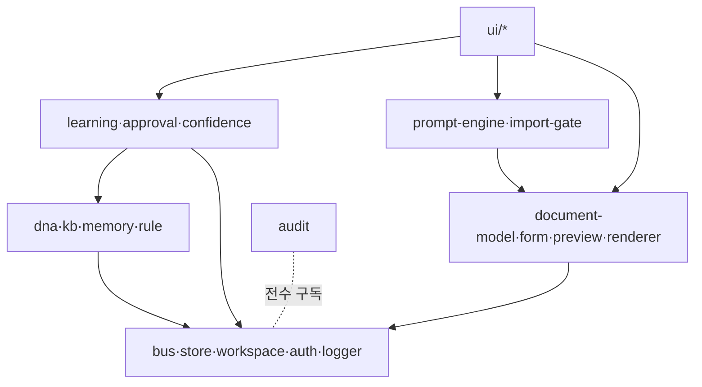

# Module Spec — 모듈 정의 · 이벤트 · 에러 소유

> **문서 상태**: 📋 설계만 (v2.5 Technical Specification · 미구현)
> **관련 문서**: [TECH_SPEC.md](TECH_SPEC.md) · [FILE_STRUCTURE.md](FILE_STRUCTURE.md) · [ERROR_SPEC.md](ERROR_SPEC.md) · [../ARCHITECTURE.md](../ARCHITECTURE.md)
> **한 줄 목적**: 모든 모듈에 대해 역할·입력·출력·의존성·공개/내부 Interface·Event·Error를 한 표 체계로 정의한다.

---

## 목차

1. [목적](#1-목적) · 2. [책임](#2-책임) · 3. [인터페이스](#3-인터페이스) · 4. [입력](#4-입력) · 5. [출력](#5-출력) · 6. [데이터 흐름](#6-데이터-흐름) · 7. [의존성](#7-의존성) · 8. [확장성](#8-확장성) · 9. [장점](#9-장점) · 10. [단점](#10-단점)

---

## 1. 목적

모듈 = ES Module 파일 1개(또는 폴더 1개)로 구현되는 단일 책임 단위. 본 문서가 모듈의 존재·경계·계약의 원본이며, [FILE_STRUCTURE.md](FILE_STRUCTURE.md)는 그 위치만 정한다.

## 2. 책임

### 모듈 카탈로그 (계층 = [../ARCHITECTURE.md](../ARCHITECTURE.md) §2)

| 모듈 | 계층 | 역할 | 상세 스펙 |
|---|---|---|---|
| `bus` | Infra | 이벤트 발행/구독 (I3) | [TECH_SPEC.md](TECH_SPEC.md) §3 봉투 |
| `workspace-context` | Infra | Workspace 해석·격리 (I5) | [STORAGE_SPEC.md](STORAGE_SPEC.md) |
| `store` | Infra | 저장 추상화 (원격=GAS·로컬) | 〃 |
| `auth` | Infra | 토큰·가드·권한 | [AUTH_SPEC.md](AUTH_SPEC.md) |
| `router` | Infra | 화면 라우팅 | [ROUTING_SPEC.md](ROUTING_SPEC.md) |
| `sync-queue` | Infra | 오프라인 쓰기 큐 | [OFFLINE_SYNC_SPEC.md](OFFLINE_SYNC_SPEC.md) |
| `logger` | Infra | 로그 정책 실행 | [LOGGING_SPEC.md](LOGGING_SPEC.md) |
| `document-model` | Core | 모델 조립·x2 확장 | [DOCUMENT_ENGINE_SPEC.md](DOCUMENT_ENGINE_SPEC.md) |
| `layout-engine` / `theme-engine` / `component-registry` | Core | v1 계승 | [LAYOUT_ENGINE_SPEC.md](LAYOUT_ENGINE_SPEC.md) · [THEME_ENGINE_SPEC.md](THEME_ENGINE_SPEC.md) |
| `renderer-ppt/xlsx/pdf/word` | Core | 파일 생성 | [RENDERER_SPEC.md](RENDERER_SPEC.md) |
| `preview-engine` | Core | HTML 렌더·오버레이 | [PREVIEW_ENGINE_SPEC.md](PREVIEW_ENGINE_SPEC.md) |
| `form-engine` / `validator` | Core | 스키마→폼·검증 | [FORM_ENGINE_SPEC.md](FORM_ENGINE_SPEC.md) |
| `prompt-engine` / `import-gate` | Prompt | Prompt 발급·JSON Contract 검증 | [../PROMPT_ENGINE.md](../PROMPT_ENGINE.md) · [JSON_SCHEMA.md](JSON_SCHEMA.md) |
| `dna` / `kb` / `memory` | Memory | 지식 저장소 접근자 | [DATA_MODEL.md](DATA_MODEL.md) |
| `rule-engine` | Memory | 규칙 평가 | [RULE_ENGINE_SPEC.md](RULE_ENGINE_SPEC.md) |
| `learning` / `confidence` / `approval` | Learning | 제안·등급·승인 | [LEARNING_ENGINE_SPEC.md](LEARNING_ENGINE_SPEC.md) |
| `workflow` | Enterprise | 결재 흐름 (MVP 제외) | [WORKFLOW_ENGINE_SPEC.md](WORKFLOW_ENGINE_SPEC.md) |
| `audit` | Enterprise | 변경 기록 수집 | [AUDIT_SPEC.md](AUDIT_SPEC.md) |
| `plugin-host` | Plugins | 수명주기·격리 (MVP 제외) | [PLUGIN_SPEC.md](PLUGIN_SPEC.md) |
| `ui/*` | Pages | 화면 조립(부품) | [COMPONENT_SPEC.md](COMPONENT_SPEC.md) |

### 모듈 정의 형식 (전 모듈 공통 — 각 상세 스펙이 이 8항목을 채운다)

역할 / 입력 / 출력 / 의존성 / 공개 Interface / 내부 Interface / 발행·구독 Event / 소유 Error 코드.

## 3. 인터페이스

### 이벤트 소유표 (Publisher 1모듈 원칙)

| 이벤트 | Publisher | 주요 Subscriber | Payload 요지 |
|---|---|---|---|
| `prompt.issued` | prompt-engine | (ai-plugin) | promptId·version·axes |
| `analysis.imported` / `import.rejected` | import-gate | learning / prompt-engine(통계) | contract payload / 오류 등급 |
| `learning.proposed` | learning | confidence | LearningProposal |
| `approval.requested` / `approval.decided` | confidence / approval | approval / learning·audit | proposalId·등급 / 결정·사유 |
| `learning.applied` · `dna.updated` · `kb.updated` · `memory.updated` · `rule.registered` | learning / 각 저장소 | preview·golden-score·audit | 경로·버전 |
| `template.saved` · `golden.promoted` | admin ui / approval | learning·preview·audit | ref·version |
| `document.assembled` / `document.generated` / `document.edited` | document-model / renderer / editor | rule·score / history / learning | modelRef / 파일 메타 / diff |
| `flag.changed` / `plugin.error` / `sync.queued` / `sync.completed` / `auth.expired` | flag / plugin-host / sync-queue / auth | 전 모듈 / host / 상태바 / router | — |

공개 Interface는 각 모듈 상세 스펙 §3에, 내부 Interface는 동일 문서에 `내부` 표기로 정의한다. **공개 Interface 외 import 금지** — 모듈 간 결합은 이벤트 또는 공개 Interface뿐.

## 4. 입력

각 모듈의 입력은 ① 공개 Interface 인자 ② 구독 이벤트 payload ③ Store 읽기 — 3경로로 한정. 전역 변수·DOM 공유 상태 금지.

## 5. 출력

① 공개 Interface 반환값 ② 발행 이벤트 ③ Store 쓰기(허가 모듈만 — I2·I5). UI 모듈만 DOM을 출력한다.

## 6. 데이터 흐름

```
[의존 방향 — 위에서 아래로만]
Pages(ui/*) → Enterprise/Learning/Memory/Prompt → Core → Infra
어긋나는 통신(아래→위, 옆↔옆) = 이벤트로만
```



## 7. 의존성

의존 검증 규칙: import 문이 위 그래프의 화살표 방향과 일치하는지 리뷰 — 역방향 import는 결함 (구현 단계에서 정적 검사 도입 예정 항목).

## 8. 확장성

- **모듈 추가** = 본 문서 카탈로그 행 + 상세 스펙 §8항목 + FILE_STRUCTURE 위치. 기존 모듈 무수정이 원칙.
- 이벤트 추가 = 소유표 행 추가 + [TECH_SPEC.md](TECH_SPEC.md) §3 카탈로그 동기.

## 9. 장점

1. **Publisher 1모듈 원칙** — 이벤트의 출처가 항상 하나라 디버깅·Audit이 단순.
2. **3입력·3출력 한정** — 모듈 테스트가 계약 테스트로 환원된다 ([TEST_SPEC.md](TEST_SPEC.md) §2).
3. **Vanilla JS에서의 질서** — 프레임워크 없는 코드베이스에 명시적 경계를 부여.

## 10. 단점

1. **표 유지 비용** — 이벤트·모듈 표가 코드와 어긋나면 해악. (→ PR에 "MODULE_SPEC 갱신 여부" 체크)
2. **이벤트 간접화** — 옆 모듈 호출이 금지라 단순 작업도 이벤트를 거친다. (→ 같은 계층 내 공개 Interface 호출은 허용으로 완화)
3. **세분화 과잉 위험** — 모듈 수가 30+로 늘 수 있다. (→ "파일 1개로 시작, 커지면 폴더" 규칙)
