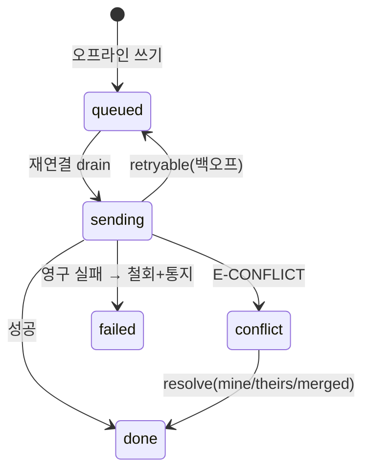

# Offline Sync Spec — 동기 큐 · 충돌 해소

> **문서 상태**: 📋 설계만 (v2.5 Technical Specification · 미구현)
> **관련 문서**: [LOCAL_STORAGE_SPEC.md](LOCAL_STORAGE_SPEC.md) · [API_SPEC.md](API_SPEC.md)(멱등) · [../ui/OFFLINE_MODE.md](../ui/OFFLINE_MODE.md) · [ERROR_SPEC.md](ERROR_SPEC.md)
> **한 줄 목적**: 오프라인 쓰기의 큐 적재·재전송·충돌 해소 규칙을 정의한다 — UI 문서의 오프라인 UX를 실행 가능한 프로토콜로 구체화.

---

## 목차

1. [목적](#1-목적) · 2. [책임](#2-책임) · 3. [인터페이스](#3-인터페이스) · 4. [입력](#4-입력) · 5. [출력](#5-출력) · 6. [데이터 흐름](#6-데이터-흐름) · 7. [의존성](#7-의존성) · 8. [확장성](#8-확장성) · 9. [장점](#9-장점) · 10. [단점](#10-단점)

---

## 1. 목적

오프라인에서 발생한 쓰기(이력 기록·Draft 동기·채택 통계 등)를 잃지 않고, 재연결 시 **순서대로·중복 없이·충돌 시 사람 결정으로** 서버에 반영한다.

## 2. 책임

| 책임 | 규칙 |
|---|---|
| 적재 | Store 쓰기 실패(네트워크) 시 요청 봉투 그대로 `queue` 스토어에 (requestId 포함 — 멱등 좌표) |
| 순서 | 동일 대상(같은 draftId 등)은 FIFO 보장 · 상이 대상은 병렬 허용 |
| 재전송 | 재연결 감지(online 이벤트 + 주기 ping) → drain: 항목별 전송, retryable 실패는 지수 백오프, 영구 실패(E-PERM 등)는 실패함으로 |
| 충돌 감지 | 쓰기 payload에 `baseVersion` 포함 — 서버 최신과 다르면 `E-CONFLICT` 반환 |
| 충돌 해소 | Draft: 병합 화면(사용자 선택 — [../ui/OFFLINE_MODE.md](../ui/OFFLINE_MODE.md) §5) · 통계류(usageCount 등): 서버 가산 병합(충돌 아님으로 처리) · 자산 쓰기: 관리자 결정 |
| 낙관 반영 철회 | 영구 실패·충돌 반려 시 로컬 표시 원상 복구 + 사용자 통지 |

### 오프라인 쓰기 허용표

| 쓰기 종류 | 오프라인 허용 | 충돌 정책 |
|---|---|---|
| Draft 동기 | ✅ | 병합 화면 |
| 생성 이력 기록 | ✅ | 없음(append) |
| Memory 채택 통계 | ✅ | 서버 가산 |
| 즐겨찾기·개인 설정 | ✅ | 최신 우선(개인 데이터) |
| 학습 승인·양식 등록·회사 설정 | ❌ 차단 | 온라인 전용(관리 작업 — 즉시 정합 필요) |

## 3. 인터페이스

| 연산(개념) | 서명 |
|---|---|
| 적재 | `enqueue(requestEnvelope) → queued` + `sync.queued` 이벤트(상태바 대기 수) |
| 배출 | `drain() → { sent, failed[], conflicts[] }` + `sync.completed` |
| 충돌 처리 | `resolve(conflictId, resolution: mine|theirs|merged)` |
| 상태 | `pending() → count` |

## 4. 입력

Store의 실패한 쓰기 봉투 · online/offline 신호 · 서버 응답(성공/E-CONFLICT/영구 실패).

## 5. 출력

서버 반영 완료 · 충돌 항목(병합 UI로) · 상태바 대기/완료 표시 · 실패함 항목.

## 6. 데이터 흐름

```
쓰기 실패(오프라인) → enqueue(requestId·baseVersion 포함) → 낙관적 로컬 반영
   ↓ 재연결
drain: 대상별 FIFO 전송
   ├─ 성공 → 큐 삭제 + 캐시 갱신
   ├─ E-CONFLICT → conflicts[] → Draft면 병합 화면 / 그 외 규칙 처리
   ├─ retryable → 백오프 재시도 (requestId 멱등이 중복 방어)
   └─ 영구 실패 → 실패함 + 낙관 반영 철회 + 통지
```



## 7. 의존성

sync-queue(Infra) → local 저장(queue 스토어) · api 클라이언트(멱등 재전송) · bus(상태 이벤트). Background Sync API는 채택하지 않음 — 페이지 컨텍스트 drain으로 충분(단순성 우선).

## 8. 확장성

- 오프라인 허용 쓰기 확대 = 허용표 1행 + 충돌 정책 지정 (정책 3종 중 택1: 병합 화면/서버 가산/최신 우선).
- 다중 기기 상시 동기(실시간)는 비목표 — 재연결 시 수렴 모델 유지.

## 9. 장점

1. **멱등 기반 안전 재전송** — 중복 이력·중복 통계가 구조적으로 불가능 ([API_SPEC.md](API_SPEC.md) requestId).
2. **관리 작업 온라인 전용** — 승인·설정의 충돌 복잡성을 허용표에서 원천 제거.
3. **충돌 정책 3종 고정** — 케이스마다 새 규칙을 발명하지 않는다.

## 10. 단점

1. **낙관 반영 철회의 UX 상처** — "됐다가 안 된" 경험. (→ 철회는 드묾(영구 실패 한정) + 명확한 통지·재시도 경로)
2. **baseVersion 관리 비용** — 모든 대상 쓰기에 기준 버전 동반 필요. (→ Store가 캐시 버전을 자동 첨부)
3. **페이지 컨텍스트 drain 한계** — 앱 미실행 중엔 동기 안 됨. (→ 수용 — 문서 도구 특성상 실행 중 동기로 충분)
