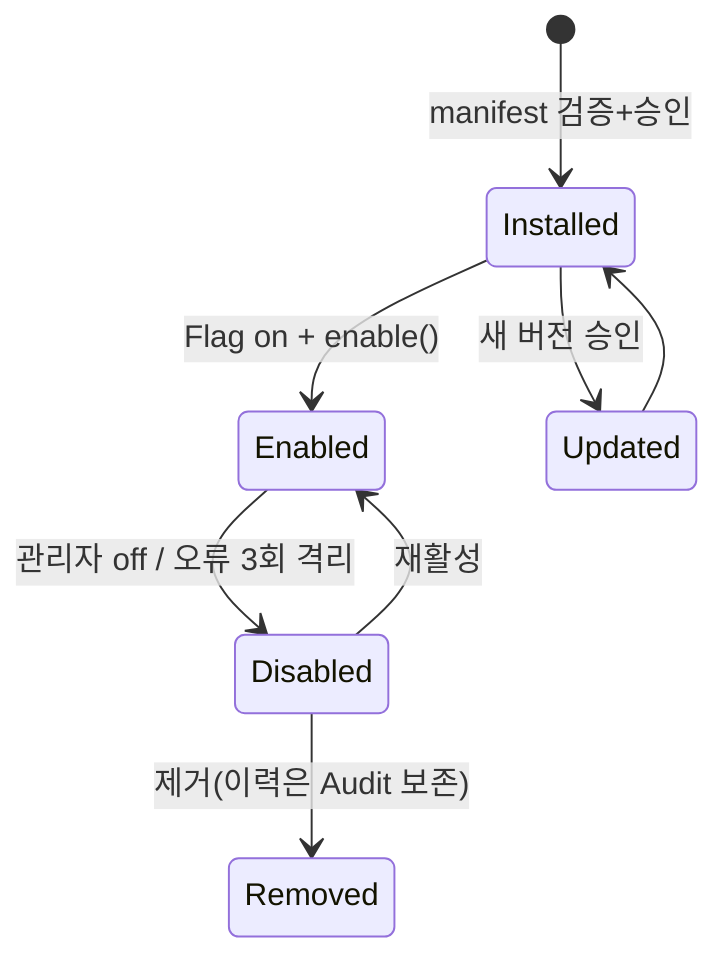

# Plugin Spec — Plugin Life Cycle · Host

> **문서 상태**: 📋 설계만 (v2.5 Technical Specification · 미구현 · MVP 제외)
> **관련 문서**: [../PLUGIN_ARCHITECTURE.md](../PLUGIN_ARCHITECTURE.md)(개념) · [AI_PLUGIN_SPEC.md](AI_PLUGIN_SPEC.md) · [SECURITY_SPEC.md](SECURITY_SPEC.md) · [MODULE_SPEC.md](MODULE_SPEC.md)
> **한 줄 목적**: Plugin의 수명주기(Install→Enable→Disable→Update→Remove)와 Host의 집행 규칙을 구현 수준으로 정의한다.

---

## 목차

1. [목적](#1-목적) · 2. [책임](#2-책임) · 3. [인터페이스](#3-인터페이스) · 4. [입력](#4-입력) · 5. [출력](#5-출력) · 6. [데이터 흐름](#6-데이터-흐름) · 7. [의존성](#7-의존성) · 8. [확장성](#8-확장성) · 9. [장점](#9-장점) · 10. [단점](#10-단점)

---

## 1. 목적

Architecture의 "Plugin은 Core를 수정하지 않는다"를 실행 규칙으로 만든다. Plugin = `v2/js/plugins/<pluginId>/` 폴더(manifest.json + entry 모듈). Host가 유일한 로더·집행자다.

## 2. 책임

### 수명주기 상태 머신

| 상태 전이 | 조건·행위 |
|---|---|
| (없음) → **Installed** | manifest 검증(스키마 `plugin.v1`·능력·이벤트 허용성) + 관리자 승인 → 등록 저장 |
| Installed → **Enabled** | Feature Flag `plugin.<id>` on + `enable()` 성공 → 이벤트 구독 개시 |
| Enabled → **Disabled** | 관리자 off / `plugin.error` 임계 초과(자동 격리) → 구독 해제 |
| Installed/Disabled → **Updated** | 새 버전 manifest 재검증 → 승인 → 교체(구버전 기록 보존) |
| any → **Removed** | 관리자 제거 → 구독·설정 정리 (등록 이력은 Audit에 잔존) |

### Host 집행 규칙

| 규칙 | 내용 |
|---|---|
| 이벤트 게이트 | manifest `subscribes[]` 외 이벤트는 전달하지 않음 · `publishes[]` 외 발행은 차단 |
| 오류 격리 | onEvent 예외 → `plugin.error` 발행 + 연속 3회 시 자동 Disabled — Core 무영향 |
| 쓰기 경계 | 능력별 허용 쓰기만 ([../PLUGIN_ARCHITECTURE.md](../PLUGIN_ARCHITECTURE.md) §2 권한 경계표) — Store 권한표와 이중 검사 |
| 설정 | Plugin 설정은 Workspace 설정 하위 `plugins.<id>` — 시크릿(API Key 등)은 GAS Script Properties 참조 키만 저장 |

## 3. 인터페이스

Plugin이 구현하는 계약(entry 모듈 공개 Interface):

| 함수 | 서명 | 의무 |
|---|---|---|
| `install(ctx)` | 초기 설정 검증 | 실패 시 Installed 진입 불가 |
| `enable(ctx)` / `disable()` | 구독 시작/해제 준비 | 멱등 |
| `update(fromVersion)` | 설정 이행 | 구버전 데이터 보존 |
| `onEvent(event, payload)` | 허용 이벤트 처리 | 예외 = 격리 대상 |
| `health()` | `{ ok, detail }` | Host 주기 점검 |

`ctx` = Host가 주입하는 제한 API: `publish(허용 이벤트만)`·`config`·`logger` — Plugin은 bus·store를 직접 import하지 않는다(주입만).

## 4. 입력

manifest.json · 허용 이벤트 payload · Workspace 설정 · Host 주입 ctx.

## 5. 출력

허용된 발행 이벤트 · health 보고 · (능력 허용 시) 경계 내 쓰기.

## 6. 데이터 흐름

```
등록: manifest 제출 → 스키마·능력 검증 → 관리자 승인 → Installed(+Audit)
가동: Flag on → enable → Host가 subscribes[] 이벤트만 중계
장애: onEvent 예외 ×3 → 자동 Disabled → 관리자 통지 → 수정 후 재활성
```



## 7. 의존성

Host(plugins 계층) → bus·flags·store(등록 저장)·logger. Plugin → Host 주입 ctx만 (직접 import 금지 — 리뷰 검사 항목).

## 8. 확장성

- 새 능력 분류 = 권한 경계표 행 + Host 검증 규칙 ([../PLUGIN_ARCHITECTURE.md](../PLUGIN_ARCHITECTURE.md) §5).
- Plugin 배포 형태는 저장소 내 폴더(정적) — 외부 로드(원격 스크립트)는 **금지**(보안 §2 외부 스크립트 제로 원칙).

## 9. 장점

1. **ctx 주입 모델** — Plugin이 시스템 내부에 물리적으로 접근 불가(허용 API만 존재).
2. **자동 격리** — 나쁜 Plugin이 앱을 죽이지 못한다.
3. **수명주기 전 단계 Audit** — 도입·변경·제거가 모두 추적된다.

## 10. 단점

1. **정적 배포 한정** — 마켓플레이스식 동적 설치 불가. (→ 보안 우선의 의도된 제약 — 저장소 PR이 곧 설치 절차)
2. **ctx API 표면 유지비** — Plugin 요구가 늘면 주입 API가 자란다. (→ 능력 분류 단위로만 확장)
3. **MVP 제외** — 실검증이 늦다. (→ AI Plugin 1종을 첫 검증 대상으로 예약, [AI_PLUGIN_SPEC.md](AI_PLUGIN_SPEC.md))
