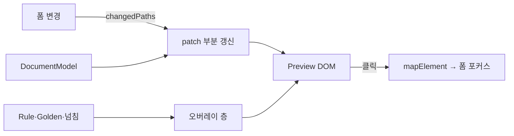

# Preview Engine Spec — HTML Preview 엔진

> **문서 상태**: 📋 설계만 (v2.5 Technical Specification · 미구현)
> **관련 문서**: [DOCUMENT_ENGINE_SPEC.md](DOCUMENT_ENGINE_SPEC.md) · [RENDERER_SPEC.md](RENDERER_SPEC.md) · [../ui/PREVIEW_SYSTEM.md](../ui/PREVIEW_SYSTEM.md) · [../DOCUMENT_MODEL.md](../DOCUMENT_MODEL.md)
> **한 줄 목적**: HTML Preview가 최종 결과와 동일 구조로 생성되는 구조 — 부분 갱신·오버레이 층·양방향 연결의 구현 계약을 정의한다.

---

## 목차

1. [목적](#1-목적) · 2. [책임](#2-책임) · 3. [인터페이스](#3-인터페이스) · 4. [입력](#4-입력) · 5. [출력](#5-출력) · 6. [데이터 흐름](#6-데이터-흐름) · 7. [의존성](#7-의존성) · 8. [확장성](#8-확장성) · 9. [장점](#9-장점) · 10. [단점](#10-단점)

---

## 1. 목적

Preview 엔진은 DocumentModel을 HTML로 렌더한다. 구조 일치의 근거는 **Renderer와 동일한 모델·동일한 절대좌표를 입력받는 것**(I4) — Preview는 "HTML 포맷 렌더러"의 성격을 갖되, 인쇄 대상이 아니라 화면 표시 대상이다.

## 2. 책임

| 책임 | 규칙 |
|---|---|
| 모델 → HTML | 절대좌표 박스 → 시맨틱 HTML(heading·table — 접근성 낭독 대응, [../ui/ACCESSIBILITY.md](../ui/ACCESSIBILITY.md) §5) |
| DNA 스타일 격리 | Preview 내부만 DNA 지배, 외부 UI는 앱 토큰 (Shadow DOM 또는 스코프 격리) |
| 부분 갱신 | 변경 필드 → 바인딩 구획만 교체(전체 리렌더 금지, 300ms 디바운스) |
| 오버레이 층 | Rule 배지·Golden 편차·넘침 경고를 문서와 **분리된 층**에 (문서 데이터 불변) |
| 양방향 연결 | Preview 요소 ↔ 폼 필드 포커스 매핑 |
| 페이지 표현 | 페이지 경계·비율·썸네일 스트립 |

## 3. 인터페이스

| 연산(개념) | 서명 |
|---|---|
| 전체 렌더 | `renderFull(model) → domTree` |
| 부분 갱신 | `patch(model, changedPaths[]) → 해당 구획만 교체` |
| 오버레이 | `setOverlays({ rules[], deviations[], overflow[] })` · `toggleOverlays(on)` |
| 연결 | `mapElement(domNode) → fieldPath` / `focusField(path) → scrollTo` |

## 4. 입력

DocumentModelV2 · 변경 경로 목록(FormEngine 발) · Rule 결과·Golden Score·넘침(LayoutEngine).

## 5. 출력

렌더된 DOM · 오버레이 표시 · `preview.elementClicked`(→ 폼 포커스) 내부 이벤트.

## 6. 데이터 흐름

```
입력 변경 → changedPaths → patch(해당 구획만) → 오버레이 갱신
사용자 Preview 클릭 → mapElement → focusField(폼)
편집 모드 → EDITOR_SYSTEM이 모델 패치 → patch로 반영
```



## 7. 의존성

preview-engine(Core) → document-model · layout-engine(좌표) · theme-engine(DNA 사영 스타일). Renderer와 **형제**(같은 모델 입력, 상호 무의존).

## 8. 확장성

- 새 컴포넌트 타입 = HTML 렌더 규칙 1개 (Renderer의 대응 규칙과 짝) — [COMPONENT_SPEC.md](COMPONENT_SPEC.md).
- 오버레이 층 추가(예: Workflow 코멘트 📋) = 오버레이 스택에 층 추가, 문서 렌더 무수정.

## 9. 장점

1. **구조 일치의 엔진 수준 보장** — Renderer와 같은 모델·좌표라 "미리보기 따로" 불가.
2. **부분 갱신 성능** — 타이핑 중 전체 리렌더 없음.
3. **오버레이 분리** — 품질 정보가 문서 데이터를 오염시키지 않음.

## 10. 단점

1. **HTML↔파일 시각 격차** — 폰트 렌더링·줄바꿈 미세 차이 불가피. (→ 구조 100%/시각 근사 기준, 완료 조건에 명시 — [../ui/IMPLEMENTATION_PLAN.md](../ui/IMPLEMENTATION_PLAN.md) S3)
2. **스타일 격리 복잡성** — Shadow DOM은 라이브러리·인쇄 제약 유발. (→ 스코프 클래스 격리를 1차안으로)
3. **부분 갱신 정합** — 구획 경계 밖 변경(페이지 재분할)은 부분 갱신으로 부족. (→ 레이아웃 영향 변경은 전체 재렌더로 승격)
